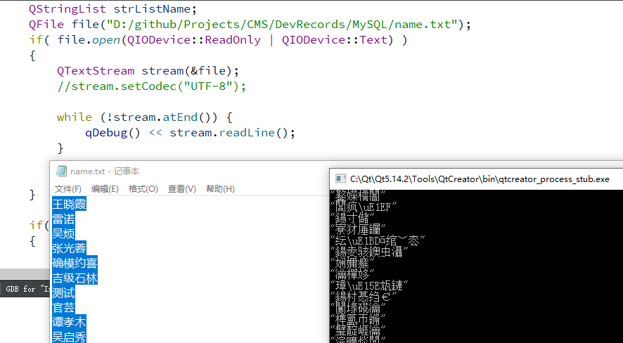
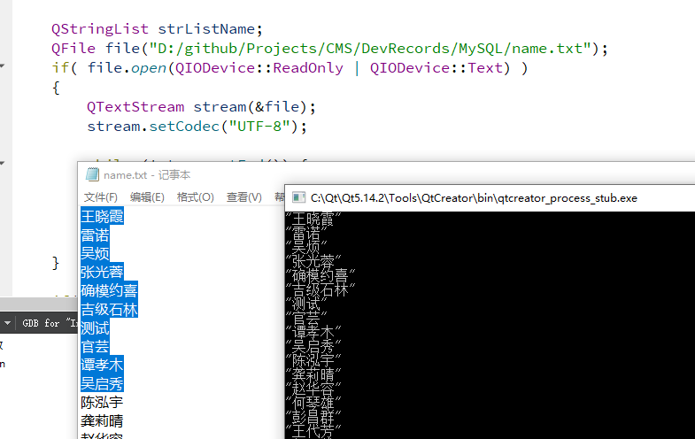
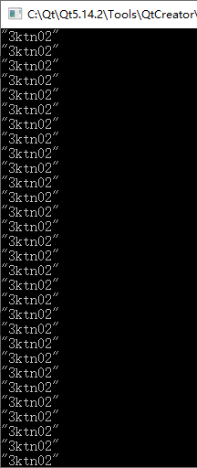
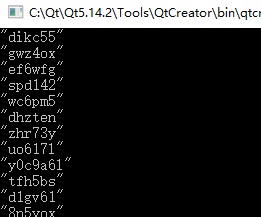
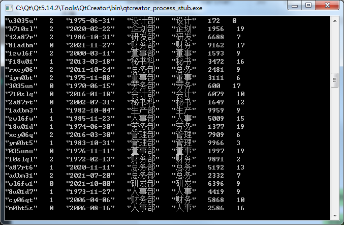
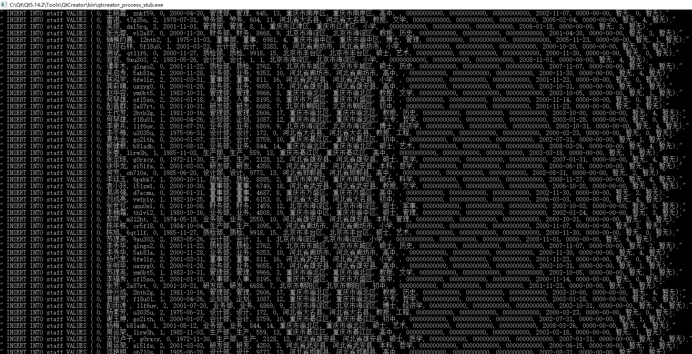
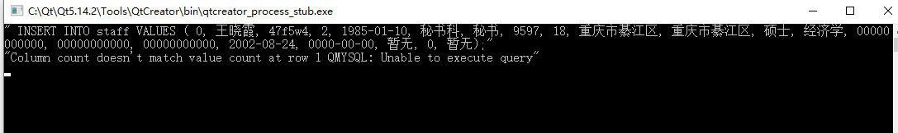
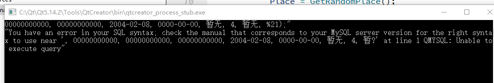
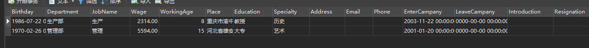
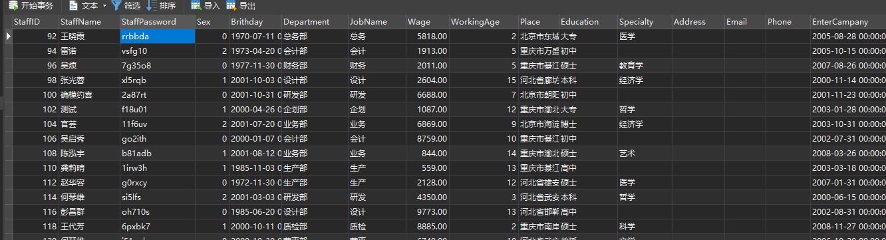

上一节，我们已经创建了数据库，这一节，简单插入几条数据

# 随机插入

这里采用随机插入的方式，就插入100条数据把。

目前已经有人名100个，所以，将这100个读取出来，然后插入。

## 读取人名

人名文件 `MySQL/name.txt`

~~~txt
王晓霞
雷诺
吴烦
张光蓉
..
~~~

采用这种方式读取，中文就乱码，因为没有设置编码

重新设置编码后

## 随机密码

~~~mysql
QString GetRandomPassword()
{
    qsrand(QTime::currentTime().secsTo(QTime::currentTime()));

    return QString("%1%2%3%4%5%6")
            .arg(g_strList[qrand() % g_nStrListSize])
            .arg(g_strList[qrand() % g_nStrListSize])
            .arg(g_strList[qrand() % g_nStrListSize])
            .arg(g_strList[qrand() % g_nStrListSize])
            .arg(g_strList[qrand() % g_nStrListSize])
            .arg(g_strList[qrand() % g_nStrListSize]);
}
~~~

获取的值，每次都一样

因为种子数采用 s 做单位，那肯定一样的了。

所以换一种方法，存一个随机值作为种子数。

~~~c++
QString GetRandomString()
{
    static int nrand = QTime(0,0,0).secsTo(QTime::currentTime());
    qsrand(nrand);
    nrand = qrand();

    return g_strList[ nrand % g_nStrListSize];
}
~~~

所以，获取随机密码

~~~c++
QString GetRandomPassword()
{
    return QString("%1%2%3%4%5%6")
            .arg(GetRandomString())
            .arg(GetRandomString())
            .arg(GetRandomString())
            .arg(GetRandomString())
            .arg(GetRandomString())
            .arg(GetRandomString());
}
~~~

结果

## 随机性别

~~~mysql
Sex int(1) NOT NULL COMMENT '性别（0 未知，1 男，2 女）',
~~~

~~~c++
int GetRandomSex(){
    return QString("%1").arg(GetRandomString(3)).toInt();
}
~~~

## 随机日期

~~~mysql
Brithday TIMESTAMP NOT NULL COMMENT '出生日期 YYYY-MM-DD HH:MM:SS',
~~~

## 随机到工龄

## 随机插入其他部分

# 插入数据库

~~~c++
if(guidocms.open())
{
	guidocms.exec(strSql);
}
~~~

果然，有错误

行数不匹配，多可一个 `place`，删除再来。

## 最后

成功咯

最后，全部运行

可能这里已经发现了，我设置的自增值为 2，这是为了以后多个服务器使用。

# staff

~~~mysql
INSERT INTO staff 
VALUES (
	0,
	'Guido',
	'123456',
	1,
	'1994-09-01',
	'研发部',
	'研发工程师',
	3000.5,
	5,
	'重庆市渝北区',
	'本科',
	'电子信息工程',
	'重庆市渝北区',
	'447459623@qq.com',
	15823159025,
	'2020-09-01',
	'0000-00-00',
	'重点培养人才',
	0,
	'o'
	);
~~~

# 搞定了
