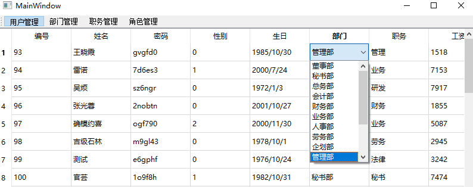

# 委托

```c++
QStyledItemDelegate
```

官方文档： [QStyledItemDelegate](https://doc.qt.io/qt-5/qstyleditemdelegate.html#details)

采用自定义类实现委托 

If you wish to change any of the bounding rectangles calculated by the style or the painting of check box indicators, you can subclass [QStyle](https://doc.qt.io/qt-5/qstyle.html). Note, however, that the size of the items can also be affected by reimplementing [sizeHint](https://doc.qt.io/qt-5/qstyleditemdelegate.html#sizeHint)().

It is possible for a custom delegate to provide editors without the use of an editor item factory. In this case, the following virtual functions must be reimplemented:

- [createEditor](https://doc.qt.io/qt-5/qstyleditemdelegate.html#createEditor)() returns the widget used to change data from the model and can be reimplemented to customize editing behavior.
- [setEditorData](https://doc.qt.io/qt-5/qstyleditemdelegate.html#setEditorData)() provides the widget with data to manipulate.
- [updateEditorGeometry](https://doc.qt.io/qt-5/qstyleditemdelegate.html#updateEditorGeometry)() ensures that the editor is displayed correctly with respect to the item view.
- [setModelData](https://doc.qt.io/qt-5/qstyleditemdelegate.html#setModelData)() returns updated data to the model.

The [Star Delegate](https://doc.qt.io/qt-5/qtwidgets-itemviews-stardelegate-example.html) example creates editors by reimplementing these methods.


# 例子

实现 下拉框的委托




采用自定义类继承 `QStyledItemDelegate`

~~~c++
class ComboxDelegate : public QStyledItemDelegate
~~~

然后实现下面几个函数

~~~c++
// .h
	// 完成创建控件的工作
    // QModelIndex 指定的表项数据的编辑控件，并对控件的内容进行限定
    QWidget * createEditor(
        QWidget *parent,
        const QStyleOptionViewItem &option,
        const QModelIndex &index) const override;

    // 设置控件显示的数据，将 Model 中的数据更新至 Delegate 中，相当于一个初始化工作
    void setEditorData(
        QWidget * pEditor,
        const QModelIndex &index ) const override;

    // 将 Delegate中对数据的改变更新至Model中
    void setModelData(
        QWidget * pEditor,
        QAbstractItemModel * pModel,
        const QModelIndex &index ) const override;

    // 更新控件区域的显示
    void updateEditorGeometry(
        QWidget *editor,
        const QStyleOptionViewItem &option,
        const QModelIndex &index) const override;
~~~

~~~c++
// cpp
QWidget *ComboxDelegate::createEditor(QWidget *parent, const QStyleOptionViewItem &option, const QModelIndex &index) const
{
    QComboBox * pEditor = new QComboBox(parent);
    for(int i = 0; i < m_listItems.count(); ++i)
    {
        pEditor->addItem(m_listItems[i]);
    }

    // 安装事件过滤器，使得 ComboxDelegate 能够捕获 QComboBox 的事件
    pEditor->installEventFilter(const_cast<ComboxDelegate*>(this));

    return pEditor;
}

void ComboxDelegate::setEditorData(QWidget *pEditor, const QModelIndex &index) const
{
    // 获取指定箱的数据，并转为 string
    QString strDate = index.model()->data(index).toString();
    QComboBox *pBox = static_cast<QComboBox*>(pEditor);
    pBox->setCurrentIndex(pBox->findText(strDate));
}

void ComboxDelegate::setModelData(QWidget *pEditor, QAbstractItemModel *pModel, const QModelIndex &index) const
{
    QComboBox *pBox = static_cast<QComboBox*>(pEditor);
    pModel->setData(index, pBox->currentText());
}

void ComboxDelegate::updateEditorGeometry(QWidget *editor, const QStyleOptionViewItem &option, const QModelIndex &index) const
{
    editor->setGeometry(option.rect);
}
~~~

