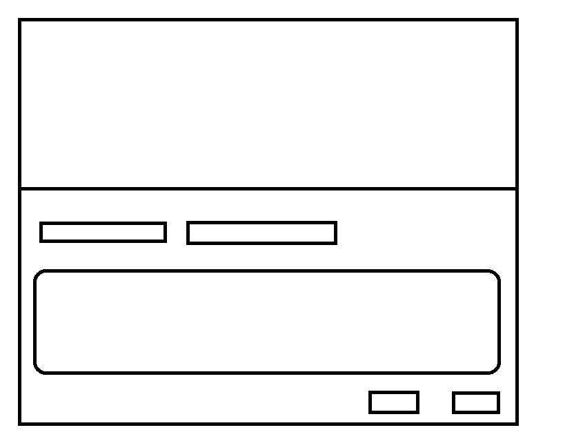
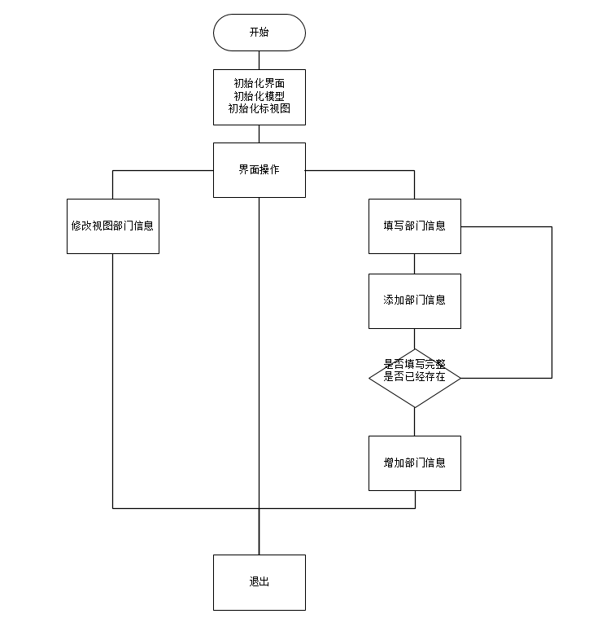
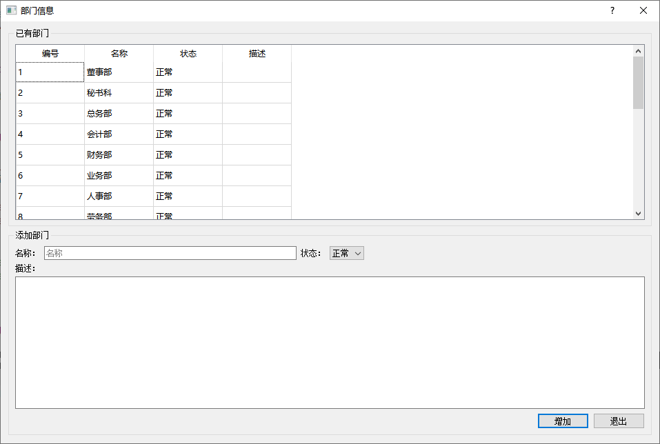

部门管理界面继承上面的管理界面，并重写相应函数。

# 样图

上面为已经存在的表信息，下面为新增信息的填写框。

# 功能

* 修改原来的部门信息，
* 新增部门信息

# 流程图

# 代码

~~~c++
// .h
class DepartmentInfoDialog : public TableInfoDialog
{
    Q_OBJECT

public:
    explicit DepartmentInfoDialog(QWidget *parent = nullptr);
    ~DepartmentInfoDialog();

protected slots:
    void slotAdd();

protected:
    virtual void InitLayout() override;
    virtual void InitTableModel() override;

private:
    void InitTableView();
    void InitDelegate();
    bool CheckParams();

private:
    Ui::DepartmentInfoDialog *ui;

    QLineEdit * m_pLineEditName;
    QComboBox * m_pComboBoxState;
    QPlainTextEdit * m_pPlainTextEditDesc;
};

~~~

# 最终效果

