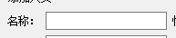
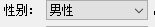
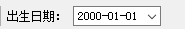

因为很多地方会使用到 一个 诸如 一个 Label + 一个其他控件的 组合，因此，这里可以写一个基类，其他来继承

# 基类

考虑可能横向或者纵向，所以，增加表方向的成员。

~~~c++
class StanderInputStructer : public QObject
{
    Q_OBJECT
public:
    explicit StanderInputStructer(
            const QString& label,
            Qt::Orientation orient = Qt::Horizontal);

    virtual ~StanderInputStructer();

    Qt::Orientation Orient() const;

    QLabel * Label() const;
    QBoxLayout * Layout() const;

private:
    Qt::Orientation m_Orient;
protected:
    QLabel * m_pLabel;
    QBoxLayout * m_pMainLayout;
};
~~~

# 子类

表示`lineedit`的输入。继承自它，所以，得到下面结果。

~~~c++

class StanderLineEdit : public StanderInputStructer
{
    Q_OBJECT

public:
    StanderLineEdit(
        const QString& label,
        const QString& lineedit,
        Qt::Orientation orient = Qt::Horizontal);

    QString Text() const;
    QLineEdit * LineEdit() const;

private:
    QLineEdit * m_pLineEdit;
};

~~~

