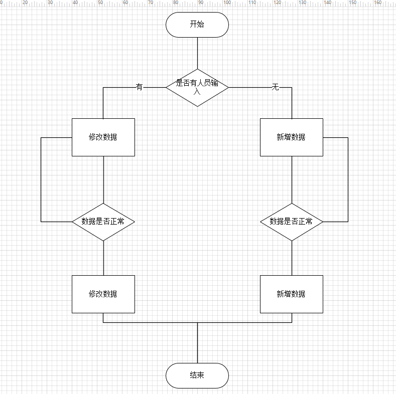

# 第一版

增加或修改人员信息，

## 流程图

## 新增

如果没有传参数进来，则为新增

点击增加，则添加人员，并写入数据库

## 修改

如果有参数传入，则为修改

## 注意事项

`combobox `内容，从数据库中获取。

有人员传入时候，`combobox `选中项应与人员相应项相同。

# 第二版

现在由于新增了扩展控件，因此，没采用拖控件的形式创建界面，采用了代码形式编写界面。

## 代码

~~~c++
void StaffInfoDialog::InitLayout()
{
    setWindowTitle("人员信息");

    ////////////////////////////////////////////////////////////
    // 已经存在的部门
    QGroupBox * pGroupBoxExist = new QGroupBox("已有人员");
    QHBoxLayout * pLayoutTableView = new QHBoxLayout;
    m_pTableView = new QTableView;
    m_pTableView->verticalHeader()->hide();
    pLayoutTableView->addWidget(m_pTableView);
    pGroupBoxExist->setLayout(pLayoutTableView);

    ////////////////////////////////////////////////////////////
    // 添加人员
    QGroupBox * pGroupBoxAdd = new QGroupBox("添加人员");
    QGridLayout * pGridLayoutAdd = new QGridLayout;

    /// Name
    m_pLineEditName = new StanderLineEdit("名称：", "");
    m_pLineEditPassword = new StanderLineEdit("密码：", "666666");
    m_pLineEditPassword->LineEdit()->setEchoMode(QLineEdit::Password);
    m_pLineEditWorkingAge = new StanderLineEdit("工龄：", "");
    m_pLineEditWage = new StanderLineEdit("工资：", "");
    m_pLineEditPhone = new StanderLineEdit("电话：", "");
    m_pLineEditEmail = new StanderLineEdit("邮箱：", "");
    m_pLineEditAddress = new StanderLineEdit("住址：", "");
    m_pPlainTextEditDesc = new StanderPlainTextEdit("备注：", "", Qt::Vertical);

    int nRow = 0, nColumn = 0;
    pGridLayoutAdd->addLayout(m_pLineEditName->Layout(), nRow++, nColumn);
    pGridLayoutAdd->addLayout(m_pLineEditPassword->Layout(), nRow++, nColumn);
    pGridLayoutAdd->addLayout(m_pLineEditWorkingAge->Layout(), nRow++, nColumn);
    pGridLayoutAdd->addLayout(m_pLineEditWage->Layout(), nRow++, nColumn);
    pGridLayoutAdd->addLayout(m_pLineEditPhone->Layout(), nRow++, nColumn);
    pGridLayoutAdd->addLayout(m_pLineEditEmail->Layout(), nRow++, nColumn);
    pGridLayoutAdd->addLayout(m_pLineEditAddress->Layout(), nRow++, nColumn);
    pGridLayoutAdd->addLayout(m_pPlainTextEditDesc->Layout(), nRow++, nColumn, 1, 5);

    m_pComboBoxSex = new StanderComboBox( "性别：", GetSexList());
    m_pComboBoxPlace = new StanderComboBox( "籍贯：", GetPlaceList());
    m_pComboBoxDepartment = new StanderComboBox( "部门：", GetDepartmentList());
    m_pComboBoxJob = new StanderComboBox( "职务：", GetJobList());
    m_pComboBoxEducation = new StanderComboBox( "学历：", GetEducationList());
    m_pComboBoxSpecialty = new StanderComboBox( "专业：", GetSpecialtyList());

    nRow = 0, nColumn++;
    pGridLayoutAdd->addLayout(m_pComboBoxSex->Layout(), nRow++, nColumn);
    pGridLayoutAdd->addLayout(m_pComboBoxPlace->Layout(), nRow++, nColumn);
    pGridLayoutAdd->addLayout(m_pComboBoxDepartment->Layout(), nRow++, nColumn);
    pGridLayoutAdd->addLayout(m_pComboBoxJob->Layout(), nRow++, nColumn);
    pGridLayoutAdd->addLayout(m_pComboBoxEducation->Layout(), nRow++, nColumn);
    pGridLayoutAdd->addLayout(m_pComboBoxSpecialty->Layout(), nRow++, nColumn);

    nRow = 0, nColumn++;
    m_pDateEditBirthday = new StanderDateEdit("出生日期：", "1965-01-01");
    m_pDateEditEnterCompany = new StanderDateEdit("入职时间：", QDate::currentDate().toString("yyyy-MM-dd"));
    m_pDateEditLeaveCompany = new StanderDateEdit("出生日期：", "9999-12-31");
    pGridLayoutAdd->addLayout(m_pDateEditBirthday->Layout(), nRow++, nColumn);
    pGridLayoutAdd->addLayout(m_pDateEditEnterCompany->Layout(), nRow++, nColumn);
    pGridLayoutAdd->addLayout(m_pDateEditLeaveCompany->Layout(), nRow++, nColumn);

    //nRow = 0, nColumn++;
    //pGridLayoutAdd->addItem( new QSpacerItem(40, 20), nRow++, nColumn);

    nRow = 8;
    QHBoxLayout * pHBoxLayoutButton = new QHBoxLayout;
    QPushButton * pButtonAdd = new QPushButton("增加");
    QPushButton * pButtonCancle = new QPushButton("退出");
    pHBoxLayoutButton->addWidget(pButtonAdd);
    pHBoxLayoutButton->addWidget(pButtonCancle);

    connect(pButtonAdd, &QPushButton::clicked, this, &StaffInfoDialog::slotAdd);
    connect(pButtonCancle, &QPushButton::clicked, this, &QDialog::close);    
    pGridLayoutAdd->addLayout(pHBoxLayoutButton, nRow, nColumn);

    pGroupBoxAdd->setLayout(pGridLayoutAdd);

    QVBoxLayout * pMainLayout = new QVBoxLayout;
    pMainLayout->addWidget(pGroupBoxExist);
    pMainLayout->addWidget(pGroupBoxAdd);

    this->setLayout(pMainLayout);

}
~~~

后续可以考虑用一个分割窗，将上下分割，那就是  `TableInfo` 继承分割窗体。