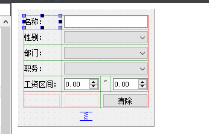
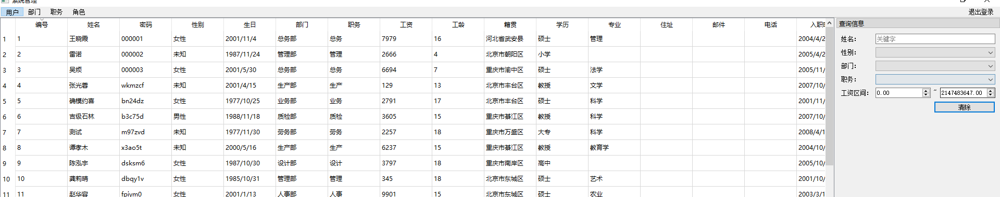
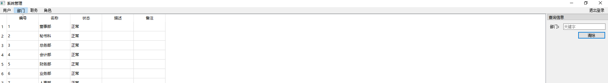
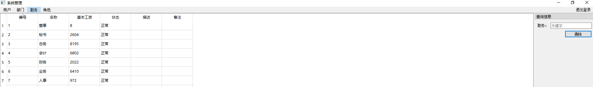
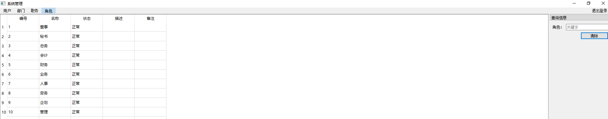

其实搜索功能挺简单的，数据库中像名字，

~~~mysql
#通配符 结合like 使用
# % _ 
LIKE ;
~~~

在Qt 中 `QSqlTableMode::setFilter() ` 已经实现了这个过滤 `WHERE`操作，只需要把过滤内容当参数传入，再`SELECT`一次就好了

# 设计

搜索对话框，其实也没几个，按这几个搜就行了，最多也就是人员列表复杂一些，所以，按这几个搜索。

其他列表的时候，该隐藏的就隐藏，这就造成了每个页面的不同

## 用户界面

## 部门界面

## 职务页面

## 角色页面

# 代码

~~~c++
void SystemManagerDialog::slotFilter(QStringList listFilter)
{
    QString strQuery = "";
    int nMode = m_pSearchDialog->SearchMode();
    if(nMode == SearchDialog::STT_JOB)
    {
        if(listFilter[SearchDialog::FILTER_NAME] != "")
            strQuery = QString("(JobName LIKE '%%1%')").arg(listFilter[SearchDialog::FILTER_NAME]);

        m_pSqlTableModelJob->setFilter(strQuery);
        m_pSqlTableModelJob->select();
    }
    else if (nMode == SearchDialog::STT_STAFF)
    {
        if(listFilter[SearchDialog::FILTER_NAME] != "")
            strQuery = QString("(StaffName LIKE '%%1%')").arg(listFilter[SearchDialog::FILTER_NAME]);

        if(listFilter[SearchDialog::FILTER_SEX] != "")
        {
            if(strQuery != "") strQuery += " AND ";
            strQuery += QString("(Sex = '%1')").arg(listFilter[SearchDialog::FILTER_SEX]);
        }

        if(listFilter[SearchDialog::FILTER_DEPARTMENT] != "")
        {
            if(strQuery != "") strQuery += " AND ";
            strQuery += QString("(Department = '%1')").arg(listFilter[SearchDialog::FILTER_DEPARTMENT]);
        }

        if(listFilter[SearchDialog::FILTER_JOB] != "")
        {
            if(strQuery != "") strQuery += " AND ";
            strQuery += QString("(JobName = '%1')").arg(listFilter[SearchDialog::FILTER_JOB]);
        }

        if(listFilter[SearchDialog::FILTER_WAGE_L] != "")
        {
            if(strQuery != "") strQuery += " AND ";
            strQuery += QString("(Wage >= '%1')").arg(listFilter[SearchDialog::FILTER_WAGE_L]);
        }

        if(listFilter[SearchDialog::FILTER_WAGE_H] != "")
        {
            if(strQuery != "") strQuery += " AND ";
            strQuery += QString("(Wage <= '%1')").arg(listFilter[SearchDialog::FILTER_WAGE_H]);
        }

        m_pSqlTableModelStaff->setFilter(strQuery);
        m_pSqlTableModelStaff->select();
    }
    else if (nMode == SearchDialog::STT_ROLE)
    {
        if(listFilter[SearchDialog::FILTER_NAME] != "")
            strQuery = QString("(RoleName LIKE '%%1%')").arg(listFilter[SearchDialog::FILTER_NAME]);

        m_pSqlTableModelRole->setFilter(strQuery);
        m_pSqlTableModelRole->select();
    }
    else if (nMode == SearchDialog::STT_DEPARTMENT)
    {
        if(listFilter[SearchDialog::FILTER_NAME] != "")
            strQuery = QString("(DepartmentName LIKE '%%1%')").arg(listFilter[SearchDialog::FILTER_NAME]);

        m_pSqlTableModelDepartment->setFilter("");
        m_pSqlTableModelDepartment->select();
    }
}
~~~

当然，这里的界面后期仍然可以修改，定义宏，采用数组方式，就不用写这么多 if 了。每个页面分别定义一个类，最好有一个基类，做像设置过滤这种操作。