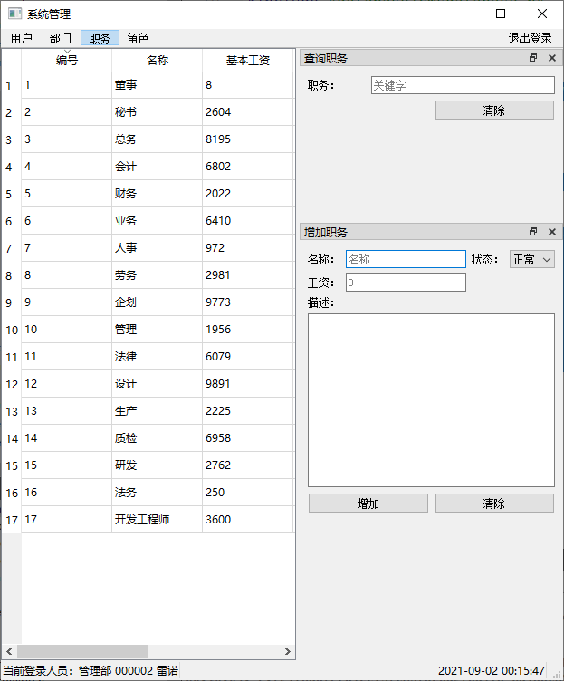
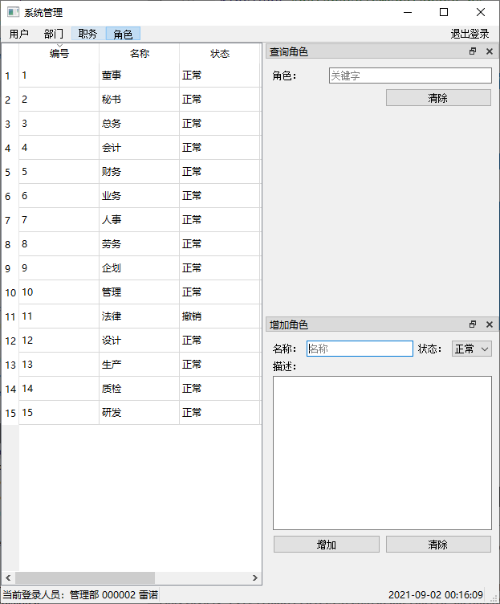

前面完成了表管理 即系统管理的基本设计

现在是时候重构一下了。

把每个表信息抽象一个基类，然后每个表继承自它

# 代码

按原来的设计此界面中有查询，有增加，还有当前显示

所以代码如下。

~~~c++
class TableManagerDialog : public QMainWindow
{
    Q_OBJECT
public:
    TableManagerDialog(QMainWindow * parent = 0);
    virtual ~TableManagerDialog();

protected:

    virtual void CreateSpecialDialog() = 0;

    virtual void InitTableView();
    virtual void InitLayout() = 0;
    virtual void InitSqlTableModel() = 0;
    virtual void InitSearchDialog() = 0;
    virtual void InitAddTableInfoDialog() = 0;

public slots:
    void slotUpdateTable(bool);

protected slots:
    virtual void slotFilter(QStringList) = 0;

protected:
    QDockWidget * m_pSearchDockWidget;
    QDockWidget * m_pAddDockWidget;

    SearchDialog * m_pSearchDialog;
    AddTableInfoDialog * m_pAddTableInfoDialog;

    QTableView * m_pTableView;
    QSqlTableModel * m_pSqlTableModel;
};

~~~

其余的类，均继承自它

# 增加界面

同上，增加信息界面也是一样，会发出增加信号等统一内容，因此，也可抽象一个基类

代码

~~~c++
class AddTableInfoDialog : public QWidget
{
    Q_OBJECT

public:
    explicit AddTableInfoDialog(QWidget *parent = nullptr);
    virtual ~AddTableInfoDialog();

    static QStringList GetDepartmentList();
    static QStringList GetSpecialtyList();
    static QStringList GetEducationList();
    static QStringList GetPlaceList();
    static QStringList GetJobList();
    static QStringList GetRoleList();
    static QStringList GetStateList();
    static QStringList GetSexList();

protected:
    virtual void InitLayout();

signals:
    void signalAddSuccess(bool);

protected slots:
    virtual void slotAdd();
    virtual void slotClear();

protected:
    CMSDatabase * m_pCMSDatabase;

    QHBoxLayout * m_pButtonLayout;
    QPushButton * m_pButtonAdd;
    QPushButton * m_pButtonClear;
};
~~~

# 结果

用户管理界面

部门管理界面

职务界面

角色界面

至此，表管理界面暂时告一段落落，下面开始总结。这段时间的开发。