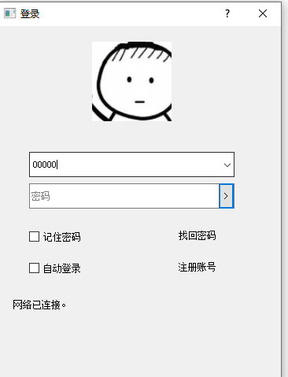
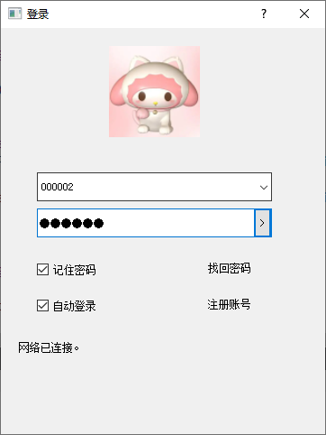
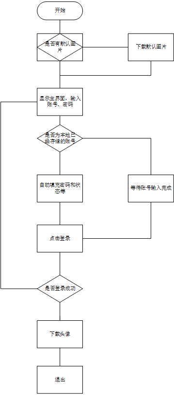

# 头像功能

功能说明：

* 在从未登录，输入登录账号的时候显示默认的图片，这个图片可能也是从网上才下载的。
* 登录过后，下次登录就采用他自己的图片了。

**默认图片：**

**用户图片：**

# 解释

Qt 其实封装得还是很不错了

三个类，一个http的下载就搞定了，具体解释看 [网络文件下载器](https://github.com/GuidoLuo0521/Notes/tree/master/Qt/QtDevelopmentAndExamples/Chapter10-Qt5NetworkAndCommunication)

~~~c++
#include <QNetworkAccessManager>
#include <QNetworkRequest>
#include <QNetworkReply>
~~~

`QNetworkAccessManager`：负责管理

`QNetworkRequest:`请求内容

`QNetworkReply：`回复内容

# 流程图

# 代码

单独封装一个下载类

~~~c++
class FileDownloader : public QObject
{
    Q_OBJECT
public:
    explicit FileDownloader(QObject *parent = 0);
    virtual ~FileDownloader();

public:
    void DownLoadFile(QString imageUrl, QString filepath);

signals:
    void signalDownLoaded(QString filepath, bool bSuccess);

private slots:
    void fileDownloaded(QNetworkReply* pReply);
private:
    QNetworkAccessManager m_WebCtrl;
    QString m_strFilePath;
};

~~~

~~~c++

FileDownloader::FileDownloader(QObject *parent) :
    QObject(parent)
{
    connect( &m_WebCtrl, SIGNAL (finished(QNetworkReply*)), this, SLOT (fileDownloaded(QNetworkReply*)) );
}
void FileDownloader::fileDownloaded(QNetworkReply* pReply)
{
    //  QString strUrl = pReply->url().toString();
    QByteArray data = pReply->readAll();

    // 保存文件。。。
    
    //emit a signal
    pReply->deleteLater();
    emit signalDownLoaded(m_strFilePath, bSuccess);
}
void FileDownloader::DownLoadFile(QString imageUrl, QString filepath)
{
    QUrl url = QUrl(imageUrl);
    m_strFilePath = filepath;

    QNetworkRequest request(url);
    m_WebCtrl.get(request);
}

~~~

这里只写了重要部分。

# 问题

* 怎么在 `DownLoadFile`快速被调用的时候，在保存文件的时候文件名和请求时候的文件路径一致列？？

## 试过的方法

增加一个 `QQueue`，记录文件名，`DownLoadFile`的时候就`push`，  `fileDownloaded `的时候就 `pop`，，但是是行不通的，有的请求下载慢，有的快，这样就会导致错误。