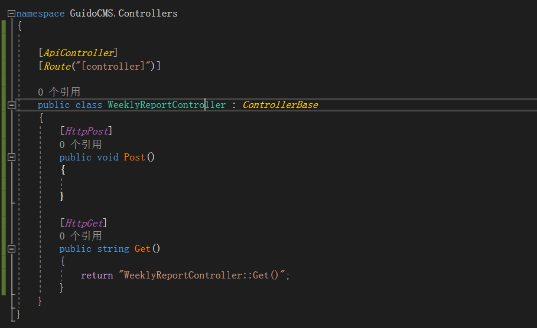

# 提交周报

主要有存储数据库，存储到文件，文件上传服务器等

# 文件上传

因为，采用的是文件形式，因此，服务器上需要写一个后端接口来接收，直接采用  `webserver `的方式吧。

文件就存储在本地，`webserver`就直接发送`json`数据，这样，要查询历史的时候也不用大量查询服务器，直接看本地的就可以了，减少服务器负载。

# 后台接口

这里就采用 C# 写吧，然后因为我这里是 windows系统，因此后台服务器使用 `iis` 把

## 创建 `WebAPI`

`VS2019` 创建 `web api` ，我这里采用的是 `.net5`，文件结构（没有Model）。采用`MVC`模式， `MVC`这个就自己去搜索吧，

创建Model文件夹，创建类 `WeeklyReportFileModel` 用于存储文件的`json`模型，因此，`nuget` 包，添加 `json`.

添加控制器

