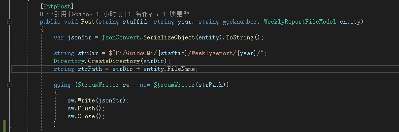

# 提交周报

主要有存储数据库，存储到文件，文件上传服务器等

# 文件上传

因为，采用的是文件形式，因此，服务器上需要写一个后端接口来接收，直接采用  `webserver `的方式吧。

文件就存储在本地，`webserver`就直接发送`json`数据，这样，要查询历史的时候也不用大量查询服务器，直接看本地的就可以了，减少服务器负载。

# 后台接口

这里就采用 C# 写吧，然后因为我这里是 windows系统，因此后台服务器使用 `iis` 把

## 创建 `WebAPI`

`VS2019` 创建 `web api` ，我这里采用的是 `.net5`，文件结构（没有Model）。采用`MVC`模式， `MVC`这个就自己去搜索吧，

创建Model文件夹，创建类 `WeeklyReportFileModel` 用于存储文件的`json`模型，因此，`nuget` 包，添加 `json`.

## 存储文件

添加控制器接口

将文件存储下来

## 写入数据库

`Nuget` 包安装

~~~shell
MySql.Data
~~~

因为这里只是简单的进行周报数据的插入，所以，我这里简单写一下插入语句

~~~c++
    public class GuidoCMSDatebase
    {
        static private string _ConnectionString = "server=www.millet.fun;User Id=guido;password=123456;Database=GuidoCMS";

        static public bool Exec(string query)
        {
            MySqlConnection con;
            try
            { 
                con = new MySql.Data.MySqlClient.MySqlConnection(_ConnectionString);
                con.Open();

                MySqlCommand mycmd1 = new MySqlCommand(query, con);
                mycmd1.ExecuteNonQuery();
                con.Close();

                return true;
            }
            catch
            {
                return false;
            }
        }
    }
~~~

# 部署`IIS `

发布，部署到 `IIS`上，选择发布到文件夹后靠到服务器上，

错误

[解决方案：](https://blog.csdn.net/weixin_39680380/article/details/111253649)

没有模块

> 所以，就需要安装指定的模块了。
>
> 因为是.NET5，所以不仅需要安装运行时，还要安装HOST，省事儿的话，直接安装捆绑的包就行了：
>
> https://dotnet.microsoft.com/download/dotnet/5.0
>
> 然后下载并安装：
>
> 

# 结果

