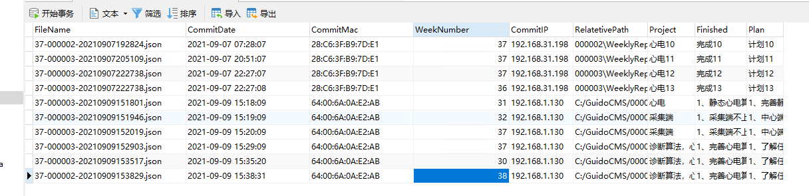

# 历史查询

也是请求web接口，在数据库中查询后，然后返回 `json`格式数据，最后显示内容。

# Get 接口

目前 Get 接口采用 参数传递的方式 传入 `staffid`，然后查询 `staffid `提交的周报，这里有一个要注意的就是，他可能本周内多次提交，因此，应该是如果周数相同，就获取时间最大的那个。

所以，`sql` 语句应该会有 `group by`

~~~mysql
select w.* from 
weeklyreport w 
where (w.staffid, w.WeekNumber, w.CommitDate) in 
(	select wr.staffid, wr.WeekNumber, max(wr.CommitDate)  
 	from weeklyreport wr where staffid = '{staffid}' 
	group by wr.staffid, wr.WeekNumber)
~~~

