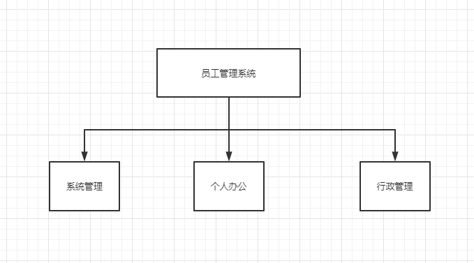
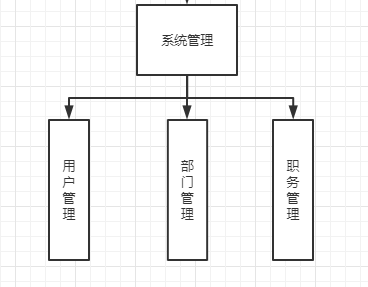
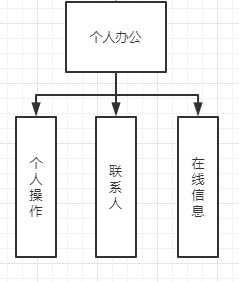
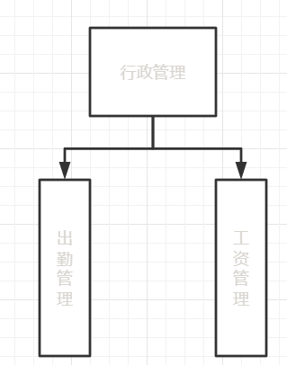

# 模块架构

因此此系统较为简单，采用`MVC`模式进行开发。

* M（Model）：模型。数据部分。
* V（View）：视图。界面的显示部分。
* C（Control）：控制。界面的操作等

## 数据库部分

分为本地和网络数据库

**本地数据库：**用来记录是否保存密码等信息，或者以后消息记录的查找等。

**网络数据库：**用来记录公司信息等。

因为数据库部分全局只需要一个，所以，采用单例模式进行设计。

# 主要功能

主要的功能包括能够管理员工信息，消息群发，公告栏，考勤管理等

# 模块划分

本系统主要有三个功能模块，每个模块下面又分为多个小模块。

* 系统管理：包括用户管理，角色管理，部门管理，职务管理等模块
* 个人办公：包括个人办公，在线信息和名片夹管理等三个模块。
* 行政管理：主要包括考勤，工资管理等模块。

**模块图**

## 系统管理

* 用户管理：用户列表，增加用户，增加角色，角色列表。
* 部门管理：部门列表，增加部门。
* 职务管理：职务列表，增加职务。

## 个人办公

* 个人操作：待办事项，个人信息。
* 联系人：我的名片夹，添加名片夹，名片夹分类，创建名片夹，共享名片夹，公司通讯录。
* 在线信息：新增留言，发件箱，收件箱，草稿箱。

## 行政管理

* 出勤管理：考勤列表，添加考勤，个人考勤。
* 工资管理：工资列表，添加工资，个人工资。

