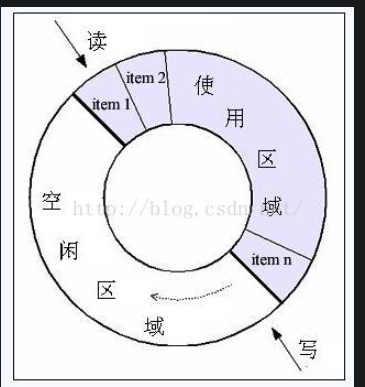
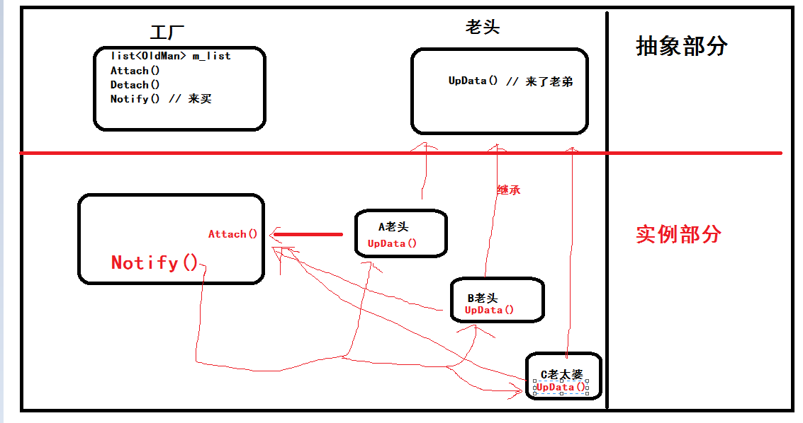
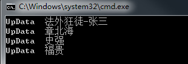

# 单例模式

鸭脖出场，单例模式的出现就是 因为这种情况  重庆A地有鸭脖厂，重庆B地有鸭脖厂，好家伙，都是给重庆人吃的，那配方肯定一样咯，辣辣辣辣就完事了，所以，这就有一个问题，如果配方一样，我没必要A，B两个地方都留一个啊，浪费吗这不是。浪费可耻~~~~

因此，单例 应运而生：**就是所有的地方都采用一个配方**

简单吧，就TM这么简单啊，取个单例，就是闲的，显得高大上而已，嘿嘿，继续继续。

那么，还有一种情况，就是如果我 A地 和 B地 出厂了鸭脖后，好家伙，那些老头儿，老太说，你这鸭脖，不辣啊，不给力啊，吃了一口气不能上五楼啊，这时候，那就需要改配方了撒，如果 A，B两地同时都要改配方，那听谁的，A说，再加10斤魔鬼椒，B说，再加20斤辣死人不偿命椒，好家伙，听谁的。这时候，就需要让让这个配方暂时的只能一个地方去修改。

**所以，转换成代码来说**

第一种情况，**单线程**，大家都只是看，而不改配方。因为全局就一个吗，所以静态咯。那么定义一个 静态的 `配方变量` ，当然，`public ` `private`都可以，这种情况。当然，c++吗，继承，封装，多态，高大上气氛要搞起来，还是定义  `private`咯，再搞一个外部接口访问。所以，代码如下：

~~~c#
    class SignalThreadSingleton
    {
        // 定义一个静态变量来保存类的实例
        // 配方
        private static SignalThreadSingleton uniqueInstance;

        // 定义私有构造函数，使外界不能创建该类实例
        // 只能我这里创建配方，你外界不能创建
        private SignalThreadSingleton(){}

        /// 给你外界访问的接口
        public static SignalThreadSingleton GetInstance()
        {
            // 如果类的实例不存在则创建，否则直接返回
            if (uniqueInstance == null)
            {
                uniqueInstance = new SignalThreadSingleton();
            }
            return uniqueInstance;
        }
    }
~~~

上面的代码，就是单线程的访问，当你同时要修改的时候，好家伙，那就不行了，相当于多线程，这时候就需要暂时锁一下`配方咯`，我 A 修改的时候，你 B 想访问，想修改，给我等着。

所以，第二种，**多线程**的就出来咯，这里比上面多了一个  `locker`，就是为了在 A 访问的时候，B不能访问和修改撒。当然，这种情况也有缺点，如果，A 也是个老头，一会要找老花眼镜，一会要找笔的，啰啰嗦嗦的，半天没 new 配方（没 new 出来），那么 这时候 B 这时候就可以 new 咯，**浪费可耻！！！！！once again~~~** 好家伙，口号叫错了，**多吃可耻**，这时候， B 也 new 了一个配方， B new 完后，A 又 new 出来了，好家伙，多了多了，爆炸了，爆炸了，仍然，口号喊起来，，**浪费可耻！！！！！浪费可耻！！！！！浪费可耻！！！！！**，所以，这种代码还是有问题的。

~~~c#
    class MultiThreadSingleton
    {

        // 定义一个静态变量来保存类的实例
        private static MultiThreadSingleton uniqueInstance;

        // 定义一个标识确保线程同步
        private static readonly object locker = new object();

        // 定义私有构造函数，使外界不能创建该类实例
        private MultiThreadSingleton(){}
        
        // 外部接口
        public static MultiThreadSingleton GetInstance()
        {
            // 当第一个线程运行到这里时，此时会对locker对象 "加锁"，
            // 当第二个线程运行该方法时，首先检测到locker对象为"加锁"状态，该线程就会挂起等待第一个线程解锁
            // lock语句运行完之后（即线程运行完之后）会对该对象"解锁"
            lock (locker)
            {
                // 如果类的实例不存在则创建，否则直接返回
                if (uniqueInstance == null)
                {
                    uniqueInstance = new MultiThreadSingleton();
                }
            }
            return uniqueInstance;
        }
    }
~~~

所以，第三种情况的就出来咯，更好的一种产生配方的方式 ，当我判定还没配方的时候，嘿嘿，我把房间锁起来，你B进不来，没办法了吧，管我啰啰嗦嗦，还是刷 8 季权游，只有等我 出来了，你才能进来，进来一看，好家伙，已经有配方了，回去吧孩子。

~~~c#
    class MultiThreadBetterSingleton
    {
        // 定义一个静态变量来保存类的实例
        private static MultiThreadBetterSingleton uniqueInstance;
        
        // 定义一个标识确保线程同步
        private static readonly object locker = new object();
        
        // 定义私有构造函数，使外界不能创建该类实例
        private MultiThreadBetterSingleton(){}
        
        /// 

        /// 定义公有方法提供一个全局访问点,同时你也可以定义公有属性来提供全局访问点
        /// 

        /// <returns></returns>
        public static MultiThreadBetterSingleton GetInstance()
        {
            // 当第一个线程运行到这里时，此时会对locker对象 "加锁"，
            // 当第二个线程运行该方法时，首先检测到locker对象为"加锁"状态，该线程就会挂起等待第一个线程解锁
            // lock语句运行完之后（即线程运行完之后）会对该对象"解锁"
            // 双重锁定只需要一句判断就可以了
            if (uniqueInstance == null)
            {
                lock (locker)
                {
                    // 如果类的实例不存在则创建，否则直接返回
                    if (uniqueInstance == null)
                    {
                        uniqueInstance = new MultiThreadBetterSingleton();
                    }
                }
            }
            return uniqueInstance;
        }
    }
~~~

# 简单工厂模式

## 实际问题

鸭脖出厂，当当当当  ，在属于我的 `BGM`里面，无人可挡。

现在，有这样一个情况：A 工厂生产 辣辣鸭脖给  法外狂徒张三吃，B工厂生产辣辣辣鸭脖给皮城女警吃，C工厂生产辣辣辣辣鸭脖当然给盲僧吃啦，那么这时候，法外狂徒想吃辣辣辣鸭脖咋办，只有去修改 A 工厂的生产配方咯。所以，这就有问题咯，万一有一万个 法外狂徒，有的要 辣辣辣鸭脖。有的不要鸭脖，还想要刘亦菲，这过分了😡啊，串场了啊你，那就只能一个一个的去修改，就要修改一万次配方，所以这个时候，有又应运而生一个模式，简单工厂模式。

鸭脖，我专门开一个工厂，你给我工厂说，你要吃什么鸭脖，没有枪没有炮，我来给你们造，我们生长在这里，每一寸土地都是我们自己的，好家伙，又串场了，收回来。

## 分析：

> M：辣辣鸭脖，辣辣辣鸭脖，辣辣辣辣鸭脖共同特点是什么
>
> N：辣
>
> M：拉出去，做鸭脖~~~
>
> N：嘿嘿，开个玩笑，是鸭脖

所以，鸭脖的共同特点，就是开厂的理由，鸭脖是共同的啊，所以，鸭脖抽出来。

那么，辣辣鸭脖，辣辣辣鸭脖，辣辣辣辣鸭脖都是他的一个小弟弟。

所以工厂做什么，工厂就根据鸭脖类型，生产鸭脖咯。

## 代码：

~~~c++
	static void Main(string[] args)
	{
        // 客户 辣辣辣鸭脖        
        Food food1 = FoodSimpleFactory.CreateFood("辣辣辣鸭脖");
       	food1.Print();

        // 客户想点 辣辣辣辣辣鸭脖
        Food food2 = FoodSimpleFactory.CreateFood("辣辣辣辣辣鸭脖");
        food2.Print();

        Console.Read();
	}    

    /// 

    /// 菜抽象类
    /// 

    public abstract class Food
    {
        // 输出点了什么菜
        public abstract void Print();
    }

    public class LLLLLDuckNeck : Food
    {
        public override void Print()
        {
            Console.WriteLine("辣辣辣辣辣鸭脖！");
        }
    }

    public class LLLDuckNeck : Food
    {
        public override void Print()
        {
            Console.WriteLine("辣辣辣鸭脖");
        }
    }

    /// 

    /// 简单工厂类
    /// 

    public class FoodSimpleFactory
    {
        public static Food CreateFood(string type)
        {
            Food food = null;
            if (type.Equals("辣辣辣辣辣鸭脖"))
            {
                food = new LLLLLDuckNeck();
            }
            else if (type.Equals("辣辣辣鸭脖"))
            {
                food = new LLLDuckNeck();
            }

            return food;
        }
    }
~~~

## 优缺点：

**优点：**

* 降低了客户端直接依赖具体对象的问题。好比，张三和辣辣辣鸭脖，这是直接关系，辣辣辣鸭脖就是张三的特供，其他人不能吃，其他人要吃这个口味，只有自己再建立一个工厂，生产辣辣辣鸭脖才行。就好比每个人都要再写一次代码。
* 起到了代码复用的作用。好比，我张三李四王麻子都想吃辣辣辣鸭脖，那么，只需把辣辣辣鸭脖告诉工厂，三个老头都可以吃了，不用再写两遍代码了。

**缺点：**

* 不方便扩展啊，**闭合闭合闭合**，当然，这也不能太死板，你小系统的时候，就可以采用吗。一旦扩展，就需要去修改工厂类里面的静态 `Create***`函数。
* 一旦工厂类错了，好家伙，全部停工，三老头提前和上帝打麻将。

## 应用场景：

当工厂不是很复杂的时候，也就是鸭脖种类并不多，三五老头只吃这三五种鸭脖，那么就可以考虑这个简单工厂模式，简单吗，方便吗~~~

但是缺点也是我们不能忽略的问题，所以为了解决这个问题，那些仙人板板们就提出来了一种更高级别点的模式：工厂模式。

# 工厂模式

## 实际问题

现在我大鸭脖种类生产越来越多了。工厂车间又老化，随时可能出现断电，跳闸等拉跨事件。我上面一个工厂的生产方式，就有问题了，**一个停电，可能导致全村没鸭脖吃**，到时候，老头又要抗议了：垃圾工厂，毁我青春，还我鸭脖。。。。

## 分析

为了预防这种，一厂停电，全村饿死的情况，我多开几个厂呗，反正开厂的生产步骤都一样，那么这里就可以**抽象出来**。要什么味道的鸭脖，就在什么类型的厂去叫他生产就行了，就是专场专鸭脖。

所以，千呼万唤始出来--->

## 代码

~~~c++
namespace Factory
{
    /// 

    /// 菜抽象类
    /// 

    public abstract class Food
    {
        // 输出点了什么菜
        public abstract void Print();
    }

    public class LLLLLDuckNeck : Food
    {
        public override void Print()
        {
            Console.WriteLine("辣辣辣辣辣鸭脖！");
        }
    }

    public class LLLDuckNeck : Food
    {
        public override void Print()
        {
            Console.WriteLine("辣辣辣鸭脖");
        }
    }

    /// 

    /// 抽象工厂类
    /// 

    public abstract class Creator
    {
        // 工厂方法
        public abstract Food CreateFoddFactory();
    }

    public class LLLDuckNeckFactory:Creator
    {
        public override Food CreateFoddFactory()
        {
            return new LLLDuckNeck();
        }
    }

    public class LLLLLDuckNeckFactory:Creator
    {
        public override Food CreateFoddFactory()
        {
            return new LLLLLDuckNeck();
        }
    }

    class Client
    {
        static void Main(string[] args)
        {
            // 初始化做鸭脖的两个工厂（）
            Creator lLLLDuckNeckFactory = new LLLLLDuckNeckFactory();
            Creator lLLDuckNeckFactory = new LLLDuckNeckFactory();

            Food lLLLLDuckNeck = lLLLLDuckNeckFactory.CreateFoddFactory();
            lLLLLDuckNeck.Print();

            Food lLLDuckNeck = lLLDuckNeckFactory.CreateFoddFactory();
            lLLDuckNeck.Print();

            Console.Read();
        }
    }  
}
~~~

## 优缺点：

**优点：**

* 解决了在种类较多的时候不好扩展的问题：现在要如果要加口味的鸭脖，只需自己再创建一个继承自工厂和继承自鸭脖的类，并重写一下。这样原来的代码就不用改咯。

**缺点：**

* 工厂逐渐变多，代码逐渐变多，老头逐渐变高兴。

> 在工厂方法模式中，工厂类与具体产品类具有平行的等级结构，它们之间是一一对应的 
>
> Creator类：充当抽象工厂角色，任何具体工厂都必须继承该抽象类 
>
> `LLLLLDuckNeck`和`LLLDuckNeck`类：充当具体工厂角色，用来创建具体产品
>
> Food类：充当抽象产品角色，具体产品的抽象类。任何具体产品都应该继承该类 
>
> `LLLLLDuckNeck`和`LLLDuckNeck`类：充当具体产品角色，实现抽象产品类对定义的抽象方法，由具体工厂类创建，它们之间有一一对应的关系。

## 应用场景

在客户只是知道我要生产鸭脖，但是不知道我要生产什么种类的鸭脖的时候，至于怎么生产，先放辣椒，先放盐，这是你具体工厂的事情，我总的流程是不改变的。

# 抽象工厂模式

## 实际问题：

上面的工厂模式，已经很不错了，每个工厂，生产每种产品，但仔细一想，好像又很拉跨，为什么也，一个工厂生产一种产品，那不是扯淡么？浪费土地资源，好歹咱也是 21 世纪先进青年，怎么能这样搞也。至少，每个工厂生产2种鸭脖。老头狂喜~~~~~~

## 分析

既然浪费土地，每个工厂不建议只生产一种，那咱就，多增加种类，超大杯辣辣辣鸭脖，大杯辣辣辣鸭脖，中杯辣辣辣鸭脖。同样，你具体到 地方的鸭脖生产厂，想生产什么类型的鸭脖，继承去实现就可以了。比如，重庆的只要超大杯和大杯，南京的只要中杯，那就分别实现就行了。

## 代码

~~~c++
/// 

    /// 因为每个地方的喜欢的口味不一样，有些地方喜欢辣点的，有些地方喜欢吃不辣点
    /// 客户端调用
    /// 

    class Client
    {
        static void Main(string[] args)
        {
            AbstractFactory nanChangFactory = new NanChangFactory();
            YaBo nanChangYabo = nanChangFactory.CreateYaBo();
            nanChangYabo.Print();
            YaJia nanChangYajia= nanChangFactory.CreateYaJia();
            nanChangYajia.Print();

            // 上海工厂制作上海的鸭脖和鸭架
            AbstractFactory shangHaiFactory = new ShangHaiFactory();
            shangHaiFactory.CreateYaBo().Print();
            shangHaiFactory.CreateYaJia().Print();

            Console.Read();
        }
    }

    /// 

    /// 抽象工厂类，提供创建两个不同地方的鸭架和鸭脖的接口
    /// 

    public abstract class AbstractFactory
    {
        // 抽象工厂提供创建一系列产品的接口，这里作为例子，只给出了绝味中鸭脖和鸭架的创建接口
        public abstract YaBo CreateYaBo();
        public abstract YaJia CreateYaJia();
    }

    /// 

    /// 南昌绝味工厂负责制作南昌的鸭脖和鸭架
    /// 

    public class NanChangFactory : AbstractFactory
    {
        // 制作南昌鸭脖
        public override YaBo CreateYaBo()
        {
            return new NanChangYaBo();
        }
        // 制作南昌鸭架
        public override YaJia CreateYaJia()
        {
            return new NanChangYaJia();
        }
    }

    /// 

    /// 上海绝味工厂负责制作上海的鸭脖和鸭架
    /// 

    public class ShangHaiFactory : AbstractFactory
    {
        // 制作上海鸭脖
        public override YaBo CreateYaBo()
        {
            return new ShangHaiYaBo();
        }
        // 制作上海鸭架
        public override YaJia CreateYaJia()
        {
            return new ShangHaiYaJia();
        }
    }

    /// 

    /// 鸭脖抽象类，供每个地方的鸭脖类继承
    /// 

    public abstract class YaBo
    {
        /// 

        /// 打印方法，用于输出信息
        /// 

        public abstract void Print();
    }

    /// 

    /// 鸭架抽象类，供每个地方的鸭架类继承
    /// 

    public abstract class YaJia
    {
        /// 

        /// 打印方法，用于输出信息
        /// 

        public abstract void Print();
    }

    /// 

    /// 南昌的鸭脖类，因为江西人喜欢吃辣的，所以南昌的鸭脖稍微会比上海做的辣
    /// 

    public class NanChangYaBo : YaBo
    {
        public override void Print()
        {
            Console.WriteLine("南昌的鸭脖");
        }
    }

    /// 

    /// 上海的鸭脖没有南昌的鸭脖做的辣
    /// 

    public class ShangHaiYaBo : YaBo
    {
        public override void Print()
        {
            Console.WriteLine("上海的鸭脖");
        }
    }

    /// 

    /// 南昌的鸭架
    /// 

    public class NanChangYaJia : YaJia
    {
        public override void Print()
        {
            Console.WriteLine("南昌的鸭架子");
        }
    }

    /// 

    /// 上海的鸭架
    /// 

    public class ShangHaiYaJia : YaJia
    {
        public override void Print()
        {
            Console.WriteLine("上海的鸭架子");
        }
    }
~~~

## 总结：

其实就是抽象了工厂，在抽象工厂里面多定了了虚接口，其他实例工厂，去相应的实现，相比工厂模式，把工厂抽象了。

# 生产者消费者

## 实际问题

生产者生成数据，消费者消费数据，再拿鸭脖举例子。

比如，A 生产鸭脖，B，C，D 吃鸭脖，A 生产一个，B，C，D就需要吃一个鸭脖。假设 A 要生产100个。

如果 A生产贼快， B，C，D都是些老头儿老太太，啃不动鸭脖，那么 A 生产完第三个鸭脖的时候，就需要等待 B  C D啃完鸭脖再去生产了，因为生产了没人吃，所以就不能生产了。

那么，这时候就可以在中间放一个桶，A生产完了就往桶里面放，才不去管 B，C，D吃得慢不慢，啃得动不动。B，C，D吃完了就去桶里面再拿一个，你吃着火锅唱着歌都不管我 A 的事情，我只管生产我的。我生产完了，我也去刷权游了。

所以，这就抽象出一个蓝图

## 数据单元

此例子中就是**鸭脖**，在分析 数据单元 的时候，需要考虑下面的特性。

* **必须关联到某种逻辑。**

  > 此例中，鸭脖必须有人生产，有人吃，这才像话，没人生产，没人吃，生产有毛用啊

* **完整性**

  > 在传输过程中，要保证数据单元的完整，要么整个拿来吃，要不就不要拿，不允许你说拿半截鸭脖。

* **独立性**

  > 就是各个鸭脖之间没有依赖，鸭脖1坏了没有被吃不能影响鸭脖2被吃。当然，也不能影响鸭脖3号的生产。如果鸭脖没砍断（有依赖） 那么， 1号鸭脖快了就会影响 2号鸭脖的被吃，当然就会影响到 3号鸭脖的生产。这样也是不行的，所以需要相互独立。

* **颗粒性**

  > 有时候，会把 N 个数据单元打包 给一个逻辑处理，好比， B 一次可以拿 2 个鸭脖，那么这个考虑就需要 N 的设置大小了，如果 N 太大，一次拿 10 个，B老头吃都吃不下，嗝屁了咋办。一次嘴巴里面嚼两个还是可以的，那么就把这个颗粒性设置为 2。

## 缓冲区

### 优点

* **解耦**

  生产者 A 和 消费者 B，C，D 不需要知道之间的关系，就那上面的说，就是，不管你吃得慢不慢，快不快，不关我事。嘿嘿。

  > 转换到代码中：
  >
  > 就好比 A是一个类，B，C，D分别是一个类，你 B C D 有什么更改，我 A 不需要知道。就好比下面代码，你 B C D 以后将 `void GetFromBuffer()`更改为 `void GetFromBuffer1()` 我 A 不需要知道，我只管 `ToBuffer()`就行了。
  >
  > ~~~c++
  > class A
  > {
  > 	void ToBuffer(); 
  > };
  > class B
  > {
  > 	void GetFromBuffer();
  > 	void GetFromBuffer1();  
  > };
  > class C
  > {
  > 	void GetFromBuffer();  
  > };
  > class D
  > {
  > 	void GetFromBuffer();  
  > };
  > ~~~

* **支持并发**

  上述已经说了，如果没有缓冲区，那么 A需要直接调用 B C D的接口，那么在多线程的时候，如果A 生产贼快， B C D 贼慢，那么 A就要去等待，所以这个时间就浪费了。所以，增加缓冲区，就可以让 A 不依赖 B C D，直接继续生产。

* **支持闲忙不均**

  如果 A 快， B，C，D 慢那么，就可以将多生产的鸭脖放在桶里面了。

### 缓冲区方式

#### 队列缓冲区

好比一个水管

##### 线程方式

优缺点

* 内存分配的性能

  > A，B，C，D都是线程，A 生产了鸭脖，就把往水管里面放，B，C，D就从队列中拿出来，如果队列满了，A 就休息一哈，等B，C，D这几个老头儿老太太啃完了来再生产。
  >
  > 上述过程有一个问题就是，对于常见的队列，每次 push 的时候，就会涉及到内存堆的分配，每次 pop 的时候，会涉及到内存的释放。假如 A , B，C，D都很快，那么频繁的内存分配和释放开销就会很大。（ 分配堆内存（new或malloc）会有加锁的开销和用户态／核心态切换的开销。 ）	

* 同步和互斥的性能

  > 如果 B，C，D 都用同一个队列，那么可能会涉及线程间的同步，互斥，死锁等让人变得更强的问题（秃头），

* 适用队列的场合

  > 上面都是队列的缺点，优点就是 **不用造轮子** 可以捡现成的使用，如果在数据量不大的情况下，那么可以采用。主要还是方便。

##### 进程方式

跨进程的生产者和消费者就需要靠进程间通信（`IPC`）了。

* 匿名管道

  > 生产者生产，往管道里面丢，消费者去取就行了，这个和线程的区别就在于，不需要我们去操心线程安全和内存分配等问题。
  >
  > 生产者进程和消费者进程必须得在同一台主机上，无法跨机器通讯。
  >
  > 在一对一的情况下，这种方式挺合用。但如果要扩展到一对多或者多对一，那就有点棘手了。 
  >
  > 由于管道是shell创建的，对于两边的进程不可见（程序看到的只是stdio）。在某些情况下，导致程序不便于对管道进行操纵（比如调整管道缓冲区尺寸）。这个缺点不太明显。 
  >
  > 这种方式只能单向传数据。好在大多数情况下，消费者进程不需要传数据给生产者进程。万一你确实需要信息反馈（从消费者到生产者），那就费劲了。可能得考虑换种`IPC`方式。 

* SOCKET（TCP方式）

  > 可跨机器，那么就可以实现分布式，比如，重庆，南京（主机）都建一个厂，上海，北京（主机）的老头都可以吃。
  >
  > 可扩展成 一对多，或者多对一的方式，比如重庆，南京的厂，都往北京运，或者 重庆的厂发往上海和北京。
  >
  > 也可以设置阻塞或者非阻塞。
  >
  > 支持双向通信，比如重庆，南京的厂，都往北京运后，北京老头说你这个太辣了，给我弄个芝麻酱味道的，那重庆的可能没办法（兽人永不为奴，辣椒永不离嘴），南京的生产下一批的时候就可以给北京的弄麻将味道的。
  >
  >  
  >
  > 虽然 TCP 还是不错的，但是跨服聊天，总有想不到的事情，比如，妈老汉拔你网线？？？？？？所以，这时候我TM就裂了啊，没问题，这时候就需要新的对策。我在本地存储一下下，嘿嘿。发现发不上去了，检查网线有毛病了，我去把网线插上，再发送给北京老头。完美~~~~
  >
  > 所以抽象蓝图就可以这样
  >
  > 
  >
  > 再建立一个发送线程，从本地缓冲区拿数据。本地缓冲区就可以是本地的数据库啊这些了撒，**就好比离线操作，上线的时候再同步。**

#### 环形缓冲区

普通队列。一端写入  push 一端写出  pop。队列空的时候，不能读取数据。队列满时，不能写入。环形缓冲区外部使用也一样，内部就不同了，突出在  环 。

所以，可以想成一个操场，警察 追 法外狂徒张三，当 P 追上 Z 的时候，就把抓到了，那就没有坏人抓了，就相当于空了，如果，Z 都追上（增加Z） P 了，那么操场上就全是坏人了。就相当于缓冲区满了。

所以，这里相对于队列缓冲区的优势就出来了：

鸭脖和鸭脖的大小空间相等，那么鸭脖1号被吃了，鸭脖2号就可以占鸭脖一号的坑。不用在申请一块空间去放鸭脖2号了。少了很多缓冲区元素控件的释放和分配。

# 观察者模式

这几个是比较常用的

什么是观察者模式拉？？？？？？？？   观察：就是一双眼睛盯着你~~~哈哈哈哈，被老大哥支配的恐惧。

鸭脖，鸭脖，鸭脖出厂~~~，当当当当，好久没更新了，有点点激动~先看问题

## 实际问题：

​		A 厂现在生产了鸭脖，没下家，那我就只能堆在那里，没办法啊，没电话，没手机的，通知不了人啊。过两天就会腐烂，那几个老头万一过两天再来买，因为他也怕还没有生产好啊，万一去了，大热天的白跑一趟，那不是，划不来，本来一把老骨头了，吃鸭脖都坏两牙齿，还跑这么远，那受不了，受不了。

## 分析

​		所以，怎么办咧~厂长就想到一个办法咯，你老头来一次，你给我留个电话，到时候好了我就通知你，你过来买，你这个电话就相当于监视我。只是要我主动给你打电话而已，小问题拉，三块五毛二的话费了，只要你们吃得开心，什么都好说啦~

​		辣，问题就是这么个问题，简单把。

### 设计

大概就是这个形象了，每个老头刚开始（`Init()`）就给工厂说(`Attach()`)，我要吃你家鸭脖，弄好了给我打电话（`Notify()`），我就来买（`UpData()`）

###  

## 代码

### 执行结果

### 代码

~~~C#
using System;
using System.Collections.Generic;

namespace ObserverPattern
{

    public class AbstractYaboFactory
    {
        public void Notify()
        {
            foreach (AbstractOldMan man in m_PersonList)
            {
                man.UpData();
            }
        }
        public void Dttach(AbstractOldMan man) { m_PersonList.Remove(man); }

        public void Attach(AbstractOldMan man) { m_PersonList.Add(man); }

        private List<AbstractOldMan> m_PersonList = new List<AbstractOldMan>();
    }

    public class AbstractOldMan
    {
        public virtual void UpData() { }
    }

    public class OldMan : AbstractOldMan
    {
        public OldMan(string strName) { m_strOldManName = strName; }

        override public void UpData()
        {
            Console.WriteLine("UpData  " + m_strOldManName);
        }

        private string m_strOldManName;
    }

    class Program
    {
        static void Main(string[] args)
        {

            OldMan oldMan_A = new OldMan("法外狂徒-张三");
            OldMan oldMan_B = new OldMan("章北海");
            OldMan oldMan_C = new OldMan("史强");
            OldMan oldMan_D = new OldMan("福贵");

            AbstractYaboFactory yaboFactory = new AbstractYaboFactory();
            yaboFactory.Attach(oldMan_A);
            yaboFactory.Attach(oldMan_B);
            yaboFactory.Attach(oldMan_C);
            yaboFactory.Attach(oldMan_D);

            yaboFactory.Notify();

            Console.ReadLine();
        }
    }
}
~~~

## 使用场景

- 当一个抽象模型有两个方面，其中一个方面依赖于另一个方面，将这两者封装在独立的对象中以使它们可以各自独立地改变和复用的情况下。从方面的这个词中可以想到，观察者模式肯定在`AOP`（面向方面编程）中有所体现。
- 当对一个对象的改变需要同时改变其他对象，而又不知道具体有多少对象有待改变的情况下。
- 当一个对象必须通知其他对象，而又不能假定其他对象是谁的情况下。

## 优缺点

### 优点

- 观察者模式实现了表示层和数据逻辑层的分离，并定义了稳定的更新消息传递机制，并抽象了更新接口，使得可以有各种各样不同的表示层，即观察者。
- 观察者模式在被观察者和观察者之间建立了一个抽象的耦合，被观察者并不知道任何一个具体的观察者，只是保存着抽象观察者的列表，每个具体观察者都符合一个抽象观察者的接口。
- 观察者模式支持广播通信。被观察者会向所有的注册过的观察者发出通知。

### 缺点

- 如果一个被观察者有很多直接和间接的观察者时，将所有的观察者都通知到会花费很多时间。
- 虽然观察者模式可以随时使观察者知道所观察的对象发送了变化，但是观察者模式没有相应的机制使观察者知道所观察的对象是怎样发生变化的。
- **如果在被观察者之间有循环依赖的话，被观察者会触发它们之间进行循环调用，导致系统崩溃，在使用观察者模式应特别注意这点。**