# LearnOpenCV3

这次采用 Qt 来学习。

## 环境配置

首先免不了的一步就是环境配置了，我这里下载了一个编译好的 opencv 库

这里感谢：https://github.com/huihut/OpenCV-MinGW-Build

**添加环境变量：**

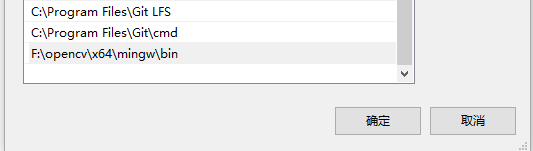

**库文件所在目录：**

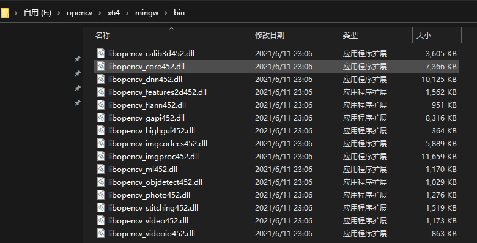

**修改 pro 文件：**

~~~perl
# $$PWD 当前文件所在路径
INCLUDEPATH += $$PWD/../opencv \
                $$PWD/../opencv/opencv2

LIBS += $$PWD/../opencv/x64/mingw/bin/libopencv_*.dll
~~~

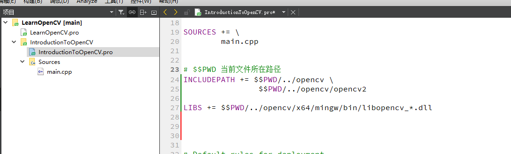

**头文件所在目录：**

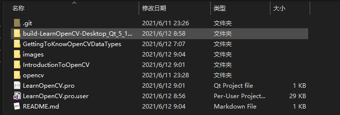

**添加头文件：**

~~~c++
#include <opencv2/opencv.hpp>
~~~

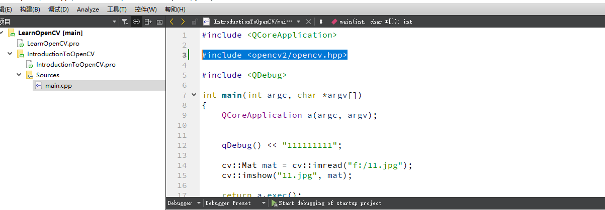

**说明：**

`#include <opencv2/opencv.hpp> //Include file for every supported OpenCV function`

好，开打开打（来自武器大师的配音）

## Chatper02. Introduction to OpenCV

### **First Program—Display a Picture**

~~~c++
#include <opencv2/opencv.hpp> //Include file for every supported OpenCV function

void DisplayPicture()
{
    cv::Mat mat = cv::imread("../lena.jpg");

    if( mat.empty() )
        return;

    cv::imshow("lena", mat);
}
~~~

`imread` 说明：

> Including BMP, DIB, JPEG, JPE, PNG, PBM, PGM, PPM, SR, RAS, and TIFF. 
>
> OpenCV uses this structure to handle all kinds of images: single-channel, multichannel, integer-valued, floating-point-valued, and so on. 

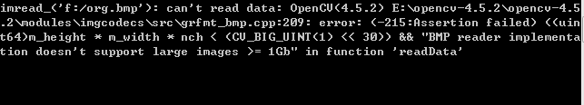

### **Second Program—Video**

Playing a video with OpenCV is almost as easy as displaying a single picture. 

just loop to read each frame in sequence;

我这里没有 *ffmpeg.dll*，所以暂时先不看 video的

~~~c++
void PlayVideo( const char* szPath )
{
    cv::VideoCapture cap;
    cap.open(szPath);

    cv::Mat frame;
    for(; ; )
    {
        cap >> frame;
        if( frame.empty() )
            continue;

        cv::imshow(szPath, frame);

        // 等待 33ms 没按键开始下一帧
        if(cv::waitKey(33) >= 0)
            break;
    }
}
~~~

## Chatper03.  Getting to Know OpenCV Data Types

In addition to these types, OpenCV also makes heavy use of the *Standard Template* *Library* (STL). OpenCV particularly relies on the vector class, and many OpenCV library functions now have vector template objects in their argument lists. We will not cover STL in this book,1 other than as necessary to explain relevant functionality. If you are already comfortable with STL, many of the template mechanisms used “under the hood” in OpenCV will be familiar to you. 

使用了标准模板库(STL)。OpenCV特别依赖于向量类，许多OpenCV库函数现在的参数列表中都有向量模板对象。

这些都很基础了，存档，跳过，不适合我们这种高端玩家。

### **The point classes**

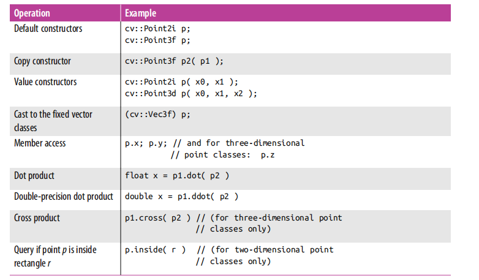

### **The size classes** 

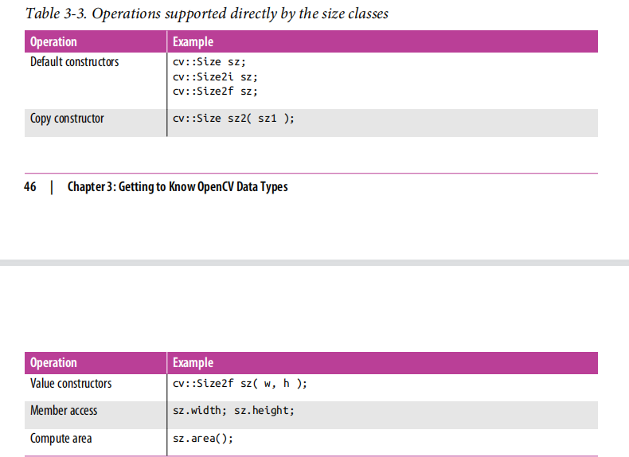

### **The cv::Rect class**

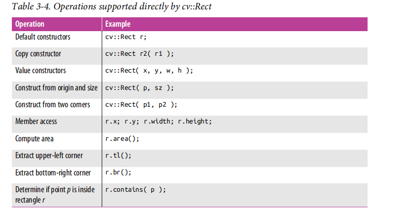

### **The cv::RotatedRect class**

The cv::RotatedRect class is one of the few classes in the C++ OpenCV interface that is not a template underneath. Instead, it is a container that holds a cv::Point2f called center, a cv::Size2f called size, and one additional float called angle, with the latter representing the rotation of the rectangle around center. One very impor‐ tant difference between cv::RotatedRect and cv::Rect is the convention that a cv::RotatedRect is located in “space” relative to its center, while the cv::Rect is located relative to its upper-left corner. Table 3-6 lists the operations that are sup‐ ported directly by cv::RotatedRect. 

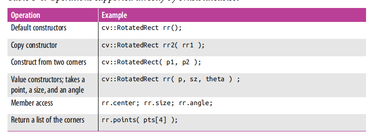

#### 源码s

~~~c++
class CV_EXPORTS RotatedRect
{
public:
    //构造函数
    RotatedRect();
    RotatedRect(const Point2f& center, const Size2f& size, float angle);
    RotatedRect(const CvBox2D& box);
    void points(Point2f pts[]) const;//!返回矩形的4个顶点
    Rect boundingRect() const; //返回包含旋转矩形的最小矩形
    operator CvBox2D() const;    //!转换到旧式的cvbox2d结构
    Point2f center; //矩形的质心
    Size2f size;   //矩形的边长
    float angle;  //旋转角度，当角度为0、90、180、270等时，矩形就成了一个直立的矩形
};
~~~

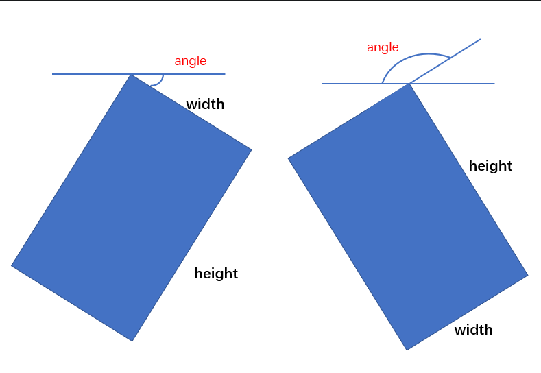

### **The fixed matrix classes** 

 all memory for their data is allocated **on the stack,**

当需要使用固定大小的矩阵的时候，最好是使用这个，栈上分配，这个使用很快。

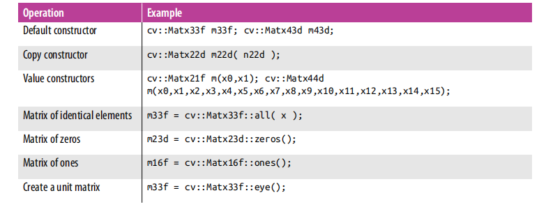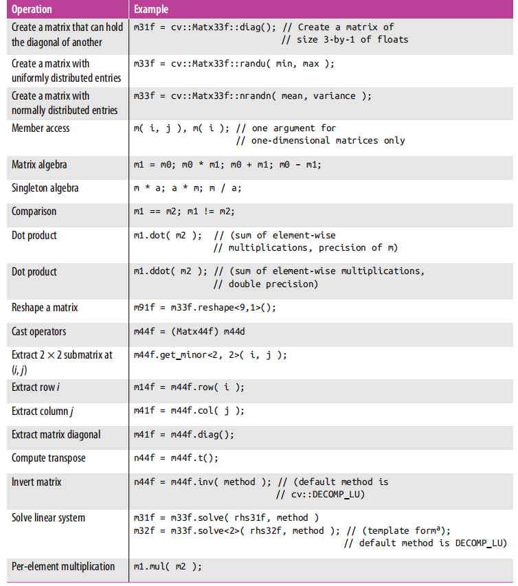

### **The fixed vector classes**

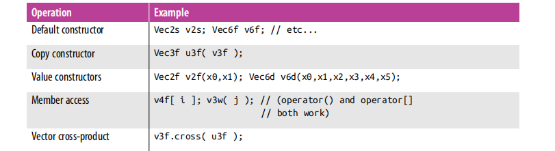

### **The complex number classes**

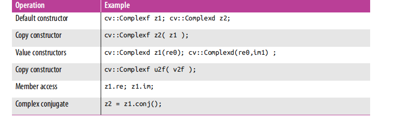

### **Helper Objects**

一些算法上的辅助对象

#### **The cv::TermCriteria class** 

结束标志

**The cv::Range class**

指定一个整数数列，左闭右开

#### **The cv::Ptr template and Garbage Collection 101**

一个智能指针，就是添加引用计数，当为 0 的时候就删除。

### cv::vect<>`

最简单的就是 `cv::Vec<>` ，当然这个和 `stl::vector` 最大区别的地方就在于

>  The key difference is that the fixed vector classes are intended for small vectors whose dimensions are known at compile time. （编译时就知道最小大小）

### `cv::Matx<>`

Just like the fixed vector classes, cv::Matx<> is not intended to be used for large arrays, but rather is designed for the handling of certain specific small matrix operations. 

对于小型的数据是很不错的选择，比如 2\*2  3\*3 这种矩阵，但是必须在编译的时候就要知道大小。

### `cv::Scalar `

相当于一个四维的点

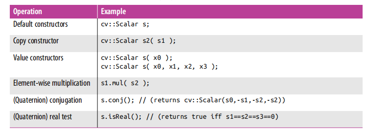

## Chapter04-Images And Large Array Types

opencv大型数据结构  cv::Mat ，opencv 最常用的数据结构。

The cv::Mat class is used to represent *dense* arrays of any number of dimensions. In this context, dense means that for every entry in the array, there is a data value stored in memory corresponding to that entry, even if that entry is zero. Most images, for example, are stored as dense arrays. The alternative would be a *sparse* array. In the case of a sparse array, only nonzero entries are typically stored. This can result in a great savings of storage space if many of the entries are in fact zero, but can be very wasteful if the array is relatively dense. A common case for using a sparse array rather than a dense array would be a histogram. For many histograms, most of the entries are zero, and storing all those zeros is not necessary. For the case of sparse arrays, openCV has the alternative data structure, cv::SparseMat. 

cv::SparseMat：稀疏数组，存储非 0 的项，常见的，比如直方图，很多为 0，就不需要存储。

### **The cv::Mat Class: N-Dimensional Dense Arrays** 

可以被多维使用

The data array is laid out such that the address of an element whose indices are given by (*i*0, *i**i*, … , *i**N**d* −1) is:

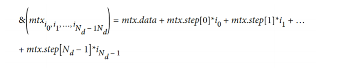

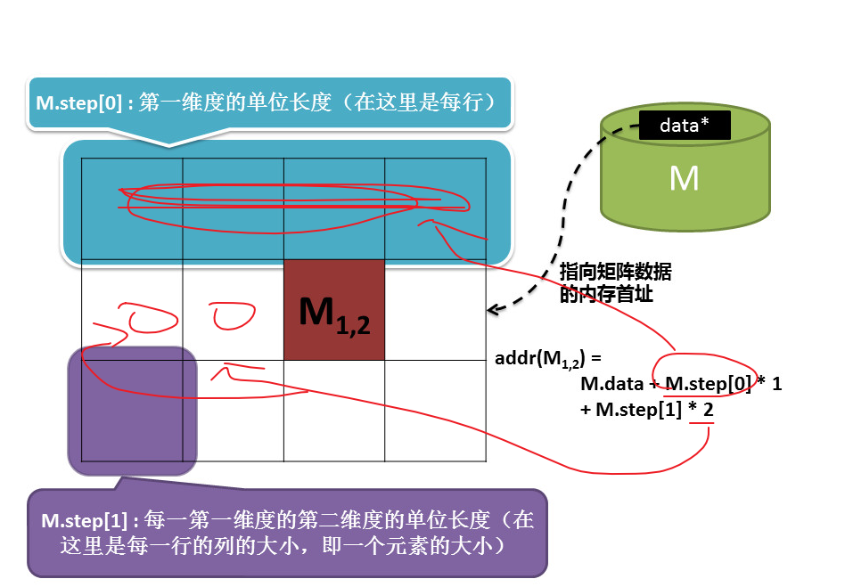

就相当于  w * 1 + 2 * elemsize 

### **Creating an Array** 

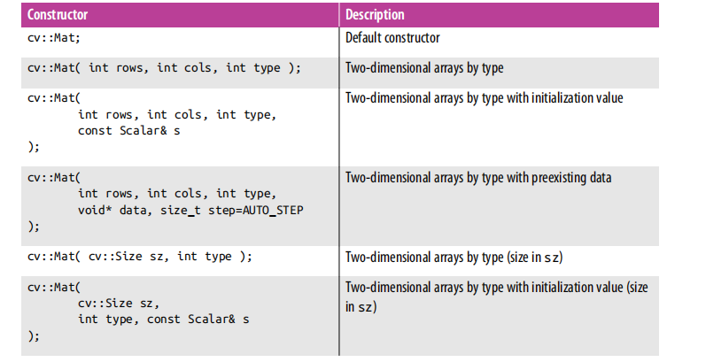

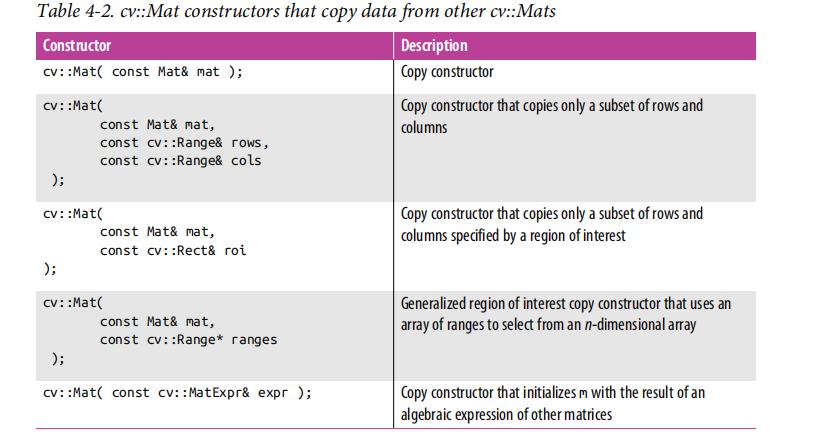

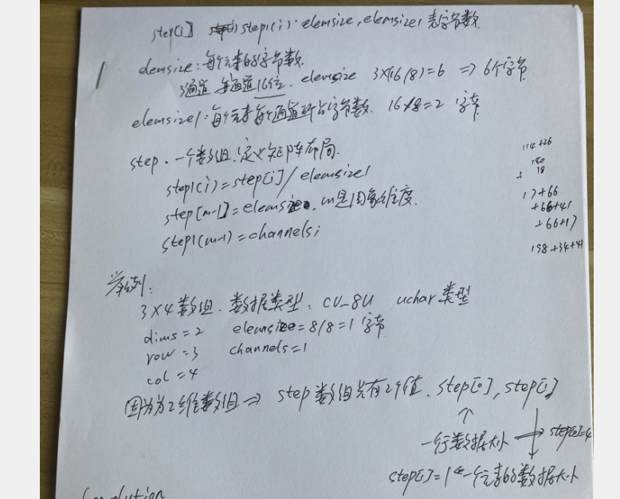

## Chapter08. Image, Video, and Data Files

OpenCV功能允许我们与操作系统、文件系统和摄像头等硬件进行交互，`HighGUI`模块（代表“高级图形用户界面”）。

HighGUI allows us to read and write graphics-related files (both images and video), to open and manage windows, to display images, and to handle imple mouse, pointer, and keyboard events. 

### **Loading and Saving Images**

#### **Reading files with cv::imread()**

函数原型：

~~~c++
cv::Mat cv::imread(
 	const string& filename, // Input filename
 	int flags = cv::IMREAD_COLOR // Flags set how to interpret file
);
~~~

When opening an image, cv::imread() doesn’t look at the file extension. Instead, it analyzes the first few bytes of the file (a.k.a. its *signature* or “magic sequence”) and determines the appropriate codec using that. 

并不依靠扩展名来读取，而是检测前几个字节来判定。

**第二个参数：**

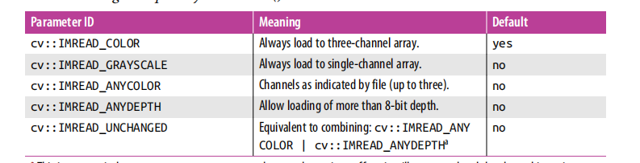

当加载的时候，并不会报运行错误，就好比没有文件，所以，要用 `Mat::empty()`来判定。

~~~c++
    cv::Mat mat = cv::imread(szPath);

    if( mat.empty() )
        return;

    cv::imshow(szPath, mat);
~~~

#### **Writing files with cv::imwrite()**

函数原型：

~~~c++
bool cv::imwrite(
 	const string& filename, // Input filename
 	cv::InputArray image, // Image to write to file
 	const vector<int>& params = vector<int>() // (Optional) for parameterized fmts
);
~~~

**第一个参数：**

​	这个文件的扩展名就有用了，就是文件的存储格式了 

​	常用的格式：

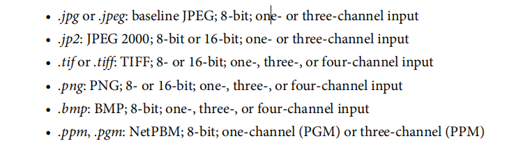

**第二个参数：**

​	图像的数据结构

**第三个参数：**

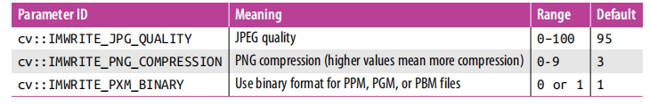

### **Compression and Decompression**

#### **Compressing files with cv::imencode()**

将图像压缩成一串字符，比如可以用来网络传输，这样就减少传输量

~~~c++
CV_EXPORTS_W bool imencode( const String& ext, InputArray img,
                            CV_OUT std::vector<uchar>& buf,
                            const std::vector<int>& params = std::vector<int>());
~~~

示例
~~~C++
// 读取压缩
std::vector<uchar> Compression(const char* szPath, const char* szExt)
{
    cv::Mat mat = cv::imread(szPath);

    //encode image
    std::vector<uchar> vEncode;
    cv::imencode(szExt, mat, vEncode);

    return vEncode;
}
//解压
cv::Mat Decompression(std::vector<uchar> vData)
{
    return cv::imdecode(vData,  cv::IMREAD_COLOR);
}
~~~

## **Chapter10. Filters and Convolution**

### **Filters, Kernels, and Convolution** 

图像滤波器，主要就是做一个卷积运算。好比系列算子，左边的式子是表示为 核 `k` 与`I(x,y)`的加权和。 

In this chapter, many of the important kernels we encounter will be *linear kernels*. This means that the value assigned to point *x*, *y* in *I*′ can be expressed as a weighted sum of the points around (and usually including) *x*, *y* in *I*.2 If you like equations, this can be written as:

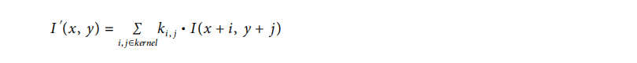

The template that defines both this small area’s shape, as well as how the elements of that small area are combined, is called a *filter* or a *kernel*.

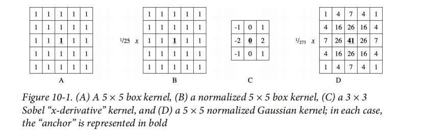

没定义锚点的情况下**中间的点就是 锚点**，如果定义了锚点，那么kernel也可以是偶数。

**Anchor points** 

Each kernel shown in Figure 10-1 has one value depicted in bold. This is the *anchor* *point* of the kernel. This indicates how the kernel is to be aligned with the source image. For example, in Figure 10-1(D), the number 41 appears in bold. This means that in the summation used to compute *I*′(*x*, *y*), it is *I*(*x*, *y*) that is multiplied by 41/273 (and similarly, the terms corresponding to *I*(*x* – 1, *y*) and *I*(*x* + 1, *y*) are multiplied by 26/273).

表示:权重   ==>  就相当于    41/ 273   就是 中间这个点的值 / 所有的值相加；

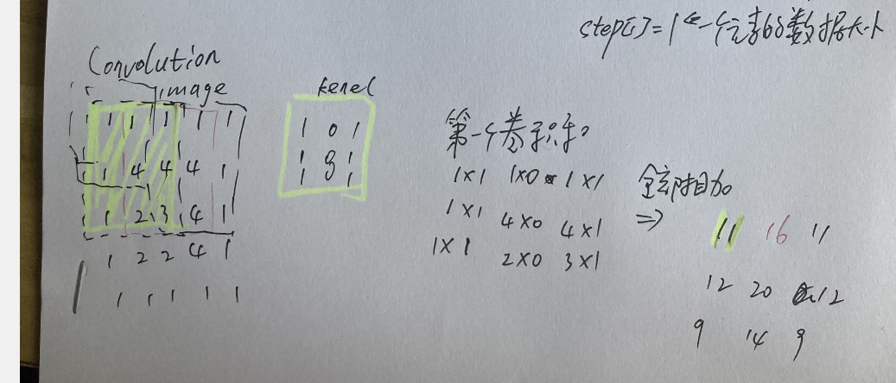

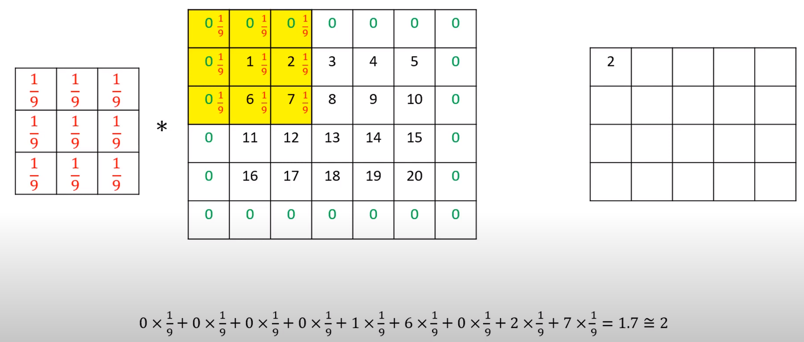

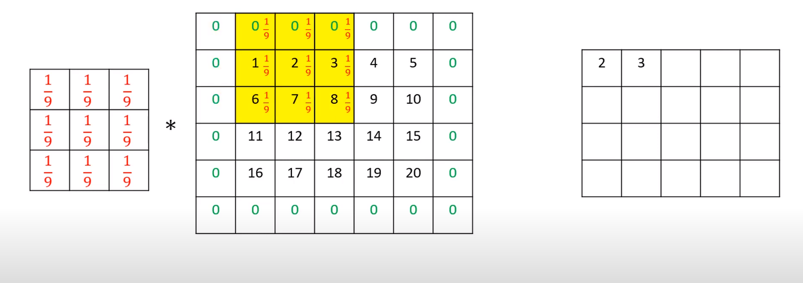

from:https://www.youtube.com/watch?v=xTRsxrvXcmM

### **Border Extrapolation and Boundary Conditions**

就相当于在图像的边界外层再增加一圈的像素（opecv中叫做： virtual 像素 ）

#### **Making borders yourself**

使用 `cv::copyMakeBorder`来增加边界

函数原型：

~~~c++
void cv::copyMakeBorder(
 	cv::InputArray src, // Input image
 	cv::OutputArray dst, // Result image
 	int top, // Top side padding (pixels)
 	int bottom, // Bottom side padding (pixels)
 	int left, // Left side padding (pixels)
 	int right, // Right side padding (pixels)
 	int borderType, // Pixel extrapolation method
 	const cv::Scalar& value = cv::Scalar() // Used for constant borders
);
~~~

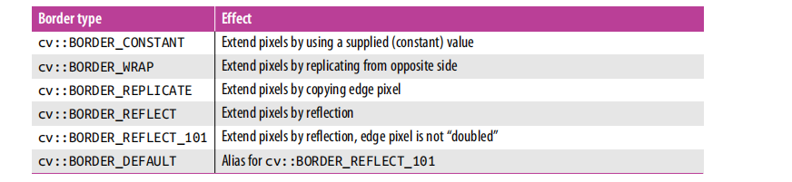

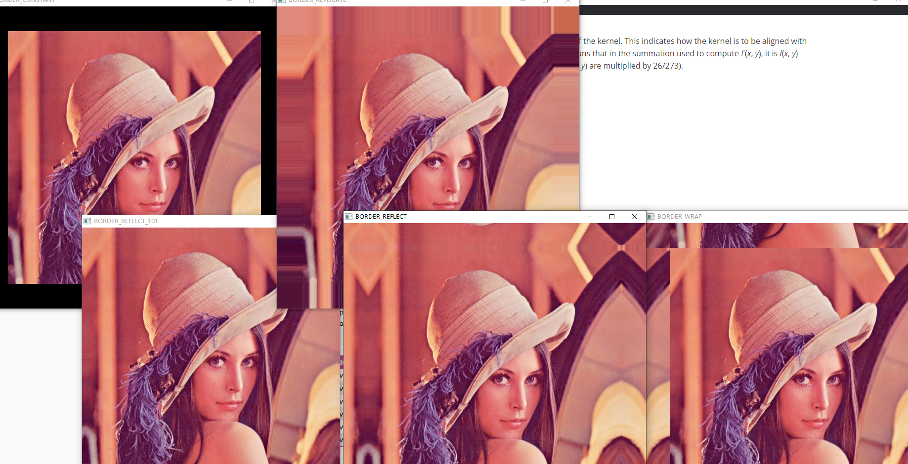

~~~c++
cv::Mat MakeBorder( const char* szPath, const cv::BorderTypes bt)
{
    cv::Mat mat = cv::imread(szPath);
    cv::copyMakeBorder( mat, mat, 5,5,5,5, bt );
    return mat;
}
    

	const char* szPath = "../lena.jpg";

    cv::imshow("BORDER_CONSTANT", MakeBorder(szPath, cv::BORDER_CONSTANT));
    cv::imshow("BORDER_REPLICATE", MakeBorder(szPath, cv::BORDER_REPLICATE));
    cv::imshow("BORDER_REFLECT", MakeBorder(szPath, cv::BORDER_REFLECT));
    cv::imshow("BORDER_WRAP", MakeBorder(szPath, cv::BORDER_WRAP));
    cv::imshow("BORDER_REFLECT_101", MakeBorder(szPath, cv::BORDER_REFLECT_101));
    //cv::imshow("BORDER_TRANSPARENT", MakeBorder(szPath, cv::BORDER_TRANSPARENT));

~~~

### **Threshold Operations** 

就是 **阈值**：

函数原型：

~~~c++
double cv::threshold(
 	cv::InputArray src, // Input image
 	cv::OutputArray dst, // Result image
 	double thresh, // Threshold value
 	double maxValue, // Max value for upward operations
 	int thresholdType // Threshold type to use (Example 10-3)
);
~~~

好比使用一个  1 * 1 的 kernel 来进行操作。

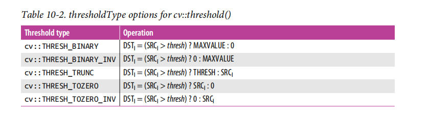

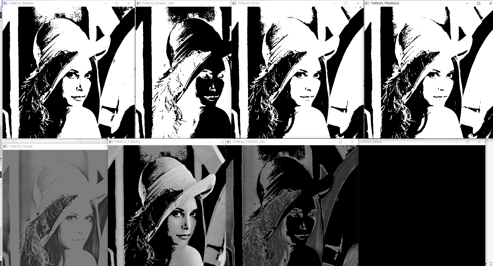

~~~c++
cv::Mat Threshold(const char* szPath, double thre, double max ,cv::ThresholdTypes tt)
{
    cv::Mat mat = cv::imread(szPath, cv::IMREAD_GRAYSCALE);
    cv::threshold(mat, mat, thre, max, tt);

    return mat;
}

    const char* szPath = "../lena.jpg";
    cv::imshow("THRESH_BINARY", Threshold(szPath, 125, 255, cv::THRESH_BINARY));
    cv::imshow("THRESH_BINARY_INV", Threshold(szPath, 125, 255, cv::THRESH_BINARY_INV));
    cv::imshow("THRESH_TRUNC", Threshold(szPath, 125, 255, cv::THRESH_TRUNC));
    cv::imshow("THRESH_TOZERO", Threshold(szPath, 125, 255, cv::THRESH_TOZERO));
    cv::imshow("THRESH_TOZERO_INV", Threshold(szPath, 125, 255, cv::THRESH_TOZERO_INV));
    cv::imshow("THRESH_MASK", Threshold(szPath, 125, 255, cv::THRESH_MASK));
    cv::imshow("THRESH_OTSU", Threshold(szPath, 125, 255, cv::THRESH_OTSU));
    cv::imshow("THRESH_TRIANGLE", Threshold(szPath, 125, 255, cv::THRESH_TRIANGLE));

~~~

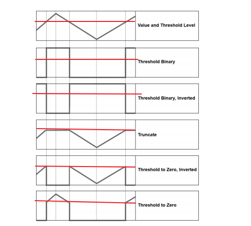

这个图，更清晰的展示，红色为阈值线。

#### **Otsu’s Algorithm**

这是一个小日子过得还不错的日本人发明的   -- 大津算法；

 		大津法由大津(otsu)于1979年提出，对图像Image，记t为前景与背景的分割阈值，前景点数占图像比例为w0，平均灰度为u0；背景点数占图像比例为w1，平均灰度为u1。图像的总平均灰度为：`u=w0*u0+w1*u1`。从最小灰度值到最大灰度值遍历t，当t使得值`g=w0*(u0-u)/2+w1*(u1-u)/2 `最大时t即为分割的最佳阈值。对大津法可作如下理解：该式实际上就是 类间方差值 ，阈值t分割出的前景和背景两部分构成了整幅图像，而前景取值u0，概率为 w0，背景取值u1，概率为w1，总均值为u，根据方差的定义即得该式。因方差是灰度分布均匀性的一种度量,方差值越大,说明构成图像的两部分差别越大, 当部分目标错分为背景或部分背景错分为目标都会导致两部分差别变小，因此使类间方差最大的分割意味着错分概率最小。 

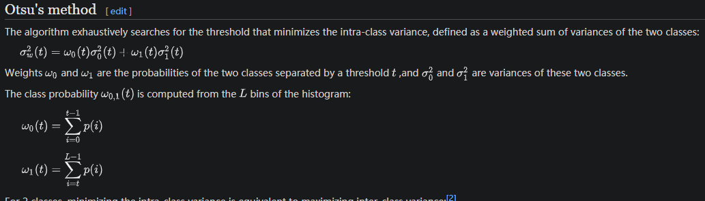

~~~c++

统计各个像素值的出现次数

while(遍历各种阈值的取值（0到255种可能）)
{
    1. 根据当前阈值对图像所有出现的像素值进行分类。
    大于阈值的像素值分为一个类A，小于阈值则分为另外一个类B。（到时候你可以让A类中所有像素值为1，B类所有像素值为0。也可以让类A所有像素值为0.这都是可以你自己定，所以我就用A，B代替了。）
    2. 计算类A的所有像素值的方差SA，计算类B中所有像素值的方差SB
    3. 计算类A中所有像素值之和IA，计算类B中所有像素点的像素值的像素值之和IB
    4. 计算当前阈值划分下两个类的像素值方差的加权和S=IA*SA+SB*IB
    5. 像素值方差的加权和S是否是目前遍历到的阈值划分下最小的那一个值？如果是那就保存当前这种取值
}

通过上面操作最终得到最优的阈值d。

while(遍历所有像素点）
{
   像素值大于阈值d赋值为1，
   像素值小于阈值d赋值为0
}

~~~

> 重新回顾一下统计学概念
>
> 数据 1：1   2   2    7   8
>
> 数据 2：2   3   4    5   6
>
> 平均值： （1 + 2 + 2 + 7 + 8 ） / 5     表明资料中各观测值相对集中较多的中心位置 
>
> 中位数： 排序后 中间 那一个  极端值对数据的中间值影响不大，   一个样本、种群或概率分布中的一个数值， 统计人均收入的时候，进来一个 jack 🐴 就没太大影响。
>
> 方差：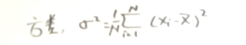 方差的意义在于反映了一组数据与其平均值的偏离程度 
>
> 标准差：	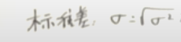 标准差能反映一个数据集的离散程度。 

#### **Adaptive Threshold**

​		 它的思想不是计算全局图像的阈值，而是根据图像不同区域亮度分布，计算其局部阈值，所以对于图像不同区域，能够自适应计算不同的阈值，因此被称为自适应阈值法。 

​		 如何确定局部阈值呢？可以**计算某个邻域(局部)的均值、中值、高斯加权平均(高斯滤波)来确定阈值**。值得说明的是：如果用局部的均值作为局部的阈值，就是常说的移动平均法(听起来挺高大上，其实......逃)。 

函数原型：

~~~c++
void cv::adaptiveThreshold(
 	cv::InputArray src, // Input image
 	cv::OutputArray dst, // Result image
 	double maxValue, // Max value for upward operations
	int adaptiveMethod, // mean or Gaussian
	int thresholdType // Threshold type to use (Example 10-3)
 	int blockSize, // Block size
 	double C // Constant
);

/*
InputArray src：源图像

OutputArray dst：输出图像，与源图像大小一致

int adaptiveMethod：在一个邻域内计算阈值所采用的算法，有两个取值，分别为 ADAPTIVE_THRESH_MEAN_C 和 ADAPTIVE_THRESH_GAUSSIAN_C 。
ADAPTIVE_THRESH_MEAN_C的计算方法是计算出领域的平均值再减去第七个参数double C的值。
ADAPTIVE_THRESH_GAUSSIAN_C的计算方法是计算出领域的高斯均值再减去第七个参数double C的值。

int thresholdType：这是阈值类型，只有两个取值，分别为 THRESH_BINARY 和THRESH_BINARY_INV  具体的请看官方的说明，这里不多做解释。

int blockSize：adaptiveThreshold的计算单位是像素的邻域块，这是局部邻域大小，3、5、7等。

double C：它是一个从均值或加权均值提取的常数，可以是负数或者是零。这个参数实际上是一个偏移值调整量，用均值和高斯计算阈值后，再减或加这个值就是最终阈值。
*/
~~~

最后一个参数传 0

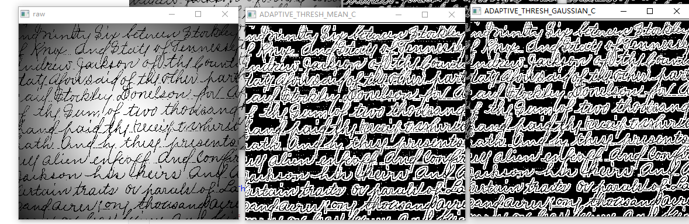

最后一个参数传  10

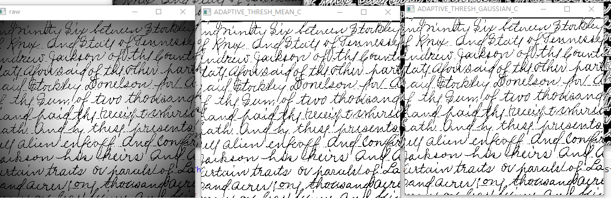

~~~c++
cv::Mat AdaptiveThreshold(const char* szPath, double max, int adaptiveMethod, int thresholdType, int blockSize, double c)
{
    cv::Mat mat = cv::imread(szPath, cv::IMREAD_GRAYSCALE);
    cv::adaptiveThreshold(mat, mat, max, adaptiveMethod, thresholdType, blockSize, c);
    return mat;
}

{
	const char* szPath = "f:/ad.png";
    cv::imshow("raw", cv::imread(szPath, cv::IMREAD_GRAYSCALE));
    cv::imshow("ADAPTIVE_THRESH_MEAN_C", AdaptiveThreshold(szPath, 255, cv::ADAPTIVE_THRESH_MEAN_C, cv::THRESH_BINARY, 5, 10));
    cv::imshow("ADAPTIVE_THRESH_GAUSSIAN_C", AdaptiveThreshold(szPath, 255, cv::ADAPTIVE_THRESH_GAUSSIAN_C, cv::THRESH_BINARY, 5, 10));
}
~~~

### **Smoothing**

*Smoothing*, also called *blurring*   模糊，平滑都是这玩意

often done to reduce noise or camera artifacts

示意图走一波~~~

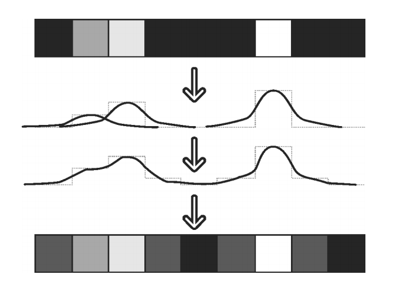

#### **Simple Blur and the Box Filter** 

函数原型：

低通滤波器，就是取平均值咯~~~~

~~~c++
void cv::blur(
 	cv::InputArray src, // Input image
 	cv::OutputArray dst, // Result image
 	cv::Size ksize, // Kernel size
 	cv::Point anchor = cv::Point(-1,-1), // Location of anchor point
 	int borderType = cv::BORDER_DEFAULT // Border extrapolation to use
);
~~~

一个简单的滤波器，就是取所有像素的平均值

方波滤波器：

~~~c++
void cv::boxFilter(
 	cv::InputArray src, // Input image
 	cv::OutputArray dst, // Result image
 	int ddepth, // Output depth (e.g., CV_8U)
 	cv::Size ksize, // Kernel size
 	cv::Point anchor = cv::Point(-1,-1), // Location of anchor point
 	bool normalize = true, // If true, divide by box area  表示内核是否其区域归一化。
 	int borderType = cv::BORDER_DEFAULT // Border extrapolation to use
);
~~~

OpenCV函数`cv::boxFilter()`是一种更通用的形式，其中`cv::blur()`本质上是一种特殊情况。`cv::boxFilter()`和`cv::blur()`之间的主要区别是，前者可以在非标准化模式下运行(使normalize=false正常化)，并且可以控制输出图像dst的深度。（对于`cv::blur()`，dst的深度将始终等于src的深度。）如果数据深度的值设置为-1，则目标图像将与源具有相同的深度；否则，您可以使用任何通常的别名（例如，CV_32F）。

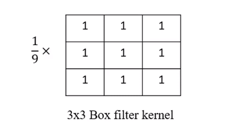

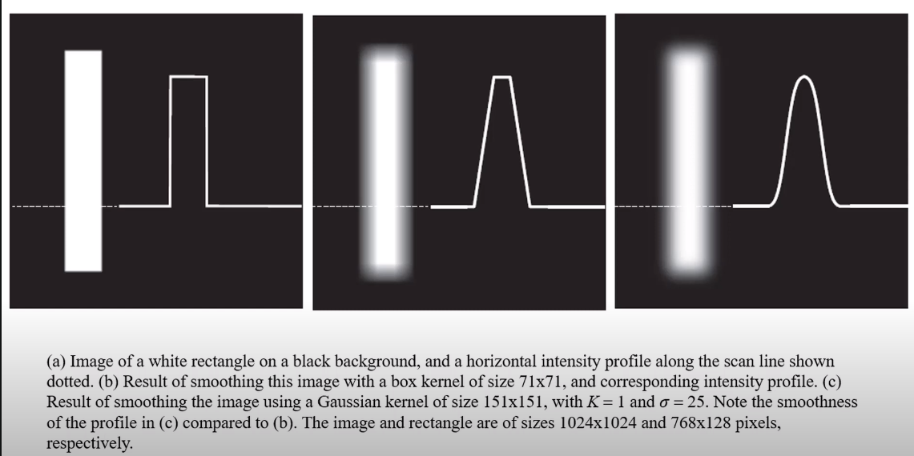

~~~c++
/*
 * void boxFilter(InputArray src,
            OutputArray dst,
            int ddepth,
            Size ksize,
            Point anchor=Point(-1, -1),
            bool normalize = true,
            int borderType = BORDER_DEFALT)

* 	参数一：InputArray类型，一般是cv::Mat，且可以处理任何通道数的图片。但需要注意，待处理的图片深度应该为CV_8U、CV_16U、CV_16S、CV_32F、CV_64F中的一个」
	参数二；OutputArray类型，输出的目标图像，需要和原图片有一样的尺寸和类型」
	参数三：int类型，表示输出图像的深度Ｑ代表使用原图深度」
	参数四：Size类型的ksize，内核的大小。一般用Size(w,h)来表示内核的大小，Size(3,3)就表3的核大小」
    参数五：Point类型，表示锚点（值被平滑的那个点）。注意：默认值Point(-1,-1)。如果点是负值，就表示取核的中心为锚点」
    参数六：bool类型normalize，默认为true，表示内核是否被其区域归一化」
    参数七：int类型的borderType，用于推断图像外部像素的某种边界模式，使用默认值BORDER_DEFULAT，一般无需使用」
*/
~~~

上下 Slider 表 内核的  w   和   h

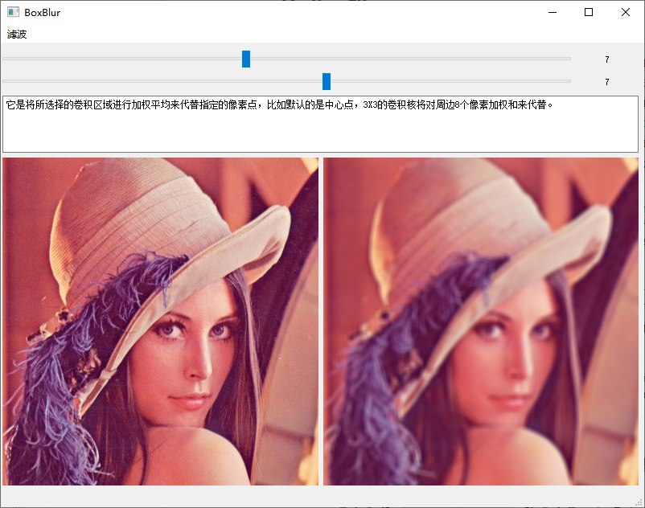

**归一化理解**

https://cppsecrets.com/users/168511510411111711412197115105110104975764103109971051084699111109/C00-OpenCV-cvnormalize.php
当从一种图像类型转换 为另一种图像类型时，也可以使用归一化，例如从浮点像素值转换为 8 位整数像素值。例如，浮点图像中的像素值可能在 0 到 5000 之间。将此范围标准化为 0-255 可以轻松转换为 8 位整数。显然，压缩过程中可能会丢失一些信息，但会保留像素的相对强度。

#### **Median Filter**

中值滤波法是一种非线性平滑技术，它将每一像素点的灰度值设置为该点某邻域窗口内的所有像素点灰度值的中值。常用来处理椒盐噪声（椒盐噪声，又称脉冲噪声，它随机改变一些像素值，在二值图像上表现为使一些像素点变白，一些像素点变黑），主要是利用中值不受分布序列极大值和极小值影响的特点。

**函数原型：**

~~~c++
void cv::medianBlur(
 	cv::InputArray src, // Input image
 	cv::OutputArray dst, // Result image
 	cv::Size ksize // Kernel size
);
~~~

**算法原理：**

就是取中值，就排序后中间那一个撒，上面的方波老哥是取的平均值。 

* 【图1】为椒盐噪声待处理图像，
* 【图2】为经过3\*3中值滤波的处理效果，
* 【图3】为经过11\*11的中值滤波器处理的效果，可明显看出边缘模糊，甚至于人物下巴处的痣消失。 
* 【图4】为经过均值滤波的处理效果。 当使用中值滤波处理图像时，图像边缘可能会受到污染，即边缘变模糊。尤其是当处理的邻域范围变大时，这种模糊将更明显。

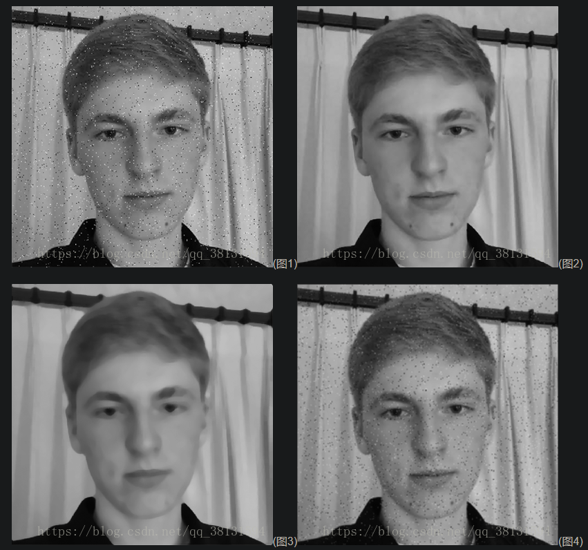

#### **Gaussian Filter**

**函数原型：**

~~~c++
void cv::GaussianBlur(
 	cv::InputArray src, // Input image
 	cv::OutputArray dst, // Result image
 	cv::Size ksize, // Kernel size
 	double sigmaX, // Gaussian half-width in x-direction
 	double sigmaY = 0.0, // Gaussian half-width in y-direction
 	int borderType = cv::BORDER_DEFAULT // Border extrapolation to use
);
~~~

For the Gaussian blur (an example kernel is shown in Figure 10-10), the parameter ksize gives the width and height of the filter window. The next parameter indicates the sigma value (half width at half max) of the Gaussian kernel in the x-dimension. The fourth parameter similarly indicates the sigma value in the y-dimension. If you specify only the *x* value, and set the *y* value to 0 (its default value), then the *y* and *x* values will be taken to be equal. If you set them both to 0, then the Gaussian’s parammeters will be automatically determined from the window size through the following formulae: 

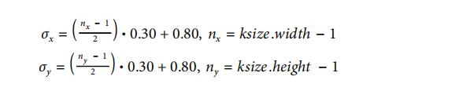

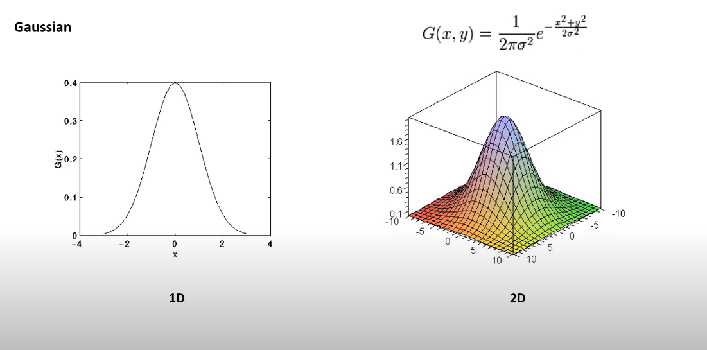

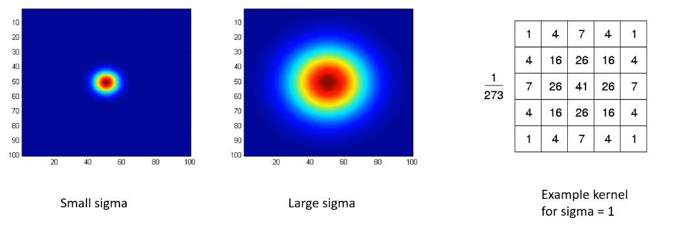

**实际效果：**

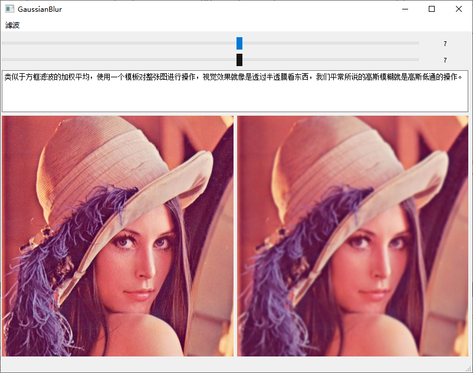

#### **Bilateral Filter** 

双边滤波器  --  它用来自附近像素的强度值的加权平均值替换每个像素的强度。该权重可以基于高斯分布。至关重要的是，权重不仅取决于像素的欧几里得距离，还取决于辐射差异（例如，范围差异，如颜色强度、深度距离等）。这保留了锋利的边缘。 

**函数原型**

~~~c++
void cv::bilateralFilter(
 	cv::InputArray src, // Input image
 	cv::OutputArray dst, // Result image
 	int d, // Pixel neighborhood size (max distance)
 	double sigmaColor, // Width param for color weight function
 	double sigmaSpace, // Width param for spatial weight function
 	int borderType = cv::BORDER_DEFAULT // Border extrapolation to use
);
~~~

**图例示例**

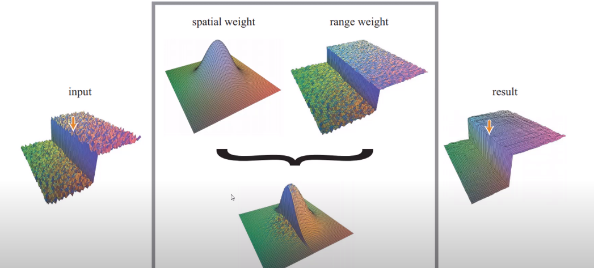

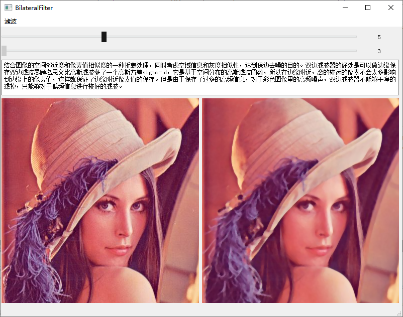

### **Derivatives and Gradients**

导数和梯度

#### **The Sobel Derivative**

用来表达微分的最常用操作是 Sobel 微分算子，Sobel 算子包含任意阶的微分以及融合偏导。

Sobel 并不是真正的导数，在离散空间上，而是一个多项式拟合，也就是说，x 方向上的二阶Sobel导数并不是真正的二阶导数，他是对抛物线函数的局部拟合，这就是为什么有时候要用较大的核，因为，更精确吗~~~ 所以，**核小的时候，精度较差，核太大，又影响效率**。

**函数原型：**

~~~c++
void cv::Sobel(
 	cv::InputArray src, // Input image
 	cv::OutputArray dst, // Result image
 	int ddepth, // Pixel depth of output (e.g., CV_8U)
 	int xorder, // order of corresponding derivative in x
 	int yorder, // order of corresponding derivative in y
 	cv::Size ksize = 3, // Kernel size
 	double scale = 1, // Scale (applied before assignment)
 	double delta = 0, // Offset (applied before assignment)
 	int borderType = cv::BORDER_DEFAULT // Border extrapolation
);
~~~

注意： if src is an 8-bit image, then the dst should have a depth of at least CV_16S to avoid overflow.  xorder and yorder are the orders of the derivative. Typically, you’ll use 0, 1, or at most 2; a 0 value indicates no derivative in that direction. The ksize parameter should be odd and is the width (and the height) of the filter to be used. Currently, aperture sizes up to 31 are supported.12 The scale factor and delta are applied to the derivative before storing in dst. This can be useful when you want to actually visualize a derivative in an 8-bit image you can show on the screen: 

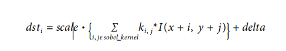

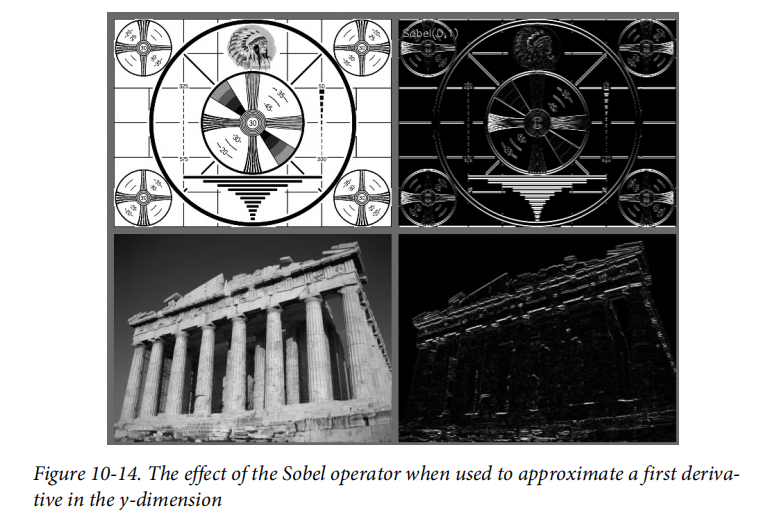

y方向上 算子计算结果，所以，显示的是水平线比较多。

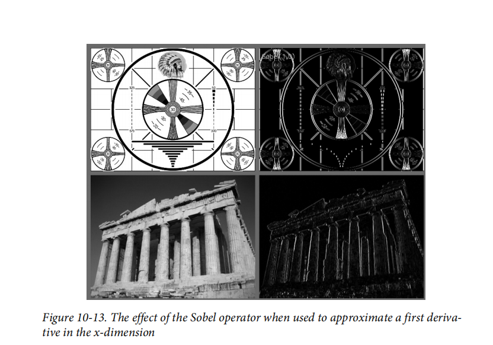

x方向上 算子计算结果，所以，显示的是竖直线比较多。，导数吗，右边减去左边，求取边缘咯，就差分。

> 突然想到应用：那我车牌不就可以用这玩意来搞了，横纵线分别求，然后一叠加。车牌那不就能搞出来一点点咯。

#### **Scharr Filter** 

如果是 3 * 3的kernel来说的话，使用这玩意比 Sobel更好一点。怎么说，就是准确度更高一下。

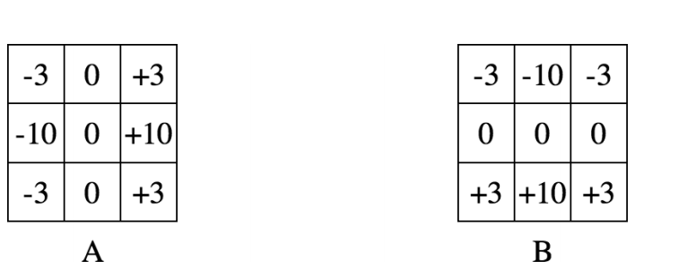

#### **The Laplacian**

对图像求二阶导数，X Y方向上的。 二阶导数，为0的地方就是边缘。

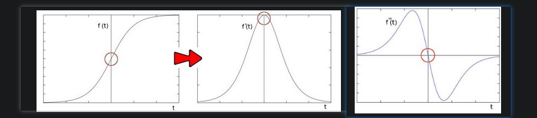

**算子表达式**

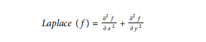

**函数原型：**

~~~c++
void cv::Laplacian(
 	cv::InputArray src, // Input image
 	cv::OutputArray dst, // Result image
 	int ddepth, // Depth of output image (e.g., CV_8U)
 	cv::Size ksize = 3, // Kernel size
 	double scale = 1, // Scale applied before assignment to dst
 	double delta = 0, // Offset applied before assignment to dst
 	int borderType = cv::BORDER_DEFAULT // Border extrapolation to use
);
~~~

#### Canny

该算法基于 Laplacian 算法，不同的地方在于，首先在 x 和 y 方向上求导，然后组合为 4 个方向的导数，当这些方向导数达到局部最大值的点就是组成边缘的候选点。

最重要的特点：试图将独立边的候选像素拼接成轮廓，轮廓的形成是对这些像素运用滞后性阈值。意味着有两个阈值，上限和下限，如果一个像素的梯度大于上限阈值，则被认为是边缘像素。如果低于下限阈值，则抛弃。如果两者之间，只有当与高于阈值的像素挨着的时候才会被接受。

Canny推荐的上下阈值比 在 2:1 和 3:1之间，

**函数原型**

~~~c++
void cv::Canny(
 	cv::InputArray image, // Input single channel image
 	cv::OutputArray edges, // Output edge image
 	double threshold1, // "lower" threshold
 	double threshold2, // "upper" threshold
 	int apertureSize = 3, // Sobel aperture
 	bool L2gradient = false // true=L2-norm (more accurate)
);
~~~

### **Image Morphology** 

形态学操作，所有的形态学操作都是基于  **膨胀** 和  **腐蚀**  来进行的。

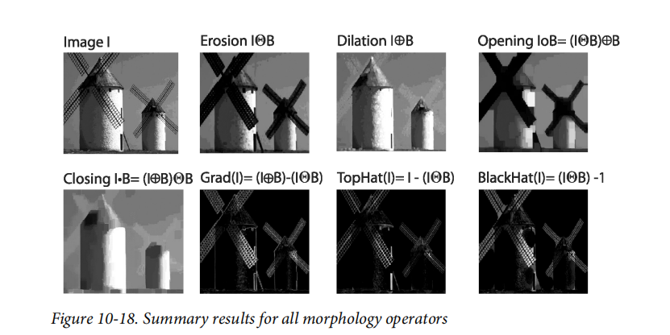

#### **Dilation and Erosion**

Dilation is a convolution of some image with a kernel in which any given pixel is replaced with the *local maximum* of all of the pixel values covered by the kernel. As we mentioned earlier, this is an example of a nonlinear operation, so the kernel cannot be expressed in the form shown back in Figure 10-1. Most often, the kernel used for dilation is a “solid” square kernel, or sometimes a disk, with the anchor point at the center. The effect of dilation is to cause filled15 regions within an image to grow as diagrammed in Figure 10-19.

膨胀 函数原型

亮的区域更多， 膨胀的作用是将与物体接触的所有背景点合并到物体中，使目标增大，可添补目标中的空洞。 

~~~c++
void cv::dilate(
 	cv::InputArray src, // Input image
 	cv::OutputArray dst, // Result image
 	cv::InputArray element, // Structuring, a cv::Mat()
 	cv::Point anchor = cv::Point(-1,-1), // Location of anchor point
 	int iterations = 1, // Number of times to apply
	 int borderType = cv::BORDER_CONSTANT // Border extrapolation
 	const cv::Scalar& borderValue = cv::morphologyDefaultBorderValue()
);
~~~

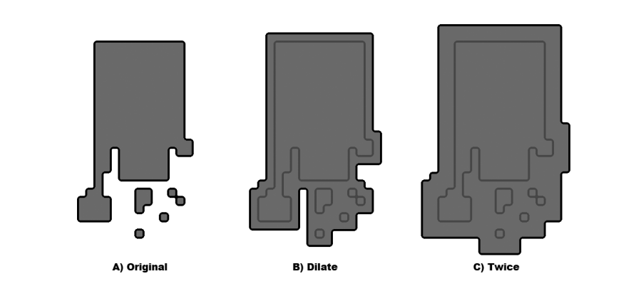

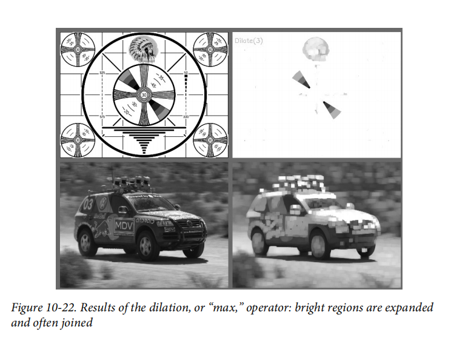

腐蚀 函数原型

暗的区域更多， 腐蚀的作用是消除物体边界点，使目标缩小，可以消除小于结构元素的噪声点； 

~~~c++
void cv::erode(
 	cv::InputArray src, // Input image
 	cv::OutputArray dst, // Result image
 	cv::InputArray element, // Structuring, a cv::Mat()
 	cv::Point anchor = cv::Point(-1,-1), // Location of anchor point
 	int iterations = 1, // Number of times to apply
 	int borderType = cv::BORDER_CONSTANT // Border extrapolation
 	const cv::Scalar& borderValue = cv::morphologyDefaultBorderValue()
);
~~~

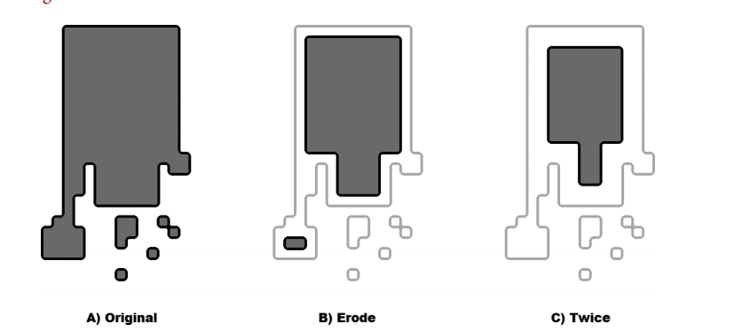

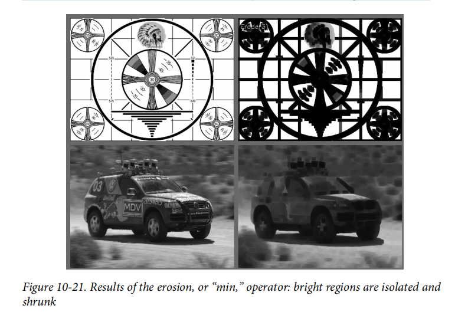

上述两个的结果原理公式：

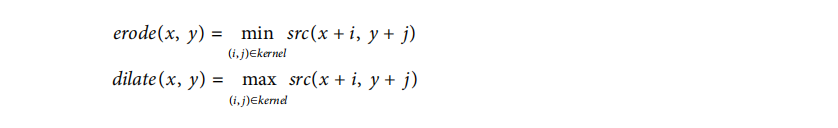

腐蚀：获取，这个 kernel 区域的最小值，膨胀，获取这个 kernel 区域的最大值。

#### The General Morphology Function

opencv 中通用的图像形态学操作

~~~c++
CV_EXPORTS_W void morphologyEx( InputArray src, OutputArray dst,
                                int op, InputArray kernel,
                                Point anchor = Point(-1,-1), int iterations = 1,
                                int borderType = BORDER_CONSTANT,
                                const Scalar& borderValue = morphologyDefaultBorderValue() );
~~~

通过参数 op，指定操作的方式，具体操作方式如下：

#### Opening and Closing

##### Opening

开运算，就是分开的意思。先腐蚀达到分开的目的，再膨胀还原。 可以**消除图像上细小的噪声**，并平滑物体边界。 

书中举了这样一个例子，如果我们对显微镜载玻片上的细胞图像进行了阈值处理，我们可能会在对区域进行计数之前将彼此靠近的细胞分开。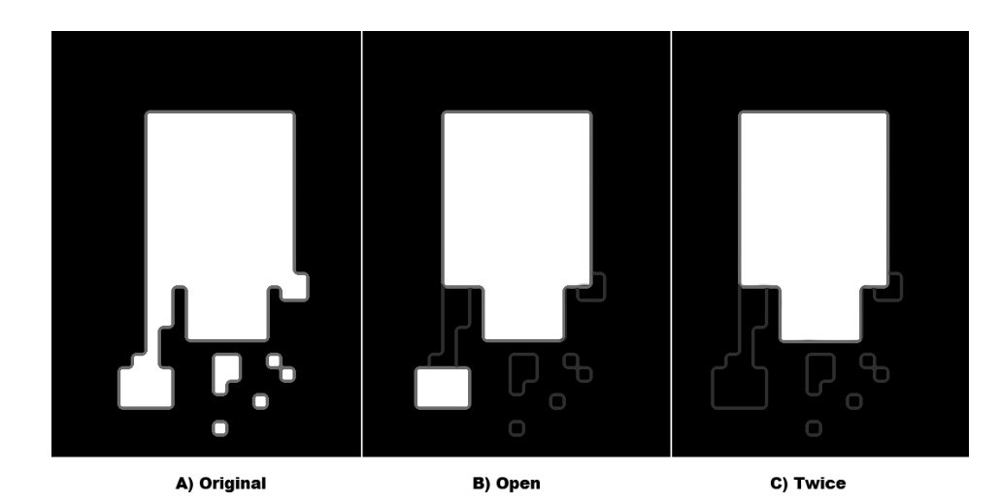

##### Closing

为了减少不必要的噪声，先膨胀后腐蚀。 可以**填充物体内细小的空洞**，并平滑物体边界。 

dilate first and then erode . 

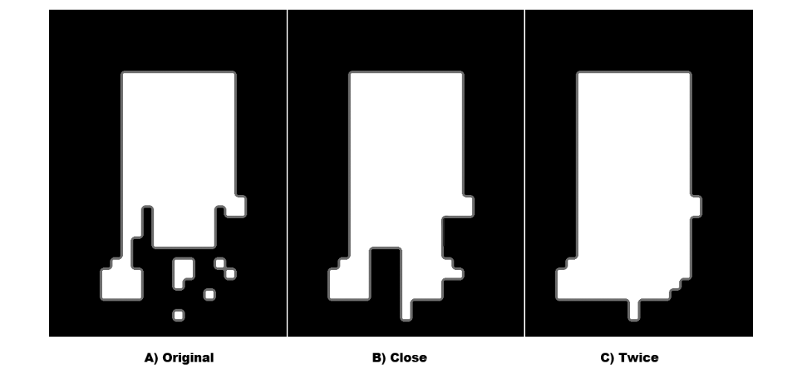

请注意，虽然使用打开或关闭的最终结果与使用腐蚀或膨胀类似，但这些新操作倾向于更准确地保留连接区域的面积

**开运算和闭运算比较**

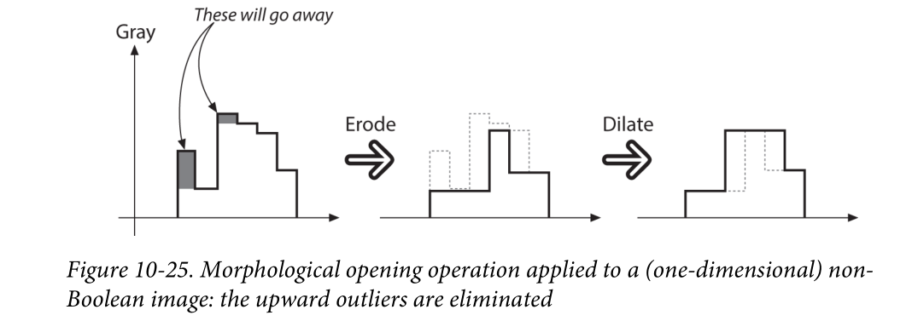

#### Morphological Gradient

图像梯度

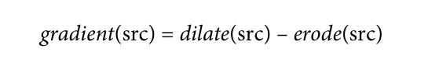

得到的结果：

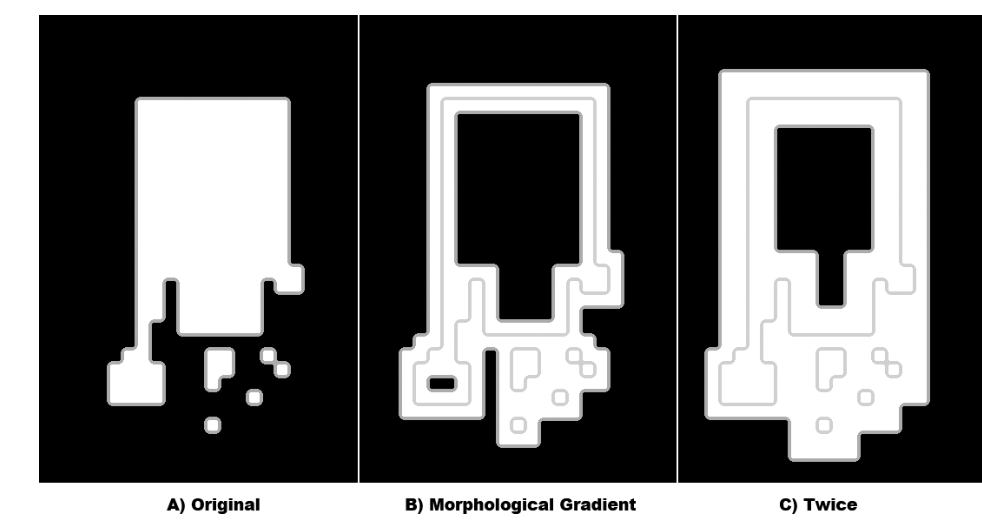

灰度图的时候，这是表示亮度变化的快慢，膨胀  - 腐蚀，就是相当于边缘区域了撒。

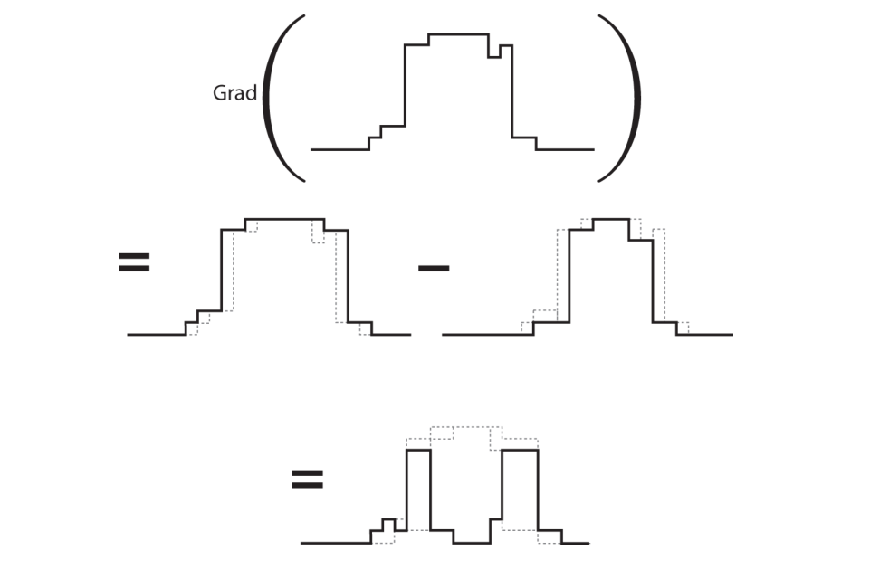

对于灰度图，在灰度变化最大的地方就有了最大值，结合算子一想就明白了。

#### Top Hat and Black Hat

算子：

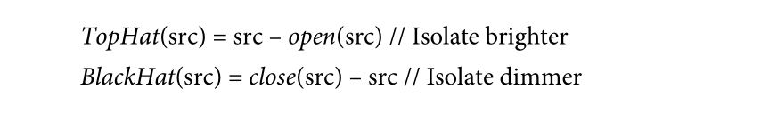

Top Hat: 顶帽运算往往用来分离比邻近点亮一些的斑块，在一幅图像具有大幅的背景，而微小物品比较有规律的情况下，可以使用顶帽运算进行背景提取。 

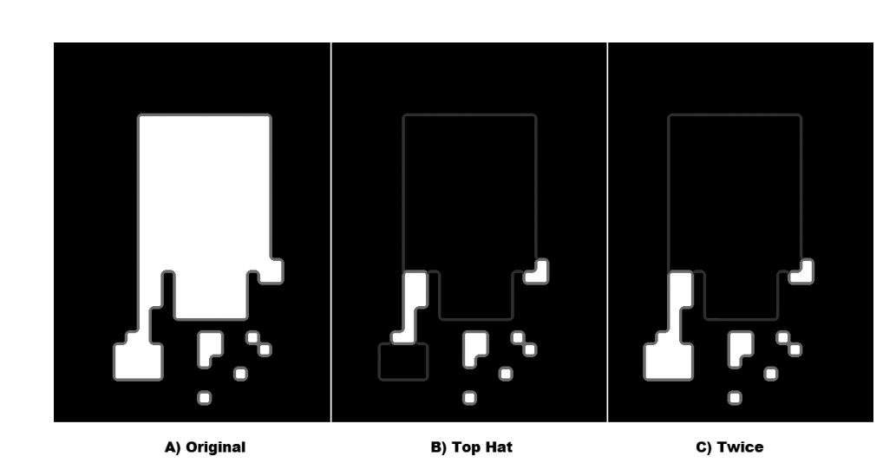

Black Hat： 用来分离比临近点暗一点的斑块，效果图有着非常完美的轮廓 

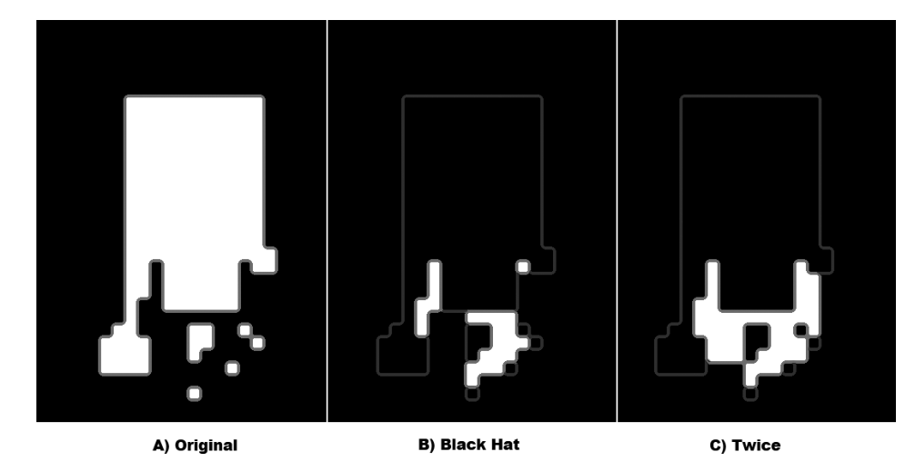

#### Making Your Own Kernel

~~~c++
CV_EXPORTS_W void morphologyEx( InputArray src, OutputArray dst,
                                int op, InputArray kernel,
                                Point anchor = Point(-1,-1), int iterations = 1,
                                int borderType = BORDER_CONSTANT,
                                const Scalar& borderValue = morphologyDefaultBorderValue() );
~~~

上述第四个参数 kernel ：这个可以自己自定义一个核，函数原型

~~~c++
cv::Mat cv::getStructuringElement(
	int shape, // Element shape, e.g., cv::MORPH_RECT
	cv::Size ksize, // Size of structuring element (odd num!)
	cv::Point anchor = cv::Point(-1,-1) // Location of anchor point
);
~~~

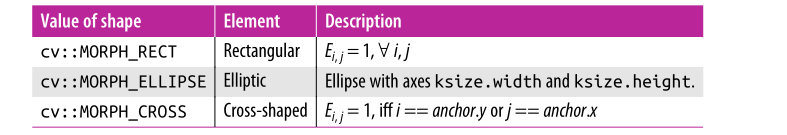

第一个参数：自定义核的类型，第二个参数，自定义核的大小，第三个参数，锚点所在位置、

### Convolution with an Arbitrary Linear Filter

和一个线性滤波器做卷积

#### Applying a General Filter with cv::filter2D() 

​		使用自定义内核对图像进行卷积。该功能将任意线性滤波器应用于图像。支持就地操作。当光圈部分位于图像外部时，该功能会根据指定的边框模式插入异常像素值。 

**函数原型：**

~~~c++
cv::filter2D(
 	cv::InputArray src, // Input image
 	cv::OutputArray dst, // Result image
 	int ddepth, // Output depth (e.g., CV_8U)
 	cv::InputArray kernel, // Your own kernel
 	cv::Point anchor = cv::Point(-1,-1), // Location of anchor point
 	double delta = 0, // Offset before assignment
 	int borderType = cv::BORDER_DEFAULT // Border extrapolation to use
);
/*
函数功能：利用卷积函数cvFilter2D和不同的卷积核对图像进行二维滤波，
注意cvFilter2D只对单通道进行滤波操作，如果对多通道进行滤波，可以先用cvSplit将图像分解到单通道分别操作。
对图像进行滤波平滑，也可用函数cvSmooth
*/
~~~

#### Applying a General Separable Filter with cv::sepFilter2D

如果内核可分离，那么可以采用这个函数来提高性能。好比下面这种

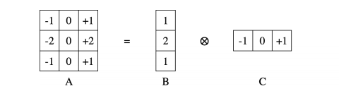

**函数原型：**

~~~c++
cv::sepFilter2D(
 	cv::InputArray src, // Input image
 	cv::OutputArray dst, // Result image
 	int ddepth, // Output depth (e.g., CV_8U)
 	cv::InputArray rowKernel, // 1-by-N row kernel
 	cv::InputArray columnKernel, // M-by-1 column kernel
 	cv::Point anchor = cv::Point(-1,-1), // Location of anchor point
 	double delta = 0, // Offset before assignment
 	int borderType = cv::BORDER_DEFAULT // Border extrapolation to use
);
~~~

### Exercise

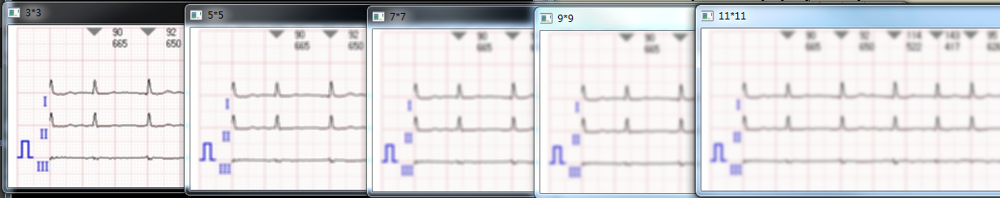

## Chapter11. General Image Transforms

### Stretch, Shrink, Warp, and Rotate

缩放，收缩，斜切，旋转

### Uniform Resize

**函数原型：**

~~~c++
void cv::resize(
 	cv::InputArray src, // Input image
 	cv::OutputArray dst, // Result image
 	cv::Size dsize, // New size
 	double fx = 0, // x-rescale
 	double fy = 0, // y-rescale
 	int interpolation = CV::INTER_LINEAR // interpolation method
);
~~~

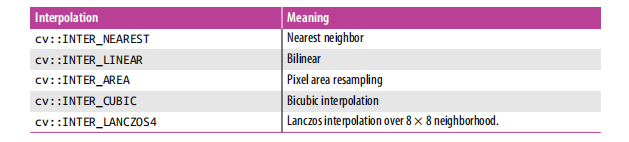

程序示例：

~~~c++
    Mat src = imread("f:/ecg.jpg"), dst;
    imshow("raw", src);

    resize(src, dst, cv::Size(200, 200), 0, 0, cv::INTER_NEAREST);
    imshow("INTER_NEAREST", dst);

    resize(src, dst, cv::Size(200, 200), 0, 0,  cv::INTER_LINEAR);
    imshow("INTER_LINEAR", dst);

    resize(src, dst, cv::Size(200, 200), 0, 0, cv::INTER_AREA);
    imshow("INTER_AREA", dst);

    resize(src, dst, cv::Size(200, 200), 0, 0, cv::INTER_CUBIC);
    imshow("INTER_CUBIC", dst);

    resize(src, dst, cv::Size(200, 200), 0, 0, cv::INTER_LANCZOS4);
    imshow("INTER_LANCZOS4", dst);
~~~

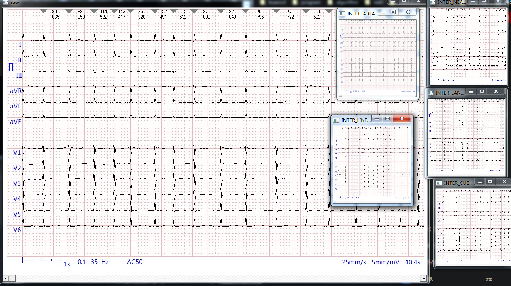

### Image Pyramids 

图像金字塔， 将图像进行一层一层的下采样，图像金字塔是为了构建图像的多尺度，让模型能够更好的适应图像的尺度变化，图像金字塔可以广泛应用于图像识别，目标检测，还有光流配准，块匹配都能看到它的身影。 

图像金字塔主要有两种，一种是高斯金字塔，gaussian pyramid，另外一种是拉普拉斯金字塔，Laplacian Pyramids。 

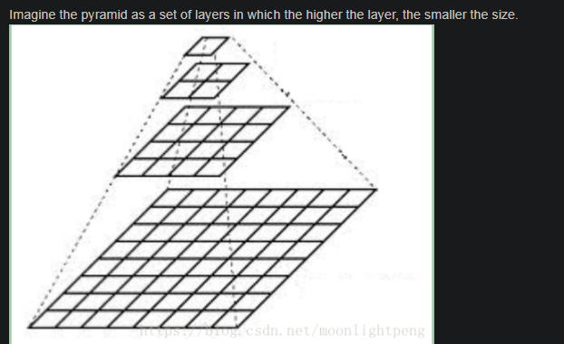

#### cv::pyrDown()

 对图像向下采样，图像尺寸减半（执行了高斯金字塔建造的向下采样操作） ，高斯金字塔。 Down的意思是向下操作，所以图像缩小。

The cv::pyrDown() method will do exactly this for us if we leave the destination size argument dstsize set to its default value of cv::Size(). To be a little more specific, the default size of the output image is ( (src.cols+1)/2, (src.rows+1)/2 ).4 Alternatively, we can supply a dstsize, which will indicate the size we would like for the output image; dstsize, however, must obey some very strict constraints. Specifically: 

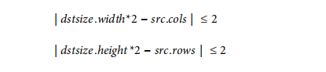

所以，意味着，图像只有原来的一半。

**函数原型：**

~~~c++
void cv::pyrDown(
 	cv::InputArray src, // Input image
 	cv::OutputArray dst, // Result image
 	const cv::Size& dstsize = cv::Size() // Output image size
);
~~~

**代码：**

~~~c++
void PyrDown()
{
    Mat src = imread("f:/ecg.jpg"), dst;
    imshow("raw", src);

    cv::pyrDown(src, dst);
    imshow("PyrDown", dst);

}
~~~

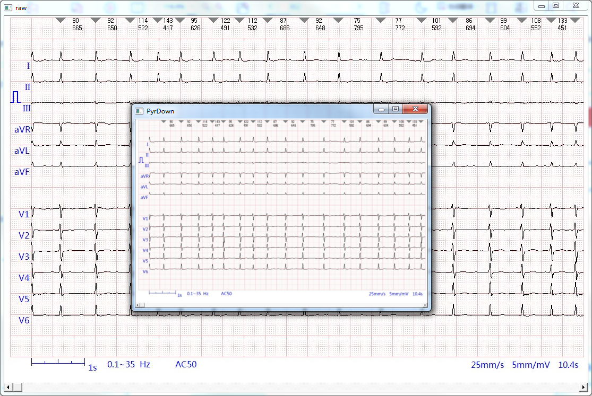

#### cv::buildPyramid()

建一个图像金字塔的数组

**函数原型**

~~~c++
void cv::buildPyramid(
 	cv::InputArray src, // Input image
 	cv::OutputArrayOfArrays dst, // Output images from pyramid
 	int maxlevel // Number of pyramid levels
);
~~~

**实例代码：**

~~~C++
void BuildPyramid()
{
    Mat src = imread("f:/ecg.jpg"), dst;
    imshow("raw", src);

    int nMax = 5;

    std::vector<Mat> vDst;
    cv::buildPyramid(src, vDst, nMax);

    for (int i = 0 ; i < vDst.size(); ++i)
    {
        Mat& dst = vDst[i];
        QString strTitle = QString("BuildPyramid - %1").arg(i);
        imshow(strTitle.toLocal8Bit().data(), dst);
    }
}
~~~

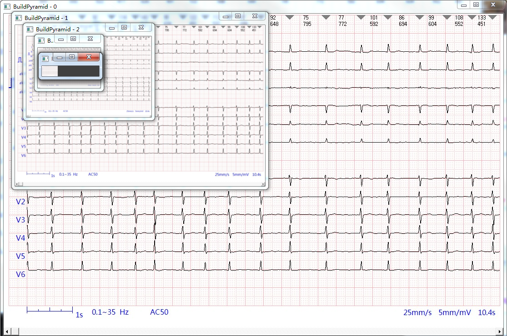

#### cv::pyrUp() 

 对图像向上采样，图像尺寸加倍（执行高斯金字塔的向上采样操作，其实它也可以用于拉普拉斯金字塔） 

**函数原型：**

~~~c++
void cv::pyrUp(
 	cv::InputArray src, // Input image
 	cv::OutputArray dst, // Result image
	 const cv::Size& dstsize = cv::Size() // Output image size
);
~~~

如果没有约束的话，那么是2倍，如果要自定义 Size，那要满足下面条件

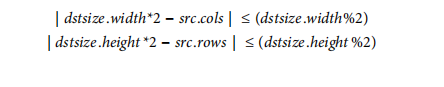

**实例代码：**

~~~c++
void PyrUp()
{
    Mat src = imread("f:/ecg.jpg"), dst;
    imshow("raw", src);

    cv::pyrUp(src, dst);
    imshow("PyrUp", dst);

}
~~~

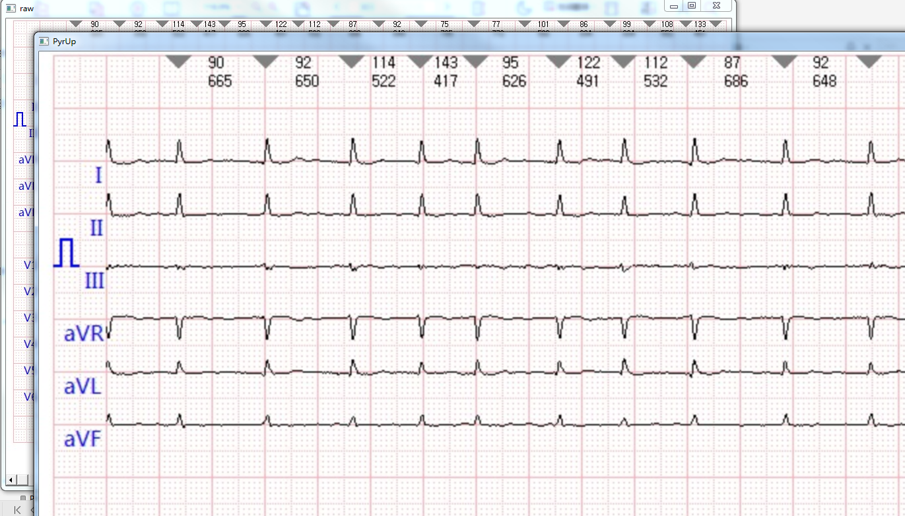

### Nonuniform Mappings

#### **Affine Transformation**

 仿射变换，了解下面这个课程，有助于了解

https://www.bilibili.com/video/av6731067/

**cv::warpAffine():**

其实就是一个线性变化， 2 * 3 的矩阵表示变化。这对于大数据来说，用这个是比较好的。

函数原型

~~~c++
void cv::warpAffine(
 	cv::InputArray src, // Input image
 	cv::OutputArray dst, // Result image
 	cv::InputArray M, // 2-by-3 transform mtx
 	cv::Size dsize, // Destination image size
 	int flags = cv::INTER_LINEAR, // Interpolation, inverse
 	int borderMode = cv::BORDER_CONSTANT, // Pixel extrapolation
 	const cv::Scalar& borderValue = cv::Scalar() // For constant borders
);
~~~

Here src and dst are your source and destination arrays, respectively. The input M is the 2 × 3 matrix we introduced earlier that quantifies the desired transformation. Each element in the destination array is computed from the element of the source array at the location given by:

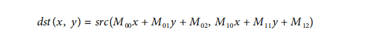

一般情况下，dst(x,y) 不会是整数，所以，第五个参数，就是不在整数的时候，插值的算法。见 resize()

**cv::getAffineTransform(): Computing an affine map matrix**

~~~c++
cv::Mat cv::getAffineTransform( // Return 2-by-3 matrix
 	const cv::Point2f* src, // Coordinates *three* of vertices
 	const cv::Point2f* dst // Target coords, three vertices
);

// 逆时针
cv::Mat cv::getRotationMatrix2D( // Return 2-by-3 matrix
 	cv::Point2f center // Center of rotation
 	double angle, // Angle of rotation
 	double scale // Rescale after rotation
);
~~~

通过这几个点的变换，计算出放射的 矩阵，这里其实就是   **向量基** 的变换。三个独立的角，因为三个点确定一个平面撒。

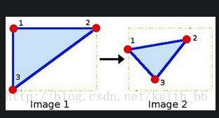

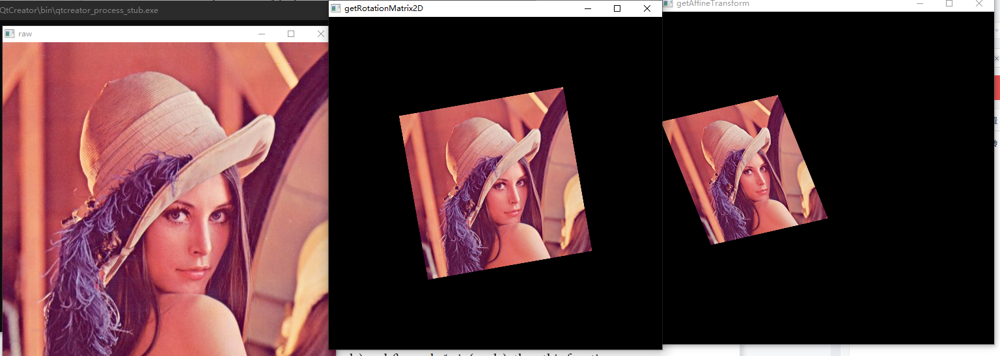

**cv::transform(): Sparse affine transformations** 

这个是稀疏变换，比如，对一系列的独立点映射。

**函数原型：**

~~~c++
void cv::transform(
 	cv::InputArray src, // Input N-by-1 array (Ds channels)
 	cv::OutputArray dst, // Output N-by-1 array (Dd channels)
 	cv::InputArray mtx // Transform matrix (Ds-by-Dd)
);
~~~

#### cv::invertAffineTransform(): Inverting an affine transformation

逆放射变换

就是把正在放射变换的变回去

**函数原型**

~~~C++
void cv::invertAffineTransform(
 	cv::InputArray M, // Input 2-by-3 matrix
 	cv::OutputArray iM // Output also a 2-by-3 matrix
);
~~~

#### Perspective Transformation

**函数原型：**

~~~c++
void cv::warpPerspective(
 	cv::InputArray src, // Input image
 	cv::OutputArray dst, // Result image
 	cv::InputArray M, // 3-by-3 transform mtx
 	cv::Size dsize, // Destination image size
 	int flags = cv::INTER_LINEAR, // Interpolation, inverse
 	int borderMode = cv::BORDER_CONSTANT, // Extrapolation method
 	const cv::Scalar& borderValue = cv::Scalar() // For constant borders
);
~~~

算子：

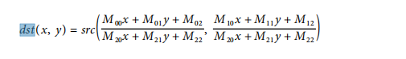

#### cv::getPerspectiveTransform(): Computing the perspective map matrix

和放射变换差不多，也有透视矩阵获取函数

~~~C++
cv::Mat cv::getPerspectiveTransform( // Return 3-by-3 matrix
 	const cv::Point2f* src, // Coordinates of *four* vertices
 	const cv::Point2f* dst // Target coords, four vertices
);
~~~

#### cv::perspectiveTransform(): Sparse perspective transformations

同样，对于一系列的点，同样有这个接口，稀疏仿射

~~~c++
void cv::perspectiveTransform(
 	cv::InputArray src, // Input N-by-1 array (2 or 3 channels)
 	cv::OutputArray dst, // Output N-by-1 array (2 or 3 channels)
 	cv::InputArray mtx // Transform matrix (3-by-3 or 4-by-4)
);
~~~

### Image Repair

#### inpaint

函数原型：

~~~c++
void cv::inpaint(
 	cv::InputArray src, // Input image: 8-bit, 1 or 3 channels
 	cv::InputArray inpaintMask, // 8-bit, 1 channel. Inpaint nonzeros
 	cv::OutputArray dst, // Result image
 	double inpaintRadius, // Range to consider around pixel
 	int flags // Select NS or TELEA
);
~~~

**代码**

没掩码图，所以，自己生成的掩码图，这里采用闭运算

~~~~c++
    Mat src = imread("f:/lena-inpaint.jpg"), dst;
    imshow("raw", src);

    Mat mask = imread("f:/lena-inpaint.jpg", IMREAD_GRAYSCALE);
    cv::threshold(mask, mask, 20, 255, THRESH_BINARY_INV);

    Mat kernel = getStructuringElement(MORPH_ELLIPSE, cv::Size(7, 7));
    morphologyEx(mask, mask, MORPH_CLOSE, kernel);

    imshow("Mask", mask);

    cv::inpaint(src, mask, dst, 5, INPAINT_NS);
    imshow("INPAINT_NS", dst);

    cv::inpaint(src, mask, dst, 5, INPAINT_TELEA);
    imshow("INPAINT_TELEA", dst);
~~~~

原图

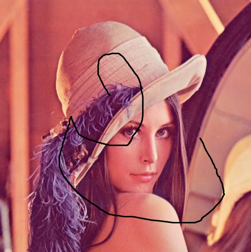

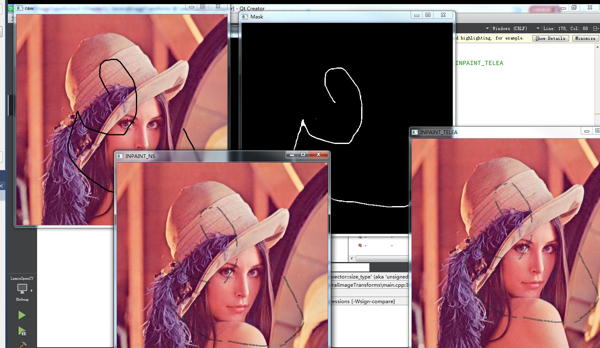

掩码图是关键，下面展示扩大掩码图的效果

代码，这次采用膨胀

~~~c++
    Mat src = imread("f:/lena-inpaint.jpg"), dst;
    imshow("raw", src);

    Mat mask = imread("f:/lena-inpaint.jpg", IMREAD_GRAYSCALE);
    cv::threshold(mask, mask, 20, 255, THRESH_BINARY_INV);

    Mat kernel = getStructuringElement(MORPH_ELLIPSE, cv::Size(7, 7));
    morphologyEx(mask, mask, MORPH_DILATE, kernel);

    imshow("Mask", mask);

    cv::inpaint(src, mask, dst, 5, INPAINT_NS);
    imshow("INPAINT_NS", dst);

    cv::inpaint(src, mask, dst, 5, INPAINT_TELEA);
    imshow("INPAINT_TELEA", dst);
~~~

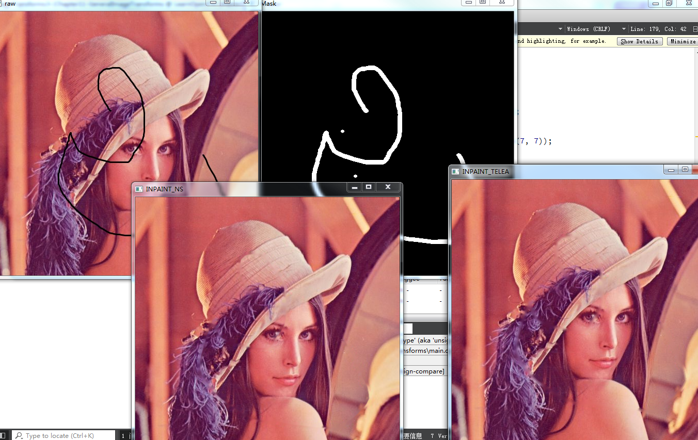

效果还是可以的，主要是掩码的选择没问题就可以。

#### Denoising 

​		噪声的主要来源来自于低光条件的影响。在低光条件下，数字成像仪必须增加数字成像仪的增益，结果是噪声也被放大。这种噪声的特征通常是随机的孤立像素，看起来太亮或太暗，但在彩色图像中也有可能变色。

​		OpenCV中的去噪算法是 **快速非局部  FNLMD**算法，核心概念是在图像的其他地方寻找相似的像素，以及在这些像素中的平均值。在本上下文中，一个像素被认为是一个相似的像素，不是因为它在颜色或强度上相似，而是因为它在环境中相似。这里的关键逻辑是，许多图像包含重复的结构，所以即使你的像素被噪声破坏了，也会有许多其他类似的像素不是。

**函数原型（1）：**

The image may be one-, two-, or three-channel, but must be or type cv::U8. 

~~~c++
void cv::fastNlMeansDenoising(
 	cv::InputArray src, // Input image
 	cv::OutputArray dst, // Output image
 	float h = 3, // Weight decay parameter
 	int templateWindowSize = 7, // Size of patches used for comparison
 	int searchWindowSize = 21 // Maximum patch distance to consider
);
~~~

参数推荐表

**函数原型（2）：**

 It accepts only images of type cv::U8C3. 

~~~c++
void cv::fastNlMeansDenoisingColored(
 	cv::InputArray src, // Input image
 	cv::OutputArray dst, // Output image
 	float h = 3, // Luminosity weight decay parameter
 	float hColor = 3, // Color weight decay parameter
 	int templateWindowSize = 7, // Size of patches used for comparison
 	int searchWindowSize = 21 // Maximum patch distance to consider
);
~~~

**FNLMD on video with cv::fastNlMeansDenoisingMulti() and cv::fastNlMeansDenoisingColorMulti()** 

~~~C++
void cv::fastNlMeansDenoisingMulti(
 	cv::InputArrayOfArrays srcImgs, // Sequence of several images
 	cv::OutputArray dst, // Output image
 	int imgToDenoiseIndex, // Index of image to denoise
 	int temporalWindowSize, // Num images to use (odd)
 	float h = 3, // Weight decay parameter
 	int templateWindowSize = 7, // Size of comparison patches
 	int searchWindowSize = 21 // Maximum patch distance
);
void cv::fastNlMeansDenoisingColoredMulti(
 	cv::InputArrayOfArrays srcImgs, // Sequence of several images
 	cv::OutputArray dst, // Output image
 	int imgToDenoiseIndex, // Index of image to denoise
 	int temporalWindowSize, // Num images to use (odd)
 	float h = 3, // Weight decay param
 	float hColor = 3, // Weight decay param for color
 	int templateWindowSize = 7, // Size of comparison patches
 	int searchWindowSize = 21 // Maximum patch distance
);
~~~

### Histogram Equalization

 直方图均衡化的作用是图像增强。 

**1.直方图**

  		直方图表达的信息是每种亮度的像素点的个数，直方图用少量的数据表达图像的灰度统计特征。灰度级别在范围【0，L-1】的数字图像的直方图是一个离散函数，图像的灰度直方图只能反映图像的灰度分布情况，反映数字图像中每一灰度级与其出现频率间的关系，但它能描述该图像的概貌。

**2.直方图均衡化的作用**

  		直方图均衡化是将原图像通过某种变换，得到一幅灰度直方图为均匀分布的新图像的方法，这样增加了像素灰度值的动态范围，从而达到增强图像整体对比度的效果。直方图均衡化不改变灰度出现的次数，改变的是出现次数所对应的灰度级，以避免改变图像的信息结构。直方图均衡化力图使等长区间出现的像素数接近相等。

**3.图像的信噪比（SNR）概念**

  		图像的信噪比应该等于信号与噪声的功率谱之比，但通常功率谱难以计算，有一种方法可以近似估计图像信噪比，即信号与噪声的方差之比。首先计算图像所有像素的局部方差，将局部方差的最大值认为是信号方差，最小值是噪声方差，求出他们的比值，再转成dB数，最后用经验公式修正。

**函数原型：**

~~~c++
//cv::equalizeHist(): Contrast equalization
//OpenCV wraps this whole process up in one neat function.
void cv::equalizeHist(
 	const cv::InputArray src, // Input image
 	cv::OutputArray dst // Result image
);
~~~

In cv::equalizeHist(), the source src must be a single-channel, 8-bit image. The destination image dst will be the same. For color images, you will have to separate the channels and process them one by one.