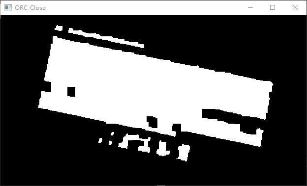
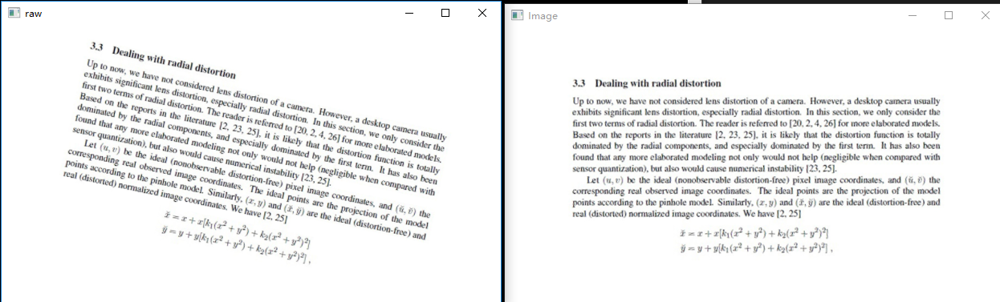

# 相机图像轮廓显示

​		一直再看 `OpenCV`的书，还是要做做项目才不觉得无聊，因此，今天做了一个项目来玩玩。

主要就是读取视频的每一帧，做一个高斯滤波，然后找轮廓，然后绘制轮廓，最后显示。

## 效果图

## 代码

[findContoursOnVideo.py](./findContoursOnVideo.py)

~~~python
import cv2
import time
import numpy as np

cap = cv2.VideoCapture(0)

while True:
    ret, frame = cap.read()
    if frame is not None:
        frame = cv2.GaussianBlur(frame, (11, 11), 2);

        gray = cv2.cvtColor(frame,cv2.COLOR_BGR2GRAY) 
        ret, binary = cv2.threshold(gray,127,255,cv2.THRESH_BINARY)
        
        contours, hierarchy = cv2.findContours(binary, cv2.RETR_TREE,cv2.CHAIN_APPROX_SIMPLE)  

        newImg = np.zeros((800,800,3), np.uint8)  
        cv2.drawContours(newImg, contours,-1,(0,0,255),3) 
        cv2.imshow("Video", newImg)

        #cv2.drawContours(frame, contours,-1,(0,0,255),3) 
        #cv2.imshow("Video", frame)

        if cv2.waitKey(1) & 0xFF == ord('q'):
            break

cap.release()
cv2.destroyAllWindows()
~~~

# ORC

感谢：https://www.cnblogs.com/wj-1314/p/11975977.html

## 摘要

​		采用`OpenCV`对图片进行文字提取。

​		**Keywords：`OpenCV`，ORC**

## 第一章  引言

​		现代社会，随着成像技术越发的发达，手机，相机等像素的提高，拍摄物体的清晰度越来越清楚，而且网络越发发达，所以，对图片中文字的提取就显得比较迫切。

​	

## 第二章 理论知识

### `OpenCV`

​		`OpenCV`是一个基于BSD许可（开源）发行的跨平台计算机视觉库，可以运行在Linux、Windows、Android和Mac OS操作系统上。它轻量级而且高效——由一系列 C 函数和少量 C++ 类构成 ，同时提供了Python、Ruby、`MATLAB`等语言的接口，实现了图像处理和计算机视觉方面的很多通用算法。

​	

## 第三章 实现步骤

### 文档矫正

​		对于这类图片，因为拍摄的背景和前景较为清楚，但是图片有可能不是水平竖直的，所以，第一步需要对图像进行水平竖直矫正。`OpenCV`中，对于水平竖直的矫正，最简单的当然是 **[仿射变换](https://github.com/GuidoLuo0521/Notes/tree/master/LearnOpenCV)**咯

> [文档](https://www.geeksforgeeks.org/python-opencv-affine-transformation/)
>
> ~~~python
> Syntax: cv2.getPerspectiveTransform(src, dst)
> 
> Parameters:
> src: Coordinates of quadrangle vertices in the source image.
> dst: Coordinates of the corresponding quadrangle vertices in the destination image.
>     
> ###########################
> Syntax: cv2.warpAffine(src, M, dsize, dst, flags, borderMode, borderValue)    
>     
> Parameters:
> src: input image.
> dst: output image that has the size dsize and the same type as src.
> M: transformation matrix.
> dsize: size of the output image.
> flags: combination of interpolation methods (see resize() ) and the optional flag
> WARP_INVERSE_MAP that means that M is the inverse transformation (dst->src).
> borderMode: pixel extrapolation method; when borderMode=BORDER_TRANSPARENT, it means that the pixels in the destination image corresponding to the “outliers” in the source image are not modified by the function.
> borderValue: value used in case of a constant border; by default, it is 0.
> ~~~
>
> ~~~c++
> void cv::warpAffine(
>  	cv::InputArray src, // Input image
>  	cv::OutputArray dst, // Result image
>  	cv::InputArray M, // 2-by-3 transform mtx
>  	cv::Size dsize, // Destination image size
>  	int flags = cv::INTER_LINEAR, // Interpolation, inverse
>  	int borderMode = cv::BORDER_CONSTANT, // Pixel extrapolation
>  	const cv::Scalar& borderValue = cv::Scalar() // For constant borders
> );
> ~~~
>
> ​		
>
> **Example**
>
> ~~~python
> 
> import cv2
> import numpy as np
> from matplotlib import pyplot as plt
>   
>   
> img = cv2.imread('food.jpeg')
> rows, cols, ch = img.shape
>   
> pts1 = np.float32([[50, 50],
>                    [200, 50], 
>                    [50, 200]])
>   
> pts2 = np.float32([[10, 100],
>                    [200, 50], 
>                    [100, 250]])
>   
> M = cv2.getAffineTransform(pts1, pts2)
> dst = cv2.warpAffine(img, M, (cols, rows))
>   
> plt.subplot(121)
> plt.imshow(img)
> plt.title('Input')
>   
> plt.subplot(122)
> plt.imshow(dst)
> plt.title('Output')
>   
> plt.show()
>   
> # Displaying the image
> while(1):
>       
>     cv2.imshow('image', img)
>     if cv2.waitKey(20) & 0xFF == 27:
>         break
>           
> cv2.destroyAllWindows()
> ~~~
>
> **Output：**
>
> 

​		当然，这其中最重要的当然要是怎么能找到变换的这个角度啊，变换的 **矩阵**，当然这个步骤也挺简单的：

首先因为这个图片的前背景对比是比较明显的，所以，可以通过二值化后，获取图片轮廓边界；再对轮廓线进行霍夫线检测，然后获取水平和竖直线，进而获取角度，这样就可以算出来变换矩阵了，再就可以将图片拉直了。

#### 读取图片

**函数原型**

~~~python
retval=cv.imread(filename[, flags])

#参数1 filename, 读取的图片文件名，可以使用相对路径或者绝对路径，但必须带完整的文件扩展名(图片格式后缀)
#参数2 flags, 一个读取标记，用于选择读取图片的方式，默认值为IMREAD_COLOR，flag值的设定与用什么颜色格式读取图片有关，具体见 IMREAD_*
~~~

#### 滤波

##### Blur

低通（均值）滤波器，就是取所有像素的平均值。得到结果不是很理想，滤波后太过模糊导致闭运算并不能看清。

##### BoxFilter

方波滤波器：一种特殊的均值滤波器

##### GaussianBlur

高斯滤波就是对整幅图像进行[加权平均](http://baike.baidu.com/view/1295039.htm)的过程，每一个像素点的值，都由其本身和邻域内的其他像素值经过加权平均后得到。

* 均值滤波使用模板内所有像素平均值代替模板中心像素灰度值，这种方法易受噪声的干扰，不能完全消除噪声，只能相对减弱噪声；

* 中值滤波计算模板内所有像素中的中值，并用所计算出来的中值体改模板中心像素的灰度值，这种方法对噪声不是那么敏感，能够较好的消除椒盐噪声，但是容易导致图像的不连续性。

* 高斯滤波对图像邻域内像素进行平滑时，邻域内不同位置的像素被赋予不同的权值，对图像进行平滑的同时，同时能够更多的保留图像的总体灰度分布特征。

公式

  

标准差越小，二维高斯图像越窄小，平滑效果不明显；标准差越大，而为高斯图像越矮宽，滤波效果比较明显。

**结果**

##### MedianBlur

中值滤波法是一种非线性平滑技术，它将每一像素点的灰度值设置为该点某邻域窗口内的所有像素点灰度值的中值。常用来处理椒盐噪声（椒盐噪声，又称脉冲噪声，它随机改变一些像素值，在二值图像上表现为使一些像素点变白，一些像素点变黑），主要是利用中值不受分布序列极大值和极小值影响的特点。

##### 结论：

​	所以此例子并不太适合中值滤波。还是高斯比较好。

#### 灰度处理

彩色图不好做图像边缘的识别，所以转为灰度图

函数原型

~~~python
cvtColor(src,dst,code,dstCn) 
# (原图像，输出图像，color转化代码，输出通道) 
# 参数三见：COLOR_*
~~~

#### 边缘检测

当然，这就要用大名鼎鼎的 Canny 了

该算法基于 Laplacian 算法，不同的地方在于，首先在 x 和 y 方向上求导，然后组合为 4 个方向的导数，当这些方向导数达到局部最大值的点就是组成边缘的候选点。

最重要的特点：试图将独立边的候选像素拼接成轮廓，轮廓的形成是对这些像素运用滞后性阈值。意味着有两个阈值，上限和下限，如果一个像素的梯度大于上限阈值，则被认为是边缘像素。如果低于下限阈值，则抛弃。如果两者之间，只有当与高于阈值的像素挨着的时候才会被接受。最好的比值是 1：2  -  1：3

**函数原型**

~~~python
edge = cv2.Canny(image, threshold1, threshold2[, edges[, apertureSize[, L2gradient ]]]) 
#必要参数：
# 第一个参数是需要处理的原图像，该图像必须为单通道的灰度图；
# 第二个参数是阈值1；
# 第三个参数是阈值2。
~~~

#### 扩展连通区域

因为这类图片的前景和背景差别比较大，所以，可以使用闭运算来连通整个图像。这样好方便找轮廓。

**函数原型**

~~~python
kernel=cv2.getStructuringElement(shape,ksize,anchor)
        shape:核的形状
                cv2.MORPH_RECT: 矩形
                cv2.MORPH_CROSS: 十字形(以矩形的锚点为中心的十字架)
                cv2.MORPH_ELLIPSE:椭圆(矩形的内切椭圆）
                
        ksize: 核的大小，矩形的宽，高格式为(width,height)
        anchor: 核的锚点，默认值为(-1,-1),即核的中心点
                                     
                                     

dst = cv2.morphologyEx(src,op,kernel,anchor,iterations,borderType,borderValue)
        src: 输入图像对象矩阵,为二值化图像
        op: 形态学操作类型
            cv2.MORPH_OPEN    开运算
            cv2.MORPH_CLOSE   闭运算
            cv2.MORPH_GRADIENT 形态梯度
            cv2.MORPH_TOPHAT   顶帽运算
            cv2.MORPH_BLACKHAT  底帽运算
            
        kernel:进行腐蚀操作的核，可以通过函数getStructuringElement()获得
        anchor:锚点，默认为(-1,-1)
        iterations:腐蚀操作的次数，默认为1
        borderType: 边界种类
        borderValue:边界值
~~~

#### 获取轮廓角度

* 寻找轮廓

  >函数原型
  >
  >~~~python 
  >cv.FindContours(image, storage, mode=CV_RETR_LIST, method=CV_CHAIN_APPROX_SIMPLE, offset=(0, 0))
  >~~~

* 轮廓排序获取最大轮廓

  > 函数原型
  >
  > ~~~python
  > sorted(iterable, key=None, reverse=False)  
  > # iterable -- 可迭代对象。
  > # key -- 主要是用来进行比较的元素，只有一个参数，具体的函数的参数就是取自于可迭代对象中，指定可迭代对象中的一个元素来进行排序。
  > # reverse -- 排序规则，reverse = True 降序 ， reverse = False 升序（默认）。
  > 
  > # 返回重新排序的列表。
  > ~~~

* 获取角度

  > 函数原型
  >
  > ~~~python
  > retval=cv.minAreaRect(points)
  > # 查找包围输入2D点集的最小区域的旋转矩形。该函数计算并返回指定点集的最小面积边界矩形（可能旋转）。
  > # 返回值:（最小外接矩形的中心（x，y），（宽度，高度），旋转角度）。
  > ~~~
  >
  > 
  >
  > 旋转角度θ是水平轴（x轴）逆时针旋转，与碰到的矩形的第一条边的夹角。并且这个边的边长是width，另一条边边长是height。也就是说，在这里，width与height不是按照长短来定义的。
  >
  > 在`opencv`中，坐标系原点在左上角，相对于x轴，逆时针旋转角度为负，顺时针旋转角度为正。在这里，θ∈（-90度，0]。

#### 矫正

##### 获取矫正矩阵

**函数原型**

~~~python
getRotationMatrix2D(center, angle, scale) ->retval
# center表示中间点的位置，逆时针旋转角度，比列的缩放
~~~

##### 仿射变换

**函数原型**

~~~python
cv2.warpAffine(src, M, dsize[, dst[, flags[, borderMode[, borderValue]]]]) → dst
~~~

#### 最终结果

当当当当，结果还是比较满意的，下一步，文字的识别。具体看代码

### 文字识别

这里采用百度的 API 

#### 注册 [百度AI](https://ai.baidu.com/)，详细教程网上找，识别的结果还是蛮可以的。

