# LearnOpenCV3

这次采用 Qt æ¥å­¦ä¹ ã€‚

## ç¯å¢ƒé…ç½®

首先å…ä¸äº†çš„一步就是ç¯å¢ƒé…置了，我这里下载了一个编译好的 opencv 库

这里感谢：https://github.com/huihut/OpenCV-MinGW-Build

**添加ç¯å¢ƒå˜é‡ï¼š**

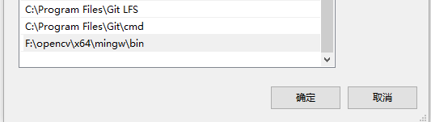

**库文件所在目录：**

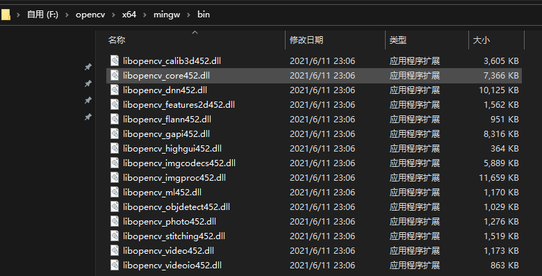

**修改 pro 文件：**

~~~perl
# $$PWD 当å‰æ–‡ä»¶æ‰€åœ¨è·¯å¾„
INCLUDEPATH += $$PWD/../opencv \
                $$PWD/../opencv/opencv2

LIBS += $$PWD/../opencv/x64/mingw/bin/libopencv_*.dll
~~~

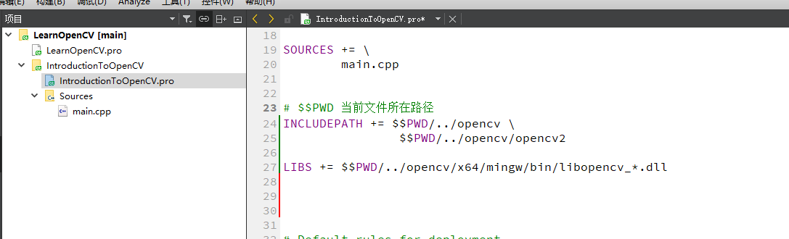

**头文件所在目录：**

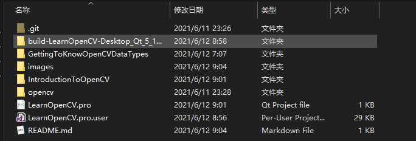

**添加头文件：**

~~~c++
#include <opencv2/opencv.hpp>
~~~

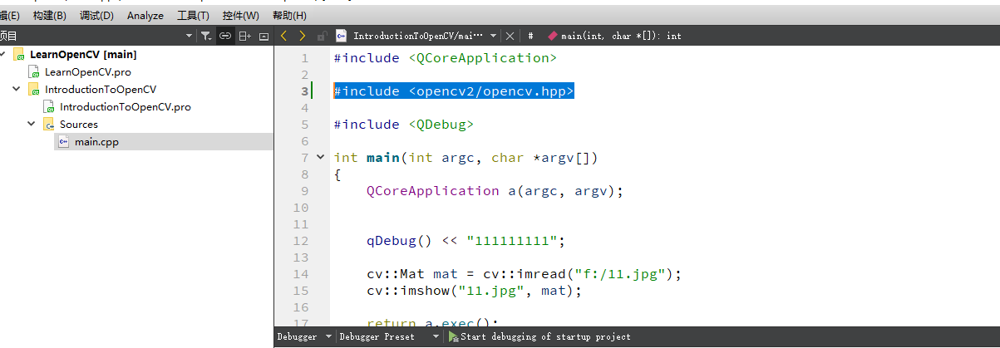

**说æ˜ï¼š**

`#include <opencv2/opencv.hpp> //Include file for every supported OpenCV function`

好，开打开打（æ¥è‡ªæ­¦å™¨å¤§å¸ˆçš„é…音）

## Chatper02. Introduction to OpenCV

### **First Program—Display a Picture**

~~~c++
#include <opencv2/opencv.hpp> //Include file for every supported OpenCV function

void DisplayPicture()
{
    cv::Mat mat = cv::imread("../lena.jpg");

    if( mat.empty() )
        return;

    cv::imshow("lena", mat);
}
~~~

`imread` 说æ˜ï¼š

> Including BMP, DIB, JPEG, JPE, PNG, PBM, PGM, PPM, SR, RAS, and TIFF. 
>
> OpenCV uses this structure to handle all kinds of images: single-channel, multichannel, integer-valued, floating-point-valued, and so on. 

### **Second Program—Video**

Playing a video with OpenCV is almost as easy as displaying a single picture. 

just loop to read each frame in sequence;

我这里没有 *ffmpeg.dll*，所以暂时先ä¸çœ‹ videoçš„

~~~c++
void PlayVideo( const char* szPath )
{
    cv::VideoCapture cap;
    cap.open(szPath);

    cv::Mat frame;
    for(; ; )
    {
        cap >> frame;
        if( frame.empty() )
            continue;

        cv::imshow(szPath, frame);

        // 等待 33ms 没按键开始下一帧
        if(cv::waitKey(33) >= 0)
            break;
    }
}
~~~

## Chatper03.  Getting to Know OpenCV Data Types

In addition to these types, OpenCV also makes heavy use of the *Standard Template* *Library* (STL). OpenCV particularly relies on the vector class, and many OpenCV library functions now have vector template objects in their argument lists. We will not cover STL in this book,1 other than as necessary to explain relevant functionality. If you are already comfortable with STL, many of the template mechanisms used “under the hood†in OpenCV will be familiar to you. 

使用了标准模æ¿åº“(STL)。OpenCV特别ä¾èµ–äºå‘é‡ç±»ï¼Œè®¸å¤šOpenCV库函数ç°åœ¨çš„å‚数列表中都有å‘é‡æ¨¡æ¿å¯¹è±¡ã€‚

这些都很基础了，存档，跳过，ä¸é€‚åˆæˆ‘们这ç§é«˜ç«¯ç©å®¶ã€‚

### **The point classes**

### **The size classes** 

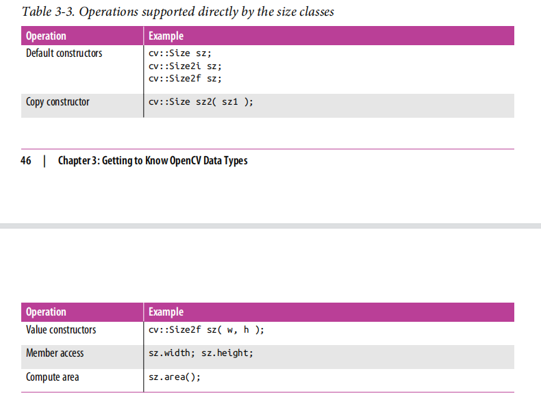

### **The cv::Rect class**

### **The cv::RotatedRect class**

The cv::RotatedRect class is one of the few classes in the C++ OpenCV interface that is not a template underneath. Instead, it is a container that holds a cv::Point2f called center, a cv::Size2f called size, and one additional float called angle, with the latter representing the rotation of the rectangle around center. One very impor†tant difference between cv::RotatedRect and cv::Rect is the convention that a cv::RotatedRect is located in “space†relative to its center, while the cv::Rect is located relative to its upper-left corner. Table 3-6 lists the operations that are sup†ported directly by cv::RotatedRect. 

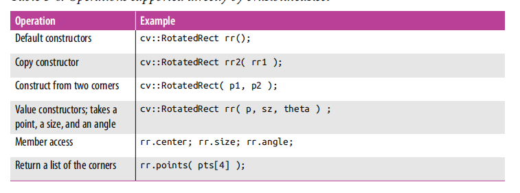

#### æºç s

~~~c++
class CV_EXPORTS RotatedRect
{
public:
    //æ„造函数
    RotatedRect();
    RotatedRect(const Point2f& center, const Size2f& size, float angle);
    RotatedRect(const CvBox2D& box);
    void points(Point2f pts[]) const;//!è¿”å›çŸ©å½¢çš„4个顶点
    Rect boundingRect() const; //è¿”å›åŒ…å«æ—‹è½¬çŸ©å½¢çš„最å°çŸ©å½¢
    operator CvBox2D() const;    //!转æ¢åˆ°æ—§å¼çš„cvbox2d结æ„
    Point2f center; //矩形的质心
    Size2f size;   //矩形的边长
    float angle;  //旋转角度，当角度为0ã€90ã€180ã€270等时，矩形就æˆäº†ä¸€ä¸ªç›´ç«‹çš„矩形
};
~~~

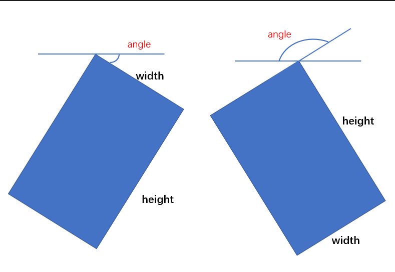

### **The fixed matrix classes** 

 all memory for their data is allocated **on the stack,**

当需è¦ä½¿ç”¨å›ºå®šå¤§å°çš„矩阵的时候，最好是使用这个，栈上分é…，这个使用很快。

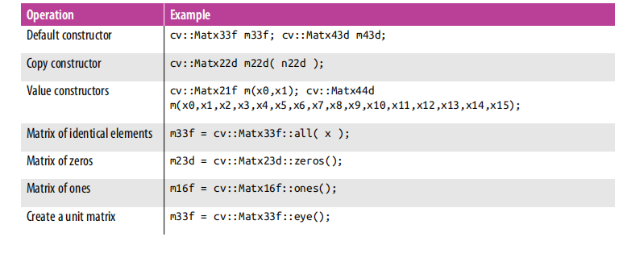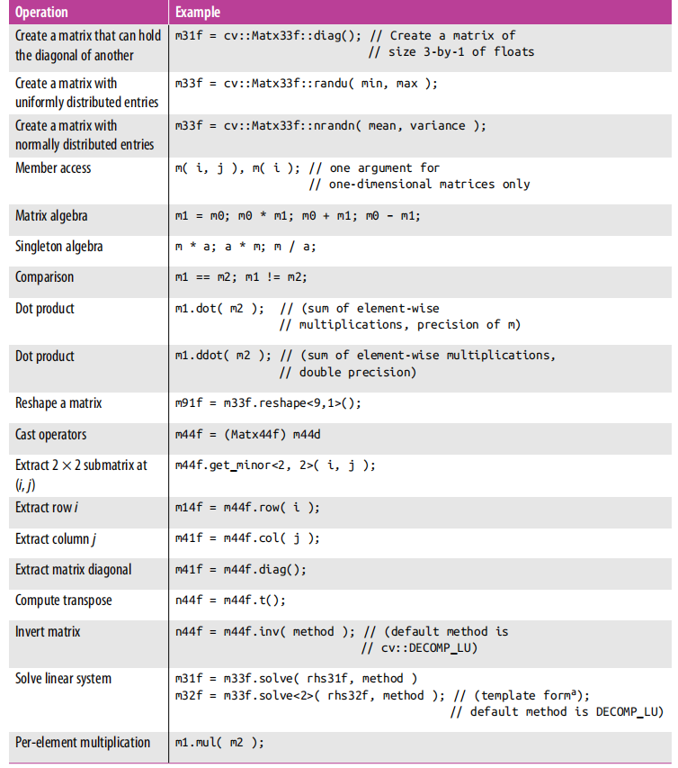

### **The fixed vector classes**

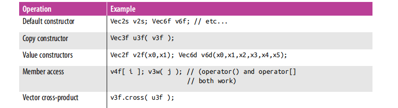

### **The complex number classes**

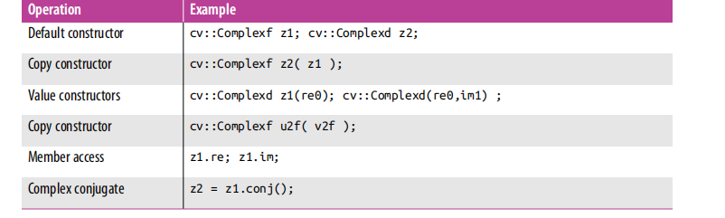

### **Helper Objects**

一些算法上的辅助对象

#### **The cv::TermCriteria class** 

结æŸæ ‡å¿—

**The cv::Range class**

指定一个整数数列，左闭å³å¼€

#### **The cv::Ptr template and Garbage Collection 101**

一个智能指针，就是添加引用计数，当为 0 的时候就删除。

### cv::vect<>`

最简å•çš„就是 `cv::Vec<>` ，当然这个和 `stl::vector` 最大区别的地方就在äº

>  The key difference is that the fixed vector classes are intended for small vectors whose dimensions are known at compile time. （编译时就知é“最å°å¤§å°ï¼‰

### `cv::Matx<>`

Just like the fixed vector classes, cv::Matx<> is not intended to be used for large arrays, but rather is designed for the handling of certain specific small matrix operations. 

对äºå°å‹çš„æ•°æ®æ˜¯å¾ˆä¸é”™çš„选择，比如 2\*2  3\*3 è¿™ç§çŸ©é˜µï¼Œä½†æ˜¯å¿…须在编译的时候就è¦çŸ¥é“大å°ã€‚

### `cv::Scalar `

相当äºä¸€ä¸ªå››ç»´çš„点

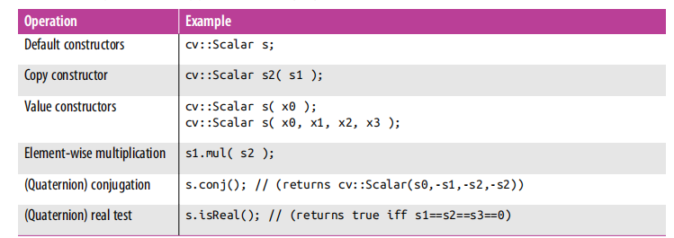

## Chapter04-Images And Large Array Types

opencv大å‹æ•°æ®ç»“æ„  cv::Mat ，opencv 最常用的数æ®ç»“æ„。

The cv::Mat class is used to represent *dense* arrays of any number of dimensions. In this context, dense means that for every entry in the array, there is a data value stored in memory corresponding to that entry, even if that entry is zero. Most images, for example, are stored as dense arrays. The alternative would be a *sparse* array. In the case of a sparse array, only nonzero entries are typically stored. This can result in a great savings of storage space if many of the entries are in fact zero, but can be very wasteful if the array is relatively dense. A common case for using a sparse array rather than a dense array would be a histogram. For many histograms, most of the entries are zero, and storing all those zeros is not necessary. For the case of sparse arrays, openCV has the alternative data structure, cv::SparseMat. 

cv::SparseMat：稀ç–数组，存储é 0 的项，常è§çš„，比如直方图，很多为 0，就ä¸éœ€è¦å­˜å‚¨ã€‚

### **The cv::Mat Class: N-Dimensional Dense Arrays** 

å¯ä»¥è¢«å¤šç»´ä½¿ç”¨

The data array is laid out such that the address of an element whose indices are given by (*i*0, *i**i*, … , *i**N**d* −1) is:

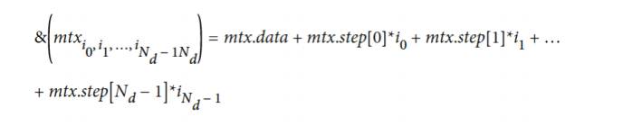

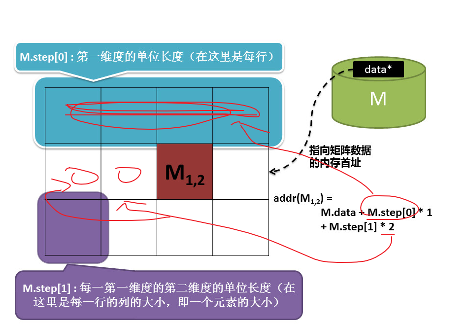

å°±ç›¸å½“äº  w * 1 + 2 * elemsize 

### **Creating an Array** 

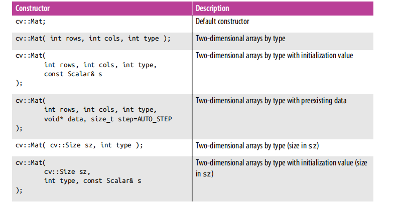

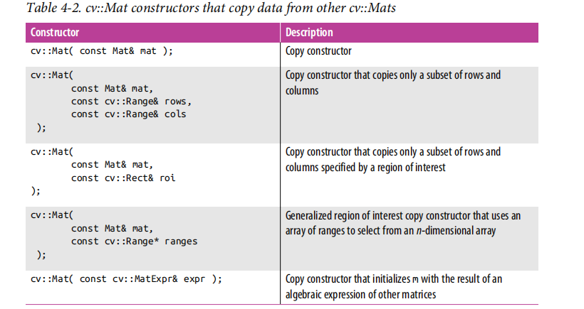

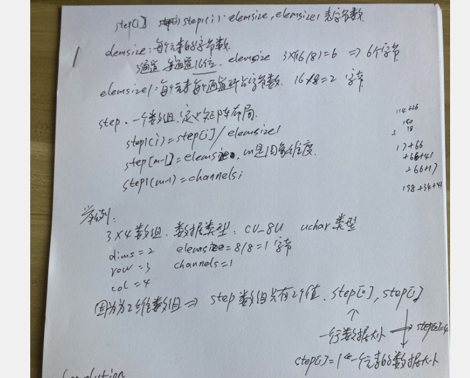

## Chapter08. Image, Video, and Data Files

OpenCV功能å…许我们ä¸æ“作系统ã€æ–‡ä»¶ç³»ç»Ÿå’Œæ‘„åƒå¤´ç­‰ç¡¬ä»¶è¿›è¡Œäº¤äº’，`HighGUI`模å—（代表“高级图形用户界é¢â€ï¼‰ã€‚

HighGUI allows us to read and write graphics-related files (both images and video), to open and manage windows, to display images, and to handle imple mouse, pointer, and keyboard events. 

### **Loading and Saving Images**

#### **Reading files with cv::imread()**

函数åŸå‹ï¼š

~~~c++
cv::Mat cv::imread(
 	const string& filename, // Input filename
 	int flags = cv::IMREAD_COLOR // Flags set how to interpret file
);
~~~

When opening an image, cv::imread() doesn’t look at the file extension. Instead, it analyzes the first few bytes of the file (a.k.a. its *signature* or “magic sequenceâ€) and determines the appropriate codec using that. 

并ä¸ä¾é æ‰©å±•åæ¥è¯»å–，而是检测å‰å‡ ä¸ªå­—节æ¥åˆ¤å®šã€‚

**第二个å‚数：**

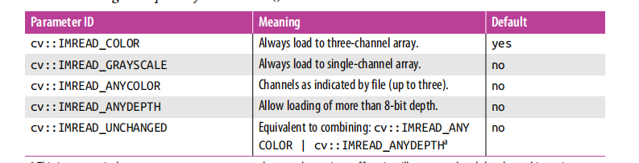

当加载的时候，并ä¸ä¼šæŠ¥è¿è¡Œé”™è¯¯ï¼Œå°±å¥½æ¯”没有文件，所以，è¦ç”¨ `Mat::empty()`æ¥åˆ¤å®šã€‚

~~~c++
    cv::Mat mat = cv::imread(szPath);

    if( mat.empty() )
        return;

    cv::imshow(szPath, mat);
~~~

#### **Writing files with cv::imwrite()**

函数åŸå‹ï¼š

~~~c++
bool cv::imwrite(
 	const string& filename, // Input filename
 	cv::InputArray image, // Image to write to file
 	const vector<int>& params = vector<int>() // (Optional) for parameterized fmts
);
~~~

**第一个å‚数：**

​	这个文件的扩展å就有用了，就是文件的存储格å¼äº† 

​	常用的格å¼ï¼š

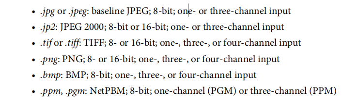

**第二个å‚数：**

​	图åƒçš„æ•°æ®ç»“æ„

**第三个å‚数：**

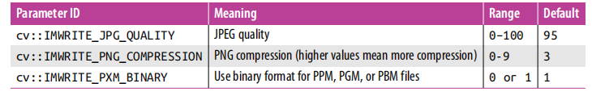

### **Compression and Decompression**

#### **Compressing files with cv::imencode()**

将图åƒå‹ç¼©æˆä¸€ä¸²å­—符，比如å¯ä»¥ç”¨æ¥ç½‘络传输，这样就å‡å°‘传输é‡

~~~c++
CV_EXPORTS_W bool imencode( const String& ext, InputArray img,
                            CV_OUT std::vector<uchar>& buf,
                            const std::vector<int>& params = std::vector<int>());
~~~

示例
~~~C++
// 读å–å‹ç¼©
std::vector<uchar> Compression(const char* szPath, const char* szExt)
{
    cv::Mat mat = cv::imread(szPath);

    //encode image
    std::vector<uchar> vEncode;
    cv::imencode(szExt, mat, vEncode);

    return vEncode;
}
//解å‹
cv::Mat Decompression(std::vector<uchar> vData)
{
    return cv::imdecode(vData,  cv::IMREAD_COLOR);
}
~~~

## **Chapter10. Filters and Convolution**

### **Filters, Kernels, and Convolution** 

图åƒæ»¤æ³¢å™¨ï¼Œä¸»è¦å°±æ˜¯åšä¸€ä¸ªå·ç§¯è¿ç®—。好比系列算å­ï¼Œå·¦è¾¹çš„å¼å­æ˜¯è¡¨ç¤ºä¸º æ ¸ `k` ä¸`I(x,y)`的加æƒå’Œã€‚ 

In this chapter, many of the important kernels we encounter will be *linear kernels*. This means that the value assigned to point *x*, *y* in *I*′ can be expressed as a weighted sum of the points around (and usually including) *x*, *y* in *I*.2 If you like equations, this can be written as:

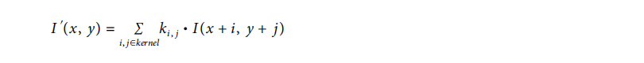

The template that defines both this small area’s shape, as well as how the elements of that small area are combined, is called a *filter* or a *kernel*.

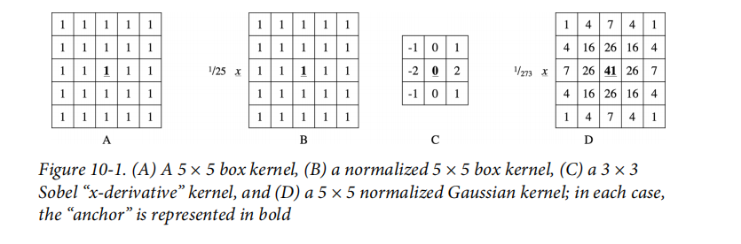

中间的点就是 锚点

**Anchor points** 

Each kernel shown in Figure 10-1 has one value depicted in bold. This is the *anchor* *point* of the kernel. This indicates how the kernel is to be aligned with the source image. For example, in Figure 10-1(D), the number 41 appears in bold. This means that in the summation used to compute *I*′(*x*, *y*), it is *I*(*x*, *y*) that is multiplied by 41/273 (and similarly, the terms corresponding to *I*(*x* – 1, *y*) and *I*(*x* + 1, *y*) are multiplied by 26/273).

表示:æƒé‡   ==>  å°±ç›¸å½“äº    41/ 273   就是 中间这个点的值 / 所有的值相加；

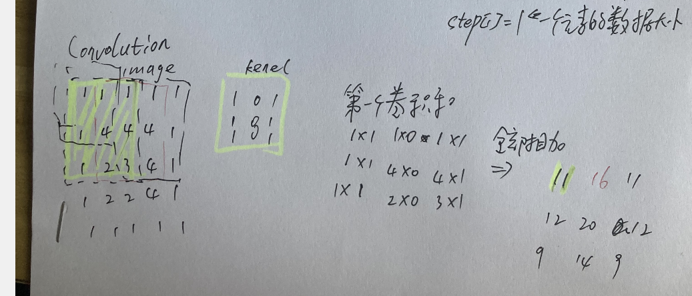

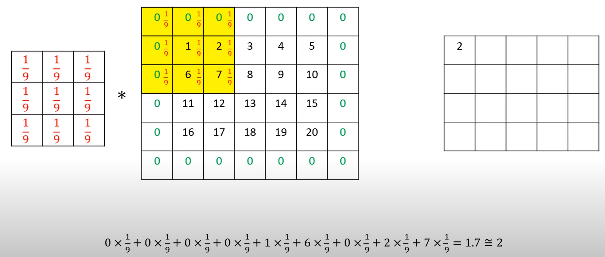

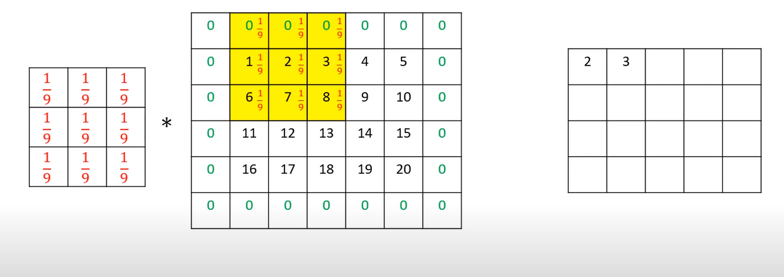

from:https://www.youtube.com/watch?v=xTRsxrvXcmM

### **Border Extrapolation and Boundary Conditions**

就相当äºåœ¨å›¾åƒçš„边界外层å†å¢åŠ ä¸€åœˆçš„åƒç´ ï¼ˆopecv中å«åšï¼š virtual åƒç´  ）

#### **Making borders yourself**

使用 `cv::copyMakeBorder`æ¥å¢åŠ è¾¹ç•Œ

函数åŸå‹ï¼š

~~~c++
void cv::copyMakeBorder(
 	cv::InputArray src, // Input image
 	cv::OutputArray dst, // Result image
 	int top, // Top side padding (pixels)
 	int bottom, // Bottom side padding (pixels)
 	int left, // Left side padding (pixels)
 	int right, // Right side padding (pixels)
 	int borderType, // Pixel extrapolation method
 	const cv::Scalar& value = cv::Scalar() // Used for constant borders
);
~~~

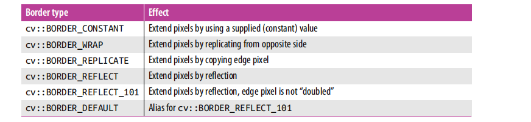

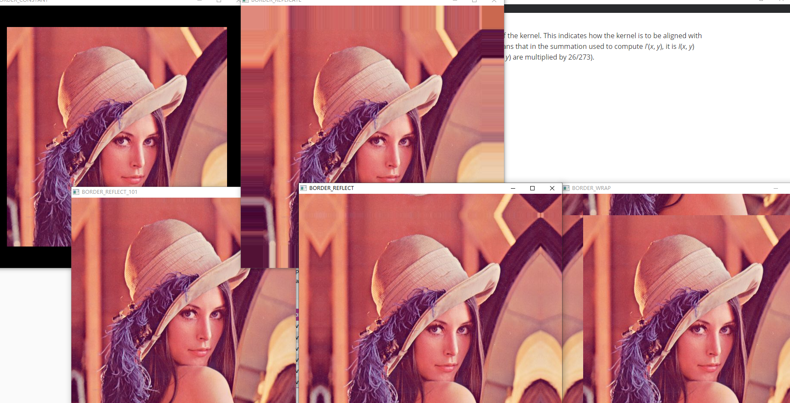

~~~c++
cv::Mat MakeBorder( const char* szPath, const cv::BorderTypes bt)
{
    cv::Mat mat = cv::imread(szPath);
    cv::copyMakeBorder( mat, mat, 5,5,5,5, bt );
    return mat;
}
    

	const char* szPath = "../lena.jpg";

    cv::imshow("BORDER_CONSTANT", MakeBorder(szPath, cv::BORDER_CONSTANT));
    cv::imshow("BORDER_REPLICATE", MakeBorder(szPath, cv::BORDER_REPLICATE));
    cv::imshow("BORDER_REFLECT", MakeBorder(szPath, cv::BORDER_REFLECT));
    cv::imshow("BORDER_WRAP", MakeBorder(szPath, cv::BORDER_WRAP));
    cv::imshow("BORDER_REFLECT_101", MakeBorder(szPath, cv::BORDER_REFLECT_101));
    //cv::imshow("BORDER_TRANSPARENT", MakeBorder(szPath, cv::BORDER_TRANSPARENT));

~~~

### **Threshold Operations** 

就是 **阈值**：

函数åŸå‹ï¼š

~~~c++
double cv::threshold(
 	cv::InputArray src, // Input image
 	cv::OutputArray dst, // Result image
 	double thresh, // Threshold value
 	double maxValue, // Max value for upward operations
 	int thresholdType // Threshold type to use (Example 10-3)
);
~~~

好比使用一个  1 * 1 çš„ kernel æ¥è¿›è¡Œæ“作。

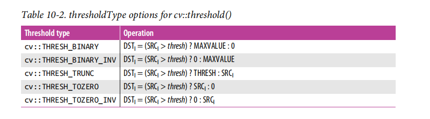

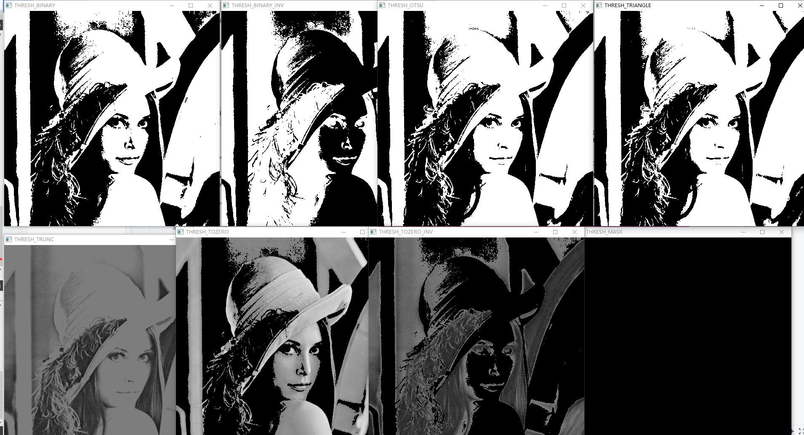

~~~c++
cv::Mat Threshold(const char* szPath, double thre, double max ,cv::ThresholdTypes tt)
{
    cv::Mat mat = cv::imread(szPath, cv::IMREAD_GRAYSCALE);
    cv::threshold(mat, mat, thre, max, tt);

    return mat;
}

    const char* szPath = "../lena.jpg";
    cv::imshow("THRESH_BINARY", Threshold(szPath, 125, 255, cv::THRESH_BINARY));
    cv::imshow("THRESH_BINARY_INV", Threshold(szPath, 125, 255, cv::THRESH_BINARY_INV));
    cv::imshow("THRESH_TRUNC", Threshold(szPath, 125, 255, cv::THRESH_TRUNC));
    cv::imshow("THRESH_TOZERO", Threshold(szPath, 125, 255, cv::THRESH_TOZERO));
    cv::imshow("THRESH_TOZERO_INV", Threshold(szPath, 125, 255, cv::THRESH_TOZERO_INV));
    cv::imshow("THRESH_MASK", Threshold(szPath, 125, 255, cv::THRESH_MASK));
    cv::imshow("THRESH_OTSU", Threshold(szPath, 125, 255, cv::THRESH_OTSU));
    cv::imshow("THRESH_TRIANGLE", Threshold(szPath, 125, 255, cv::THRESH_TRIANGLE));

~~~

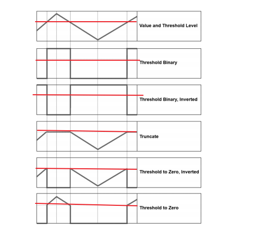

这个图，更清晰的展示，红色为阈值线。

#### **Otsu’s Algorithm**

这是一个å°æ—¥å­è¿‡å¾—还ä¸é”™çš„日本人å‘æ˜çš„   -- 大津算法；

 		大津法由大津(otsu)äº1979å¹´æ出，对图åƒImage，记t为å‰æ™¯ä¸èƒŒæ™¯çš„分割阈值，å‰æ™¯ç‚¹æ•°å å›¾åƒæ¯”例为w0，平å‡ç°åº¦ä¸ºu0；背景点数å å›¾åƒæ¯”例为w1，平å‡ç°åº¦ä¸ºu1。图åƒçš„总平å‡ç°åº¦ä¸ºï¼š`u=w0*u0+w1*u1`。ä»æœ€å°ç°åº¦å€¼åˆ°æœ€å¤§ç°åº¦å€¼éå†t，当t使得值`g=w0*(u0-u)/2+w1*(u1-u)/2 `最大时tå³ä¸ºåˆ†å‰²çš„最佳阈值。对大津法å¯ä½œå¦‚下ç†è§£ï¼šè¯¥å¼å®é™…上就是 类间方差值 ，阈值t分割出的å‰æ™¯å’ŒèƒŒæ™¯ä¸¤éƒ¨åˆ†æ„æˆäº†æ•´å¹…图åƒï¼Œè€Œå‰æ™¯å–值u0，概ç‡ä¸º w0，背景å–值u1，概ç‡ä¸ºw1，总å‡å€¼ä¸ºu，根æ®æ–¹å·®çš„定义å³å¾—该å¼ã€‚因方差是ç°åº¦åˆ†å¸ƒå‡åŒ€æ€§çš„一ç§åº¦é‡,方差值越大,说æ˜æ„æˆå›¾åƒçš„两部分差别越大, 当部分目标错分为背景或部分背景错分为目标都会导致两部分差别å˜å°ï¼Œå› æ­¤ä½¿ç±»é—´æ–¹å·®æœ€å¤§çš„分割æ„味ç€é”™åˆ†æ¦‚ç‡æœ€å°ã€‚ 

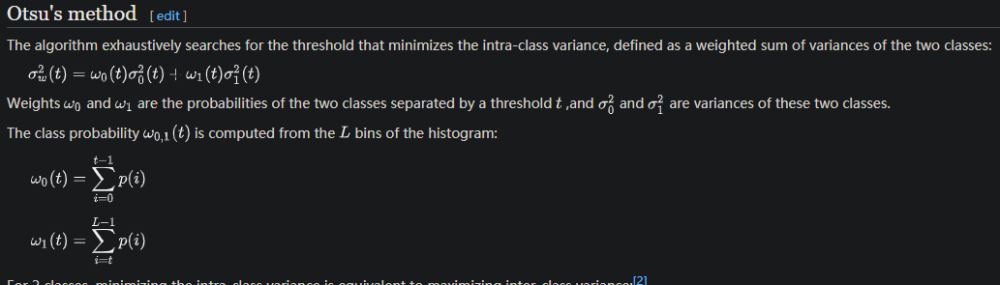

~~~c++

统计å„个åƒç´ å€¼çš„出ç°æ¬¡æ•°

while(éå†å„ç§é˜ˆå€¼çš„å–值（0到255ç§å¯èƒ½ï¼‰)
{
    1. æ ¹æ®å½“å‰é˜ˆå€¼å¯¹å›¾åƒæ‰€æœ‰å‡ºç°çš„åƒç´ å€¼è¿›è¡Œåˆ†ç±»ã€‚
    大äºé˜ˆå€¼çš„åƒç´ å€¼åˆ†ä¸ºä¸€ä¸ªç±»A，å°äºé˜ˆå€¼åˆ™åˆ†ä¸ºå¦å¤–一个类B。（到时候你å¯ä»¥è®©A类中所有åƒç´ å€¼ä¸º1，B类所有åƒç´ å€¼ä¸º0。也å¯ä»¥è®©ç±»A所有åƒç´ å€¼ä¸º0.这都是å¯ä»¥ä½ è‡ªå·±å®šï¼Œæ‰€ä»¥æˆ‘就用A，B代替了。）
    2. 计算类A的所有åƒç´ å€¼çš„方差SA，计算类B中所有åƒç´ å€¼çš„方差SB
    3. 计算类A中所有åƒç´ å€¼ä¹‹å’ŒIA，计算类B中所有åƒç´ ç‚¹çš„åƒç´ å€¼çš„åƒç´ å€¼ä¹‹å’ŒIB
    4. 计算当å‰é˜ˆå€¼åˆ’分下两个类的åƒç´ å€¼æ–¹å·®çš„加æƒå’ŒS=IA*SA+SB*IB
    5. åƒç´ å€¼æ–¹å·®çš„加æƒå’ŒS是å¦æ˜¯ç›®å‰éå†åˆ°çš„阈值划分下最å°çš„那一个值？如æœæ˜¯é‚£å°±ä¿å­˜å½“å‰è¿™ç§å–值
}

通过上é¢æ“作最终得到最优的阈值d。

while(éå†æ‰€æœ‰åƒç´ ç‚¹ï¼‰
{
   åƒç´ å€¼å¤§äºé˜ˆå€¼d赋值为1，
   åƒç´ å€¼å°äºé˜ˆå€¼d赋值为0
}

~~~

> é‡æ–°å›é¡¾ä¸€ä¸‹ç»Ÿè®¡å­¦æ¦‚念
>
> æ•°æ® 1：1   2   2    7   8
>
> æ•°æ® 2：2   3   4    5   6
>
> å¹³å‡å€¼ï¼š （1 + 2 + 2 + 7 + 8 ） / 5     表æ˜èµ„料中å„观测值相对集中较多的中心ä½ç½® 
>
> 中ä½æ•°ï¼š æ’åºå 中间 那一个  æ端值对数æ®çš„中间值影å“ä¸å¤§ï¼Œ   一个样本ã€ç§ç¾¤æˆ–概ç‡åˆ†å¸ƒä¸­çš„一个数值， 统计人å‡æ”¶å…¥çš„时候，进æ¥ä¸€ä¸ª jack 🴠就没太大影å“。
>
> 方差：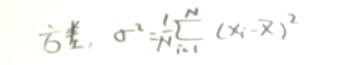 方差的æ„义在äºå映了一组数æ®ä¸å…¶å¹³å‡å€¼çš„å离程度 
>
> 标准差：	 标准差能å映一个数æ®é›†çš„离散程度。 

#### **Adaptive Threshold**

​		 它的æ€æƒ³ä¸æ˜¯è®¡ç®—全局图åƒçš„阈值，而是根æ®å›¾åƒä¸åŒåŒºåŸŸäº®åº¦åˆ†å¸ƒï¼Œè®¡ç®—其局部阈值，所以对äºå›¾åƒä¸åŒåŒºåŸŸï¼Œèƒ½å¤Ÿè‡ªé€‚应计算ä¸åŒçš„阈值，因此被称为自适应阈值法。 

​		 如何确定局部阈值呢？å¯ä»¥**计算æŸä¸ªé‚»åŸŸ(局部)çš„å‡å€¼ã€ä¸­å€¼ã€é«˜æ–¯åŠ æƒå¹³å‡(高斯滤波)æ¥ç¡®å®šé˜ˆå€¼**。值得说æ˜çš„是：如æœç”¨å±€éƒ¨çš„å‡å€¼ä½œä¸ºå±€éƒ¨çš„阈值，就是常说的移动平å‡æ³•(å¬èµ·æ¥æŒºé«˜å¤§ä¸Šï¼Œå…¶å®......逃)。 

函数åŸå‹ï¼š

~~~c++
void cv::adaptiveThreshold(
 	cv::InputArray src, // Input image
 	cv::OutputArray dst, // Result image
 	double maxValue, // Max value for upward operations
	int adaptiveMethod, // mean or Gaussian
	int thresholdType // Threshold type to use (Example 10-3)
 	int blockSize, // Block size
 	double C // Constant
);

/*
InputArray src：æºå›¾åƒ

OutputArray dst：输出图åƒï¼Œä¸æºå›¾åƒå¤§å°ä¸€è‡´

int adaptiveMethod：在一个邻域内计算阈值所采用的算法，有两个å–值，分别为 ADAPTIVE_THRESH_MEAN_C å’Œ ADAPTIVE_THRESH_GAUSSIAN_C 。
ADAPTIVE_THRESH_MEAN_C的计算方法是计算出领域的平å‡å€¼å†å‡å»ç¬¬ä¸ƒä¸ªå‚æ•°double C的值。
ADAPTIVE_THRESH_GAUSSIAN_C的计算方法是计算出领域的高斯å‡å€¼å†å‡å»ç¬¬ä¸ƒä¸ªå‚æ•°double C的值。

int thresholdType：这是阈值类å‹ï¼Œåªæœ‰ä¸¤ä¸ªå–值，分别为 THRESH_BINARY å’ŒTHRESH_BINARY_INV  具体的请看官方的说æ˜ï¼Œè¿™é‡Œä¸å¤šåšè§£é‡Šã€‚

int blockSize：adaptiveThreshold的计算å•ä½æ˜¯åƒç´ çš„邻域å—，这是局部邻域大å°ï¼Œ3ã€5ã€7等。

double C：它是一个ä»å‡å€¼æˆ–加æƒå‡å€¼æå–的常数，å¯ä»¥æ˜¯è´Ÿæ•°æˆ–者是零。这个å‚æ•°å®é™…上是一个å移值调整é‡ï¼Œç”¨å‡å€¼å’Œé«˜æ–¯è®¡ç®—阈值å，å†å‡æˆ–加这个值就是最终阈值。
*/
~~~

最å一个å‚æ•°ä¼  0

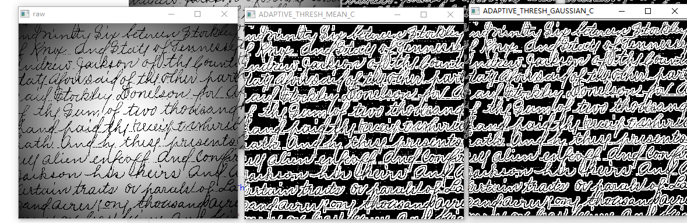

最å一个å‚æ•°ä¼   10

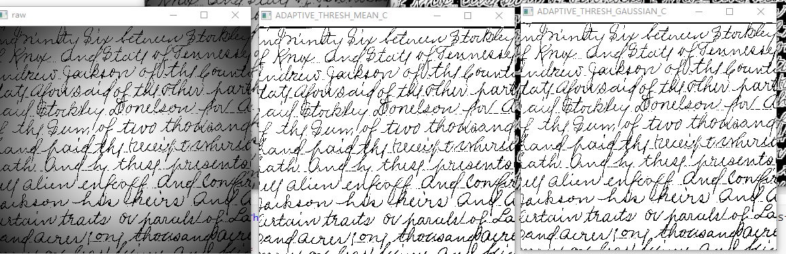

~~~c++
cv::Mat AdaptiveThreshold(const char* szPath, double max, int adaptiveMethod, int thresholdType, int blockSize, double c)
{
    cv::Mat mat = cv::imread(szPath, cv::IMREAD_GRAYSCALE);
    cv::adaptiveThreshold(mat, mat, max, adaptiveMethod, thresholdType, blockSize, c);
    return mat;
}

{
	const char* szPath = "f:/ad.png";
    cv::imshow("raw", cv::imread(szPath, cv::IMREAD_GRAYSCALE));
    cv::imshow("ADAPTIVE_THRESH_MEAN_C", AdaptiveThreshold(szPath, 255, cv::ADAPTIVE_THRESH_MEAN_C, cv::THRESH_BINARY, 5, 10));
    cv::imshow("ADAPTIVE_THRESH_GAUSSIAN_C", AdaptiveThreshold(szPath, 255, cv::ADAPTIVE_THRESH_GAUSSIAN_C, cv::THRESH_BINARY, 5, 10));
}
~~~

### **Smoothing**

*Smoothing*, also called *blurring*   模糊，平滑都是这ç©æ„

often done to reduce noise or camera artifacts

示æ„图走一波~~~

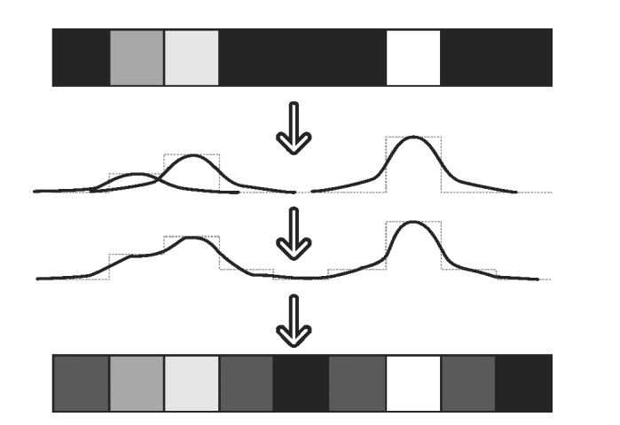

#### **Simple Blur and the Box Filter** 

函数åŸå‹ï¼š

ä½é€šæ»¤æ³¢å™¨ï¼Œå°±æ˜¯å–å¹³å‡å€¼å’¯~~~~

~~~c++
void cv::blur(
 	cv::InputArray src, // Input image
 	cv::OutputArray dst, // Result image
 	cv::Size ksize, // Kernel size
 	cv::Point anchor = cv::Point(-1,-1), // Location of anchor point
 	int borderType = cv::BORDER_DEFAULT // Border extrapolation to use
);
~~~

一个简å•çš„滤波器，就是å–所有åƒç´ çš„å¹³å‡å€¼

方波滤波器：

~~~c++
void cv::boxFilter(
 	cv::InputArray src, // Input image
 	cv::OutputArray dst, // Result image
 	int ddepth, // Output depth (e.g., CV_8U)
 	cv::Size ksize, // Kernel size
 	cv::Point anchor = cv::Point(-1,-1), // Location of anchor point
 	bool normalize = true, // If true, divide by box area  表示内核是å¦å…¶åŒºåŸŸå½’一化。
 	int borderType = cv::BORDER_DEFAULT // Border extrapolation to use
);
~~~

OpenCV函数`cv::boxFilter()`是一ç§æ›´é€šç”¨çš„å½¢å¼ï¼Œå…¶ä¸­`cv::blur()`本质上是一ç§ç‰¹æ®Šæƒ…况。`cv::boxFilter()`å’Œ`cv::blur()`之间的主è¦åŒºåˆ«æ˜¯ï¼Œå‰è€…å¯ä»¥åœ¨é标准化模å¼ä¸‹è¿è¡Œ(使normalize=false正常化)，并且å¯ä»¥æ§åˆ¶è¾“出图åƒdst的深度。（对äº`cv::blur()`，dst的深度将始终等äºsrc的深度。）如æœæ•°æ®æ·±åº¦çš„值设置为-1，则目标图åƒå°†ä¸æºå…·æœ‰ç›¸åŒçš„深度；å¦åˆ™ï¼Œæ‚¨å¯ä»¥ä½¿ç”¨ä»»ä½•é€šå¸¸çš„别å（例如，CV_32F）。

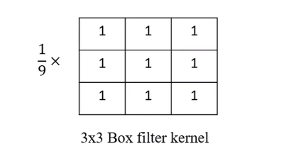

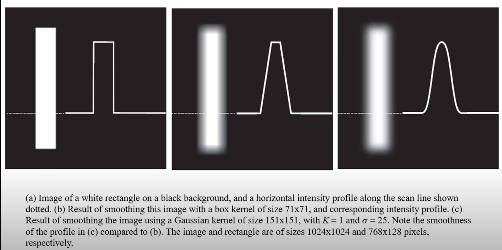

~~~c++
/*
 * void boxFilter(InputArray src,
            OutputArray dst,
            int ddepth,
            Size ksize,
            Point anchor=Point(-1, -1),
            bool normalize = true,
            int borderType = BORDER_DEFALT)

* 	å‚数一：InputArrayç±»å‹ï¼Œä¸€èˆ¬æ˜¯cv::Mat，且å¯ä»¥å¤„ç†ä»»ä½•é€šé“数的图片。但需è¦æ³¨æ„，待处ç†çš„图片深度应该为CV_8Uã€CV_16Uã€CV_16Sã€CV_32Fã€CV_64F中的一个ã€
	å‚数二；OutputArrayç±»å‹ï¼Œè¾“出的目标图åƒï¼Œéœ€è¦å’ŒåŸå›¾ç‰‡æœ‰ä¸€æ ·çš„尺寸和类å‹ã€
	å‚数三：intç±»å‹ï¼Œè¡¨ç¤ºè¾“出图åƒçš„深度Ｑ代表使用åŸå›¾æ·±åº¦ã€
	å‚数四：Sizeç±»å‹çš„ksize，内核的大å°ã€‚一般用Size(w,h)æ¥è¡¨ç¤ºå†…核的大å°ï¼ŒSize(3,3)就表3的核大å°ã€
    å‚数五：Pointç±»å‹ï¼Œè¡¨ç¤ºé”šç‚¹ï¼ˆå€¼è¢«å¹³æ»‘的那个点）。注æ„：默认值Point(-1,-1)。如æœç‚¹æ˜¯è´Ÿå€¼ï¼Œå°±è¡¨ç¤ºå–核的中心为锚点ã€
    å‚数六：boolç±»å‹normalize，默认为true，表示内核是å¦è¢«å…¶åŒºåŸŸå½’一化ã€
    å‚数七：intç±»å‹çš„borderType，用äºæ¨æ–­å›¾åƒå¤–部åƒç´ çš„æŸç§è¾¹ç•Œæ¨¡å¼ï¼Œä½¿ç”¨é»˜è®¤å€¼BORDER_DEFULAT，一般无需使用ã€
*/
~~~

上下 Slider 表 内核的  w   和   h

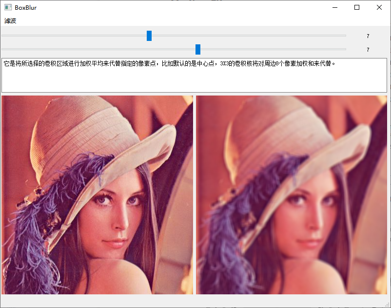

**归一化ç†è§£**

https://cppsecrets.com/users/168511510411111711412197115105110104975764103109971051084699111109/C00-OpenCV-cvnormalize.php
当ä»ä¸€ç§å›¾åƒç±»å‹è½¬æ¢ 为å¦ä¸€ç§å›¾åƒç±»å‹æ—¶ï¼Œä¹Ÿå¯ä»¥ä½¿ç”¨å½’一化，例如ä»æµ®ç‚¹åƒç´ å€¼è½¬æ¢ä¸º 8 ä½æ•´æ•°åƒç´ å€¼ã€‚例如，浮点图åƒä¸­çš„åƒç´ å€¼å¯èƒ½åœ¨ 0 到 5000 之间。将此范围标准化为 0-255 å¯ä»¥è½»æ¾è½¬æ¢ä¸º 8 ä½æ•´æ•°ã€‚显然，å‹ç¼©è¿‡ç¨‹ä¸­å¯èƒ½ä¼šä¸¢å¤±ä¸€äº›ä¿¡æ¯ï¼Œä½†ä¼šä¿ç•™åƒç´ çš„相对强度。

#### **Median Filter**

中值滤波法是一ç§é线性平滑技术，它将æ¯ä¸€åƒç´ ç‚¹çš„ç°åº¦å€¼è®¾ç½®ä¸ºè¯¥ç‚¹æŸé‚»åŸŸçª—å£å†…的所有åƒç´ ç‚¹ç°åº¦å€¼çš„中值。常用æ¥å¤„ç†æ¤’ç›å™ªå£°ï¼ˆæ¤’ç›å™ªå£°ï¼Œåˆç§°è„‰å†²å™ªå£°ï¼Œå®ƒéšæœºæ”¹å˜ä¸€äº›åƒç´ å€¼ï¼Œåœ¨äºŒå€¼å›¾åƒä¸Šè¡¨ç°ä¸ºä½¿ä¸€äº›åƒç´ ç‚¹å˜ç™½ï¼Œä¸€äº›åƒç´ ç‚¹å˜é»‘），主è¦æ˜¯åˆ©ç”¨ä¸­å€¼ä¸å—分布åºåˆ—æ大值和æå°å€¼å½±å“的特点。

**函数åŸå‹ï¼š**

~~~c++
void cv::medianBlur(
 	cv::InputArray src, // Input image
 	cv::OutputArray dst, // Result image
 	cv::Size ksize // Kernel size
);
~~~

**算法åŸç†ï¼š**

就是å–中值，就æ’åºå中间那一个撒，上é¢çš„方波è€å“¥æ˜¯å–çš„å¹³å‡å€¼ã€‚ 

* ã€å›¾1】为椒ç›å™ªå£°å¾…处ç†å›¾åƒï¼Œ
* ã€å›¾2】为ç»è¿‡3\*3中值滤波的处ç†æ•ˆæœï¼Œ
* ã€å›¾3】为ç»è¿‡11\*11的中值滤波器处ç†çš„效æœï¼Œå¯æ˜æ˜¾çœ‹å‡ºè¾¹ç¼˜æ¨¡ç³Šï¼Œç”šè‡³äºäººç‰©ä¸‹å·´å¤„的痣消失。 
* ã€å›¾4】为ç»è¿‡å‡å€¼æ»¤æ³¢çš„处ç†æ•ˆæœã€‚ 当使用中值滤波处ç†å›¾åƒæ—¶ï¼Œå›¾åƒè¾¹ç¼˜å¯èƒ½ä¼šå—到污染，å³è¾¹ç¼˜å˜æ¨¡ç³Šã€‚尤其是当处ç†çš„邻域范围å˜å¤§æ—¶ï¼Œè¿™ç§æ¨¡ç³Šå°†æ›´æ˜æ˜¾ã€‚

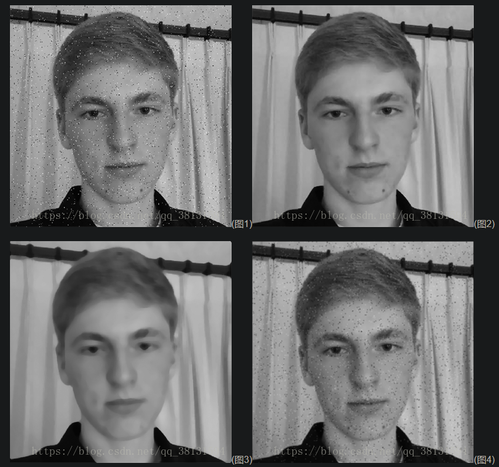

#### **Gaussian Filter**

**函数åŸå‹ï¼š**

~~~c++
void cv::GaussianBlur(
 	cv::InputArray src, // Input image
 	cv::OutputArray dst, // Result image
 	cv::Size ksize, // Kernel size
 	double sigmaX, // Gaussian half-width in x-direction
 	double sigmaY = 0.0, // Gaussian half-width in y-direction
 	int borderType = cv::BORDER_DEFAULT // Border extrapolation to use
);
~~~

For the Gaussian blur (an example kernel is shown in Figure 10-10), the parameter ksize gives the width and height of the filter window. The next parameter indicates the sigma value (half width at half max) of the Gaussian kernel in the x-dimension. The fourth parameter similarly indicates the sigma value in the y-dimension. If you specify only the *x* value, and set the *y* value to 0 (its default value), then the *y* and *x* values will be taken to be equal. If you set them both to 0, then the Gaussian’s parammeters will be automatically determined from the window size through the following formulae: 

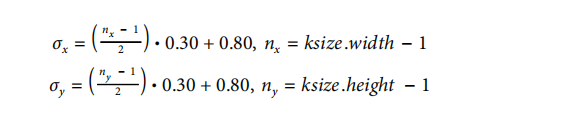

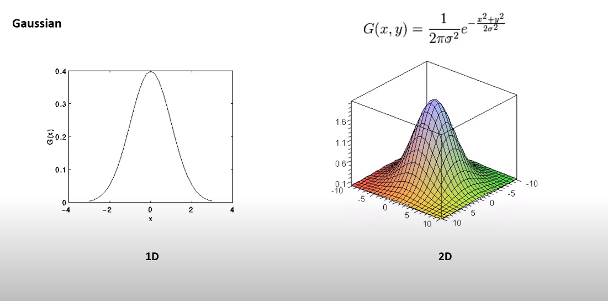

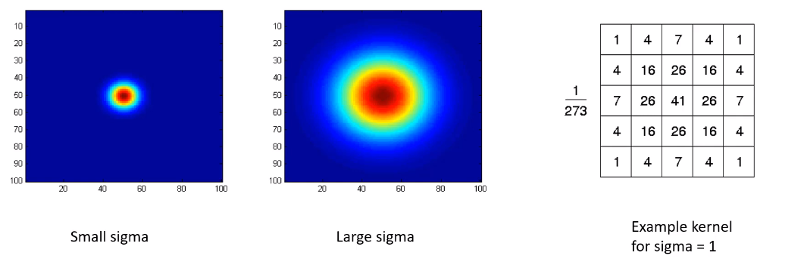

**å®é™…效æœï¼š**

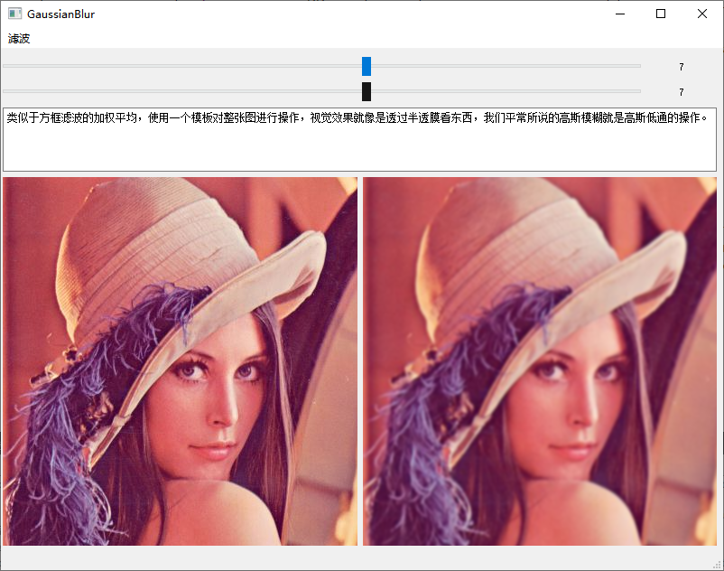

#### **Bilateral Filter** 

åŒè¾¹æ»¤æ³¢å™¨  --  它用æ¥è‡ªé™„è¿‘åƒç´ çš„强度值的加æƒå¹³å‡å€¼æ›¿æ¢æ¯ä¸ªåƒç´ çš„强度。该æƒé‡å¯ä»¥åŸºäºé«˜æ–¯åˆ†å¸ƒã€‚至关é‡è¦çš„是，æƒé‡ä¸ä»…å–决äºåƒç´ çš„欧几里得è·ç¦»ï¼Œè¿˜å–决äºè¾å°„差异（例如，范围差异，如颜色强度ã€æ·±åº¦è·ç¦»ç­‰ï¼‰ã€‚è¿™ä¿ç•™äº†é”‹åˆ©çš„边缘。 

**函数åŸå‹**

~~~c++
void cv::bilateralFilter(
 	cv::InputArray src, // Input image
 	cv::OutputArray dst, // Result image
 	int d, // Pixel neighborhood size (max distance)
 	double sigmaColor, // Width param for color weight function
 	double sigmaSpace, // Width param for spatial weight function
 	int borderType = cv::BORDER_DEFAULT // Border extrapolation to use
);
~~~

**图例示例**

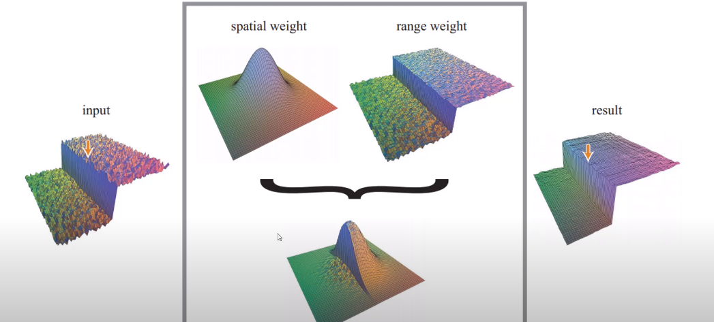

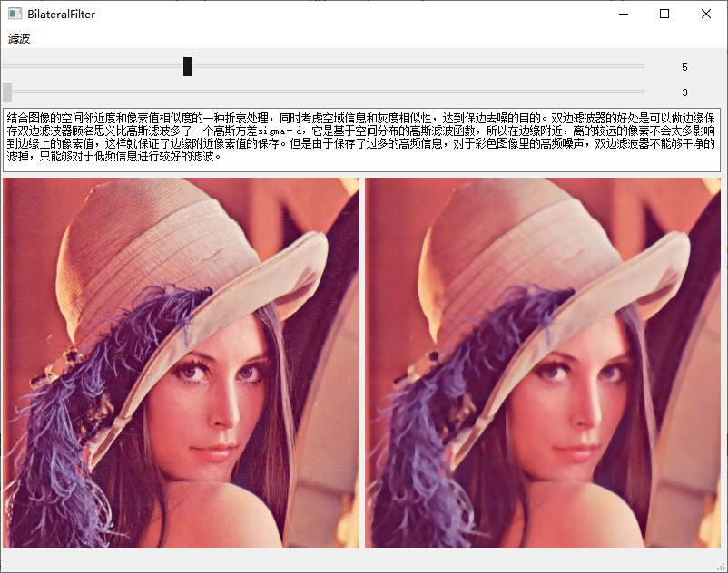

