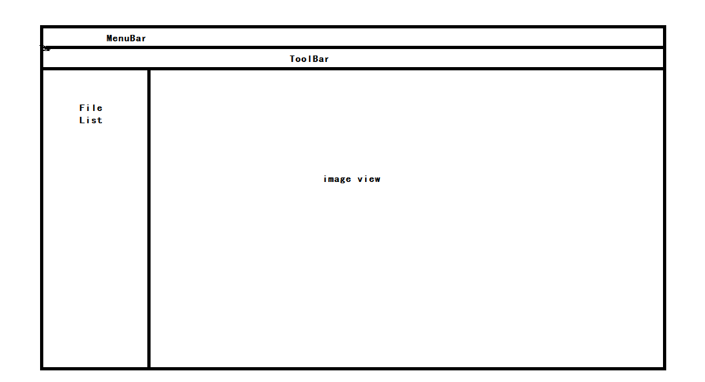

# 预测Mark点

## 概述

准备做一个Gerber文件自动检测对位点的程序，两步走。

* 把Gerber文件读入然后保存图片。
* 打开图片，然后选取标记点。保存点的位置

## 规划

采用 Qt 编写读取文件生产图片部分，用Python做模型。

**两个模块**

* 文件读取生成图片
* 读入图片做样本标记

**模型部分**

* 样本的多样化要多

### 读取文件模块

读取的部分有点，线，弧，多边形。

#### 标记模块

标记可以在图片最大的时候，采用 opencv 寻找轮廓后，反查数据点。提高精确性。

### 界面设计

这个比较简单

**菜单栏：**包含分辨率的更改等

**文件列表：**显示当前文件夹下的线路层文件

**图片显示区域：**显示生成的图像

### 程序设计

文件生成图片的时候，可以采用多线程，同时全部生成，没必要一个一个生成文件。载入标记的时候没办法，只有一个一个标记了。

标记后，保存点的坐标。

## 代码部分

### 主界面部分

### 文件模块

* 选择路径，获取当前路径下所有文件。

