一些小项目合集

# [CShapeExample](https://github.com/GuidoLuo0521/Projects/tree/master/CShapeExample)

C#例子

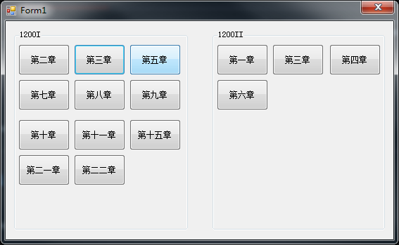

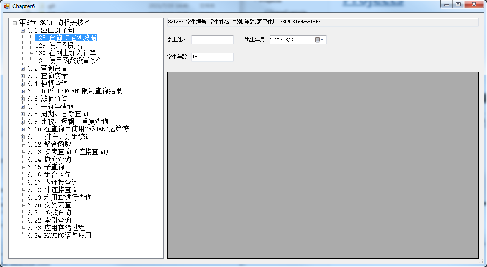

# [ParserGerber](https://github.com/GuidoLuo0521/Projects/tree/master/ParserGerber)

框架Qt读取Gerber文件，主要用来标注Mark点。

# **[LPR](https://github.com/GuidoLuo0521/Projects/tree/master/LPR)**

Qt，OpenCV 编写的车牌识别系统。

原图

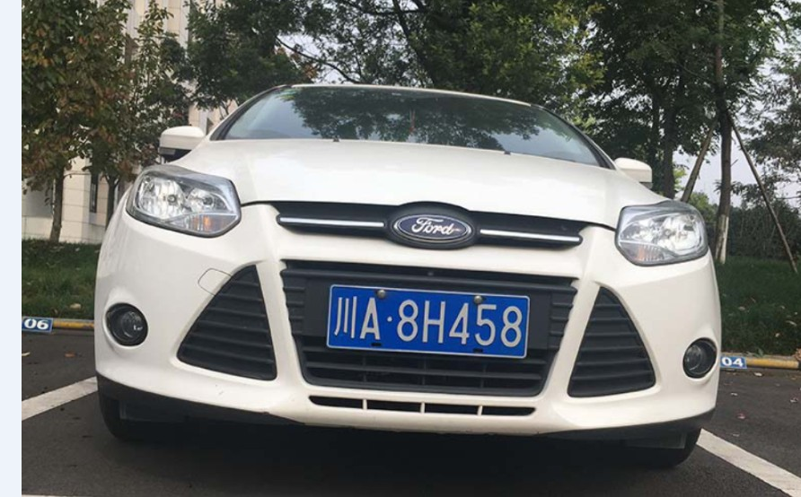

结果

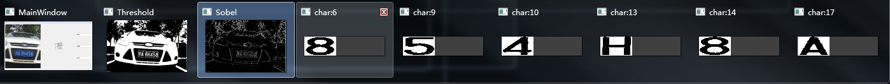

# [OpenCV](https://github.com/GuidoLuo0521/Projects/tree/master/OpenCV)

Python，OpenCV编写的小项目。

# [显示轮廓](https://github.com/GuidoLuo0521/Projects/blob/master/OpenCV/findContoursOnVideo.py)

关键字：OpenCV

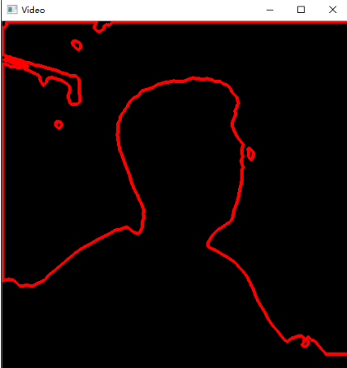

# [ORC](https://github.com/GuidoLuo0521/Projects/blob/master/OpenCV/EasyORC.py)

关键字：图像校正，文字识别，百度AI。

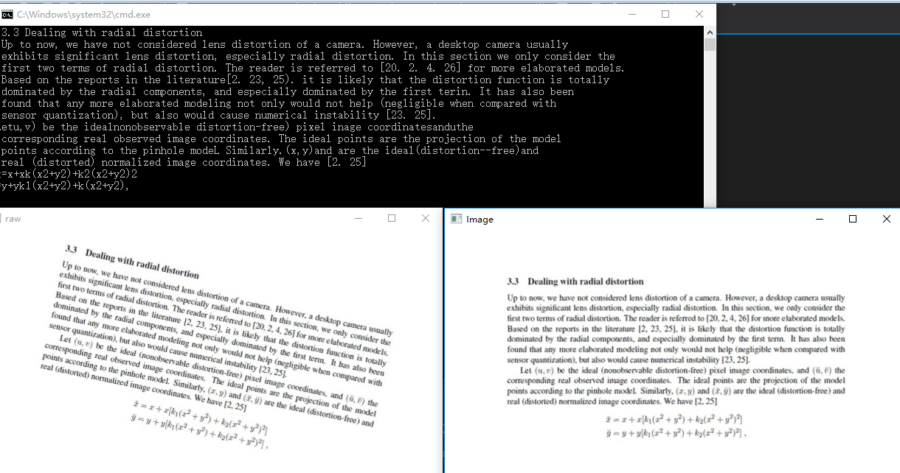

# [MilletWord](https://github.com/GuidoLuo0521/Notes/tree/master/Qt/QtDevelopmentAndExamples/Chapter05-Qt5MainWindow)

Qt，简易版本的Word。

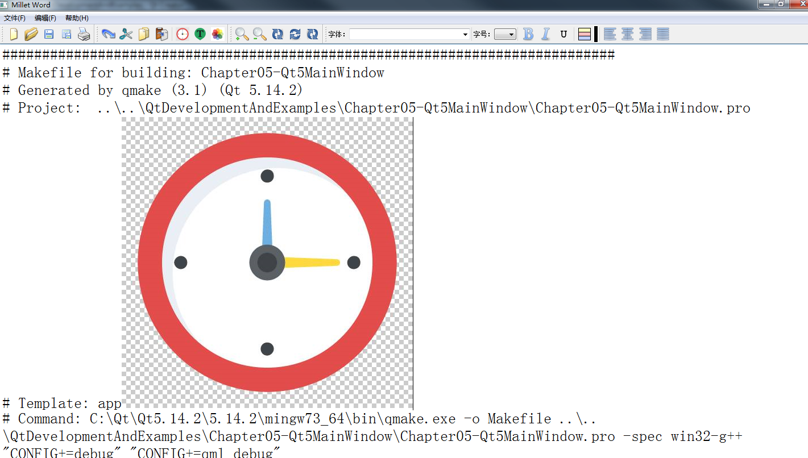

# [Painter](https://github.com/GuidoLuo0521/Notes/tree/master/Qt/QtDevelopmentAndExamples/Chapter06-Qt5ShapeAndImage)

Qt，绘制，电线弧面等的简易版绘图板

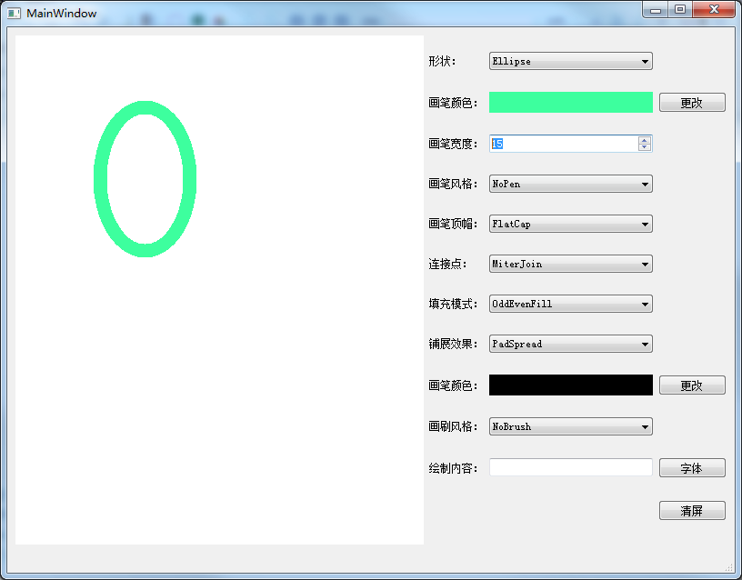

# [TCP聊天室](https://github.com/GuidoLuo0521/Notes/tree/master/Qt/QtDevelopmentAndExamples/TcpSocket)

Qt QTcpSocket QTcpServer 的聊天室

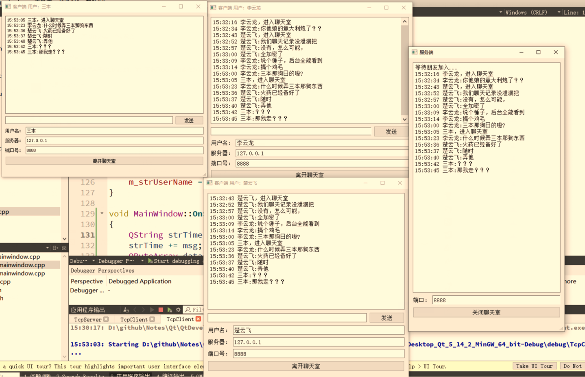

# [网络下载器](https://github.com/GuidoLuo0521/Notes/tree/master/Qt/QtDevelopmentAndExamples/Chapter10-Qt5NetworkAndCommunication)

Qt `QNetworkAccessManager`，`QNetworkRequest`，`QNetworkReply`

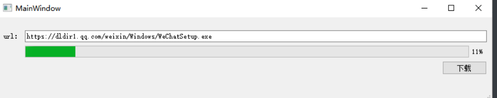

# [心电系统标记](\EcgMarkSystem)

Qt，Json，自动更新

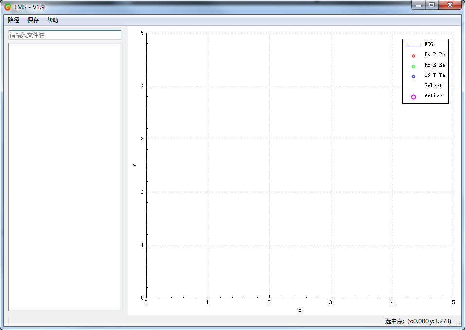

